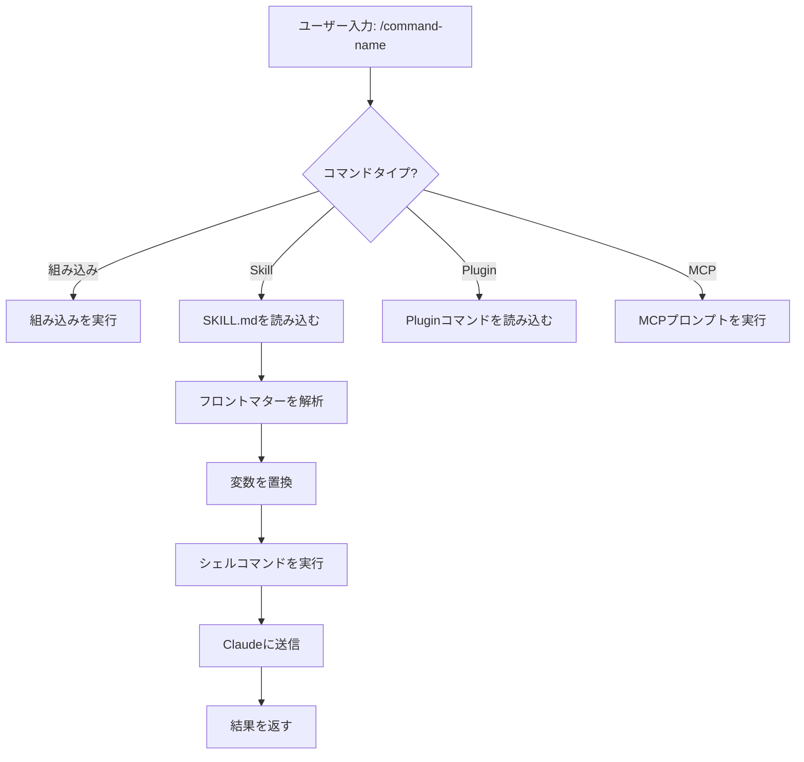
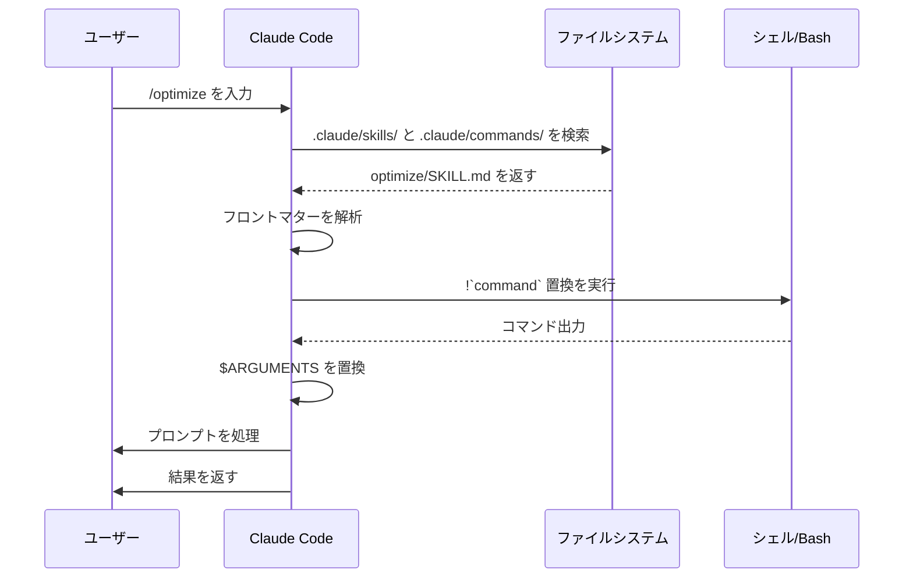

<picture>
  <source media="(prefers-color-scheme: dark)" srcset="../resources/logos/claude-howto-logo-dark.svg">
  
</picture>

# Slash Commands

## 概要

Slash commandsはインタラクティブセッション中のClaudeの動作を制御するショートカットです。いくつかの種類があります:

- **組み込みコマンド**: Claude Codeが提供するもの (`/help`, `/clear`, `/model`)
- **Skills**: `SKILL.md` ファイルとして作成されたユーザー定義コマンド (`/optimize`, `/pr`)
- **Pluginコマンド**: インストール済みpluginsからのコマンド (`/frontend-design:frontend-design`)
- **MCPプロンプト**: MCPサーバーからのコマンド (`/mcp__github__list_prs`)

> **注意**: カスタムslash commandsはskillsに統合されました。`.claude/commands/` のファイルは引き続き動作しますが、skills (`.claude/skills/`) が現在推奨されるアプローチです。どちらも `/command-name` ショートカットを作成します。完全なリファレンスは [Skillsガイド](../03-skills/) を参照してください。

## 組み込みコマンドリファレンス

組み込みコマンドは一般的なアクションのショートカットです。**55以上の組み込みコマンド**と**5つのバンドルskills**が利用可能です。Claude Codeで `/` を入力して全リストを確認するか、`/` に続けて文字を入力してフィルタリングします。

| コマンド | 目的 |
|---------|---------|
| `/add-dir <path>` | 作業ディレクトリを追加 |
| `/agents` | エージェント設定を管理 |
| `/branch [name]` | 会話を新しいセッションに分岐 (エイリアス: `/fork`)。注: v2.1.77で `/fork` から `/branch` に改名 |
| `/btw <question>` | 履歴に追加せずに質問 |
| `/chrome` | Chromeブラウザ連携を設定 |
| `/clear` | 会話をクリア (エイリアス: `/reset`, `/new`) |
| `/color [color\|default]` | プロンプトバーの色を設定 |
| `/compact [instructions]` | オプションのフォーカス指示付きで会話をコンパクト化 |
| `/config` | 設定を開く (エイリアス: `/settings`) |
| `/context` | コンテキスト使用量をカラーグリッドで可視化 |
| `/copy [N]` | アシスタントの応答をクリップボードにコピー; `w` でファイルに書き込み |
| `/cost` | トークン使用統計を表示 |
| `/desktop` | Desktopアプリで続ける (エイリアス: `/app`) |
| `/diff` | コミットされていない変更のインタラクティブdiffビューア |
| `/doctor` | インストールの健全性を診断 |
| `/effort [low\|medium\|high\|max\|auto]` | 努力レベルを設定。`max` はOpus 4.6が必要 |
| `/exit` | REPLを終了 (エイリアス: `/quit`) |
| `/export [filename]` | 現在の会話をファイルまたはクリップボードにエクスポート |
| `/extra-usage` | レート制限の追加使用を設定 |
| `/fast [on\|off]` | 高速モードを切り替え |
| `/feedback` | フィードバックを送信 (エイリアス: `/bug`) |
| `/help` | ヘルプを表示 |
| `/hooks` | hook設定を表示 |
| `/ide` | IDE連携を管理 |
| `/init` | `CLAUDE.md` を初期化。インタラクティブフローには `CLAUDE_CODE_NEW_INIT=true` を設定 |
| `/insights` | セッション分析レポートを生成 |
| `/install-github-app` | GitHub Actionsアプリをセットアップ |
| `/install-slack-app` | Slackアプリをインストール |
| `/keybindings` | キーバインディング設定を開く |
| `/login` | Anthropicアカウントを切り替え |
| `/logout` | Anthropicアカウントからサインアウト |
| `/mcp` | MCPサーバーとOAuthを管理 |
| `/memory` | `CLAUDE.md` を編集、auto-memoryを切り替え |
| `/mobile` | モバイルアプリ用QRコード (エイリアス: `/ios`, `/android`) |
| `/model [model]` | 努力度調整のために左右矢印でモデルを選択 |
| `/passes` | Claude Codeの無料1週間を共有 |
| `/permissions` | パーミッションを表示/更新 (エイリアス: `/allowed-tools`) |
| `/plan [description]` | Plan modeに入る |
| `/plugin` | Pluginsを管理 |
| `/pr-comments [PR]` | GitHub PRのコメントを取得 |
| `/privacy-settings` | プライバシー設定 (Pro/Maxのみ) |
| `/release-notes` | changelogを表示 |
| `/reload-plugins` | アクティブなpluginsを再読み込み |
| `/remote-control` | claude.aiからリモートコントロール (エイリアス: `/rc`) |
| `/remote-env` | デフォルトのリモート環境を設定 |
| `/rename [name]` | セッションを名前変更 |
| `/resume [session]` | 会話を再開 (エイリアス: `/continue`) |
| `/review` | **非推奨** — 代わりに `code-review` pluginをインストールする |
| `/rewind` | 会話やコードを巻き戻す (エイリアス: `/checkpoint`) |
| `/sandbox` | サンドボックスモードを切り替え |
| `/schedule [description]` | スケジュールタスクを作成/管理 |
| `/security-review` | ブランチのセキュリティ脆弱性を分析 |
| `/skills` | 利用可能なskillsを一覧 |
| `/stats` | 日次使用量・セッション・ストリークを可視化 |
| `/status` | バージョン・モデル・アカウントを表示 |
| `/statusline` | ステータスラインを設定 |
| `/tasks` | バックグラウンドタスクを一覧/管理 |
| `/terminal-setup` | ターミナルキーバインディングを設定 |
| `/theme` | カラーテーマを変更 |
| `/vim` | Vim/Normalモードを切り替え |
| `/voice` | プッシュトゥトーク音声入力を切り替え |

### バンドルSkills

これらのskillsはClaude Codeに付属し、slash commandsとして呼び出せます:

| Skill | 目的 |
|-------|---------|
| `/batch <instruction>` | worktreesを使って大規模な並列変更を調整 |
| `/claude-api` | プロジェクト言語のClaude APIリファレンスを読み込む |
| `/debug [description]` | デバッグログを有効化 |
| `/loop [interval] <prompt>` | プロンプトを一定間隔で繰り返し実行 |
| `/simplify [focus]` | 変更されたファイルのコード品質をレビュー |

### 非推奨コマンド

| コマンド | 状態 |
|---------|--------|
| `/review` | 非推奨 — `code-review` pluginで置き換え |
| `/output-style` | v2.1.73から非推奨 |
| `/fork` | `/branch` に改名 (エイリアスは引き続き動作、v2.1.77) |

### 最近の変更

- `/fork` を `/branch` に改名、`/fork` はエイリアスとして維持 (v2.1.77)
- `/output-style` を非推奨 (v2.1.73)
- `/review` を `code-review` pluginに置き換えるため非推奨
- `/effort` コマンドを追加。`max` レベルにはOpus 4.6が必要
- `/voice` コマンドをプッシュトゥトーク音声入力として追加
- `/schedule` コマンドをスケジュールタスクの作成/管理として追加
- `/color` コマンドをプロンプトバーカスタマイズとして追加
- `/model` ピッカーが生のモデルIDの代わりに人間が読みやすいラベル (例: "Sonnet 4.6") を表示
- `/resume` が `/continue` エイリアスをサポート
- MCPプロンプトが `/mcp__<server>__<prompt>` コマンドとして利用可能 ([MCPプロンプトをコマンドとして使う](#mcpプロンプトをコマンドとして使う)を参照)

## カスタムコマンド (現在はSkills)

カスタムslash commandsは**skillsに統合**されました。どちらのアプローチも `/command-name` で呼び出せるコマンドを作成します:

| アプローチ | 場所 | 状態 |
|----------|----------|--------|
| **Skills (推奨)** | `.claude/skills/<name>/SKILL.md` | 現在の標準 |
| **レガシーコマンド** | `.claude/commands/<name>.md` | 引き続き動作 |

SkillとCommandが同じ名前を共有する場合、**skillが優先**されます。例えば、`.claude/commands/review.md` と `.claude/skills/review/SKILL.md` の両方が存在する場合、skillバージョンが使用されます。

### 移行パス

既存の `.claude/commands/` ファイルは変更なしで引き続き動作します。Skillsへの移行:

**移行前 (Command):**
```
.claude/commands/optimize.md
```

**移行後 (Skill):**
```
.claude/skills/optimize/SKILL.md
```

### なぜSkillsか?

Skillsはレガシーコマンドより追加機能を提供します:

- **ディレクトリ構造**: スクリプト・テンプレート・参照ファイルをバンドル
- **自動呼び出し**: Claudeが関連する場合に自動でskillsをトリガーできる
- **呼び出し制御**: ユーザー・Claude・または両方が呼び出せるかを選択
- **Subagent実行**: `context: fork` で独立したコンテキストでskillsを実行
- **段階的開示**: 必要な時のみ追加ファイルを読み込む

### Skillとしてカスタムコマンドを作成する

`SKILL.md` ファイルを含むディレクトリを作成:

```bash
mkdir -p .claude/skills/my-command
```

**ファイル:** `.claude/skills/my-command/SKILL.md`

```yaml
---
name: my-command
description: このコマンドの機能と使用タイミング
---

# マイコマンド

このコマンドが呼び出された時にClaudeが従う指示。

1. 最初のステップ
2. 2番目のステップ
3. 3番目のステップ
```

### フロントマターリファレンス

| フィールド | 目的 | デフォルト |
|-------|---------|---------|
| `name` | コマンド名 (`/name` になる) | ディレクトリ名 |
| `description` | 簡単な説明 (Claudeがいつ使うかを理解するのに役立つ) | 最初の段落 |
| `argument-hint` | オートコンプリート用の期待される引数 | なし |
| `allowed-tools` | パーミッションなしでコマンドが使用できるツール | 継承 |
| `model` | 使用する特定のモデル | 継承 |
| `disable-model-invocation` | `true` の場合、ユーザーのみ呼び出し可 (Claudeは不可) | `false` |
| `user-invocable` | `false` の場合、`/` メニューから非表示 | `true` |
| `context` | 独立したsubagentで実行するには `fork` に設定 | なし |
| `agent` | `context: fork` 使用時のエージェントタイプ | `general-purpose` |
| `hooks` | Skill固有のhooks (PreToolUse, PostToolUse, Stop) | なし |

### 引数

コマンドは引数を受け取れます:

**`$ARGUMENTS` ですべての引数:**

```yaml
---
name: fix-issue
description: 番号でGitHub Issueを修正
---

私たちのコーディング標準に従ってIssue #$ARGUMENTS を修正して
```

使い方: `/fix-issue 123` → `$ARGUMENTS` が "123" になる

**`$0`, `$1` などで個別の引数:**

```yaml
---
name: review-pr
description: 優先度付きでPRをレビュー
---

PR #$0 を優先度 $1 でレビューして
```

使い方: `/review-pr 456 high` → `$0`="456", `$1`="high"

### シェルコマンドによる動的コンテキスト

`` !`command` `` を使ってプロンプト前にbashコマンドを実行:

```yaml
---
name: commit
description: コンテキスト付きでgitコミットを作成
allowed-tools: Bash(git *)
---

## コンテキスト

- 現在のgit status: !`git status`
- 現在のgit diff: !`git diff HEAD`
- 現在のブランチ: !`git branch --show-current`
- 最近のコミット: !`git log --oneline -5`

## タスク

上記の変更をもとに、単一のgitコミットを作成してください。
```

### ファイル参照

`@` を使ってファイルの内容を含める:

```markdown
@src/utils/helpers.js の実装をレビューして
@src/old-version.js と @src/new-version.js を比較して
```

## Pluginコマンド

Pluginsはカスタムコマンドを提供できます:

```
/plugin-name:command-name
```

または命名の競合がない場合は単純に `/command-name`。

**サンプル:**
```bash
/frontend-design:frontend-design
/commit-commands:commit
```

## MCPプロンプトをコマンドとして使う

MCPサーバーはプロンプトをslash commandsとして公開できます:

```
/mcp__<server-name>__<prompt-name> [arguments]
```

**サンプル:**
```bash
/mcp__github__list_prs
/mcp__github__pr_review 456
/mcp__jira__create_issue "バグのタイトル" high
```

### MCPパーミッション構文

パーミッションでMCPサーバーアクセスを制御:

- `mcp__github` - GitHub MCPサーバー全体へのアクセス
- `mcp__github__*` - すべてのツールへのワイルドカードアクセス
- `mcp__github__get_issue` - 特定のツールアクセス

## コマンドアーキテクチャ



## コマンドライフサイクル



## このフォルダで利用可能なコマンド

これらのサンプルコマンドはskillsまたはレガシーコマンドとしてインストールできます。

### 1. `/optimize` - コード最適化

コードのパフォーマンス問題・メモリリーク・最適化の機会を分析します。

**使い方:**
```
/optimize
[コードを貼り付ける]
```

### 2. `/pr` - プルリクエスト準備

リンティング・テスト・コミットフォーマットを含むPR準備チェックリストをガイドします。

**使い方:**
```
/pr
```

**スクリーンショット:**


### 3. `/generate-api-docs` - APIドキュメント生成

ソースコードから包括的なAPIドキュメントを生成します。

**使い方:**
```
/generate-api-docs
```

### 4. `/commit` - コンテキスト付きGitコミット

リポジトリからの動的コンテキスト付きでgitコミットを作成します。

**使い方:**
```
/commit [任意のメッセージ]
```

### 5. `/push-all` - ステージ・コミット・プッシュ

安全チェックを実施しながらすべての変更をステージし、コミットを作成してリモートにプッシュします。

**使い方:**
```
/push-all
```

**安全チェック:**
- シークレット: `.env*`, `*.key`, `*.pem`, `credentials.json`
- APIキー: 実際のキーとプレースホルダーを検出
- 大きなファイル: Git LFSなしで `>10MB`
- ビルド成果物: `node_modules/`, `dist/`, `__pycache__/`

### 6. `/doc-refactor` - ドキュメント再構成

プロジェクトドキュメントを明確さとアクセスしやすさのために再構成します。

**使い方:**
```
/doc-refactor
```

### 7. `/setup-ci-cd` - CI/CDパイプラインセットアップ

品質保証のためのpre-commitフックとGitHub Actionsを実装します。

**使い方:**
```
/setup-ci-cd
```

### 8. `/unit-test-expand` - テストカバレッジ拡張

未テストのブランチとエッジケースを対象にしてテストカバレッジを向上させます。

**使い方:**
```
/unit-test-expand
```

## インストール

### Skillsとして (推奨)

skillsディレクトリにコピー:

```bash
# skillsディレクトリを作成
mkdir -p .claude/skills

# 各コマンドファイルのskillディレクトリを作成
for cmd in optimize pr commit; do
  mkdir -p .claude/skills/$cmd
  cp 01-slash-commands/$cmd.md .claude/skills/$cmd/SKILL.md
done
```

### レガシーコマンドとして

commandsディレクトリにコピー:

```bash
# プロジェクト全体 (チーム)
mkdir -p .claude/commands
cp 01-slash-commands/*.md .claude/commands/

# 個人使用
mkdir -p ~/.claude/commands
cp 01-slash-commands/*.md ~/.claude/commands/
```

## 独自コマンドの作成

### Skillテンプレート (推奨)

`.claude/skills/my-command/SKILL.md` を作成:

```yaml
---
name: my-command
description: このコマンドの機能。[トリガー条件] の時に使用。
argument-hint: [optional-args]
allowed-tools: Bash(npm *), Read, Grep
---

# コマンドタイトル

## コンテキスト

- 現在のブランチ: !`git branch --show-current`
- 関連ファイル: @package.json

## 指示

1. 最初のステップ
2. 引数付きの2番目のステップ: $ARGUMENTS
3. 3番目のステップ

## 出力フォーマット

- 応答のフォーマット方法
- 含めるもの
```

### ユーザー専用コマンド (自動呼び出しなし)

Claudeが自動的にトリガーすべきでない副作用のあるコマンド:

```yaml
---
name: deploy
description: 本番環境にデプロイ
disable-model-invocation: true
allowed-tools: Bash(npm *), Bash(git *)
---

アプリケーションを本番環境にデプロイする:

1. テストを実行
2. アプリケーションをビルド
3. デプロイ先にプッシュ
4. デプロイを確認
```

## ベストプラクティス

| やること | やってはいけないこと |
|------|---------|
| 明確でアクション指向の名前を使う | 1回限りのタスクにコマンドを作らない |
| トリガー条件付きの `description` を含める | コマンドに複雑なロジックを組み込まない |
| コマンドを単一タスクに集中させる | 機密情報をハードコードしない |
| 副作用に `disable-model-invocation` を使う | descriptionフィールドをスキップしない |
| 動的コンテキストに `!` プレフィックスを使う | Claudeが現在の状態を知っていると仮定しない |
| 関連ファイルをskillディレクトリに整理する | すべてを1つのファイルに入れない |

## トラブルシューティング

### コマンドが見つからない

**解決策:**
- ファイルが `.claude/skills/<name>/SKILL.md` または `.claude/commands/<name>.md` にあるか確認する
- フロントマターの `name` フィールドが期待するコマンド名と一致しているか確認する
- Claude Codeセッションを再起動する
- `/help` を実行して利用可能なコマンドを確認する

### コマンドが期待通りに実行されない

**解決策:**
- より具体的な指示を追加する
- skillファイルにサンプルを含める
- bashコマンドを使用している場合は `allowed-tools` を確認する
- まずシンプルな入力でテストする

### SkillとCommandの競合

同じ名前で両方が存在する場合、**skillが優先**されます。どちらかを削除するか名前を変更してください。

## 関連ガイド

- **[Skills](../03-skills/)** - Skillsの完全リファレンス (自動呼び出し機能)
- **[Memory](../02-memory/)** - CLAUDE.mdによる永続的コンテキスト
- **[Subagents](../04-subagents/)** - 委任されたAIエージェント
- **[Plugins](../07-plugins/)** - バンドルされたコマンドコレクション
- **[Hooks](../06-hooks/)** - イベント駆動自動化

## 追加リソース

- [公式 Interactive Mode ドキュメント](https://code.claude.com/docs/en/interactive-mode) - 組み込みコマンドリファレンス
- [公式 Skills ドキュメント](https://code.claude.com/docs/en/skills) - 完全なSkillsリファレンス
- [CLIリファレンス](https://code.claude.com/docs/en/cli-reference) - コマンドラインオプション

---

*[Claude How To](../) ガイドシリーズの一部*
