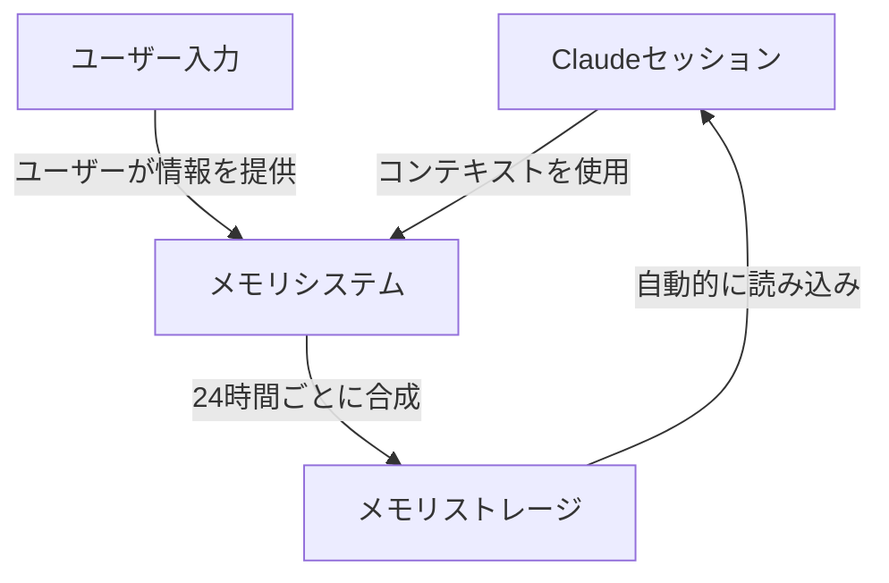
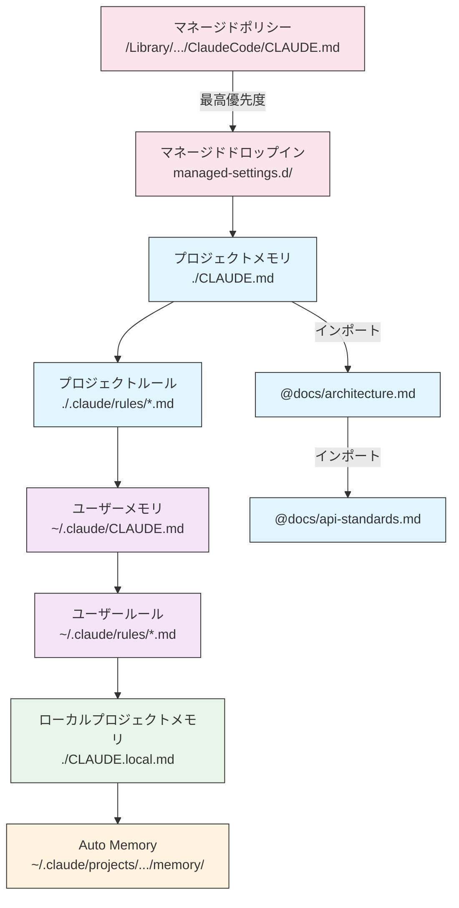
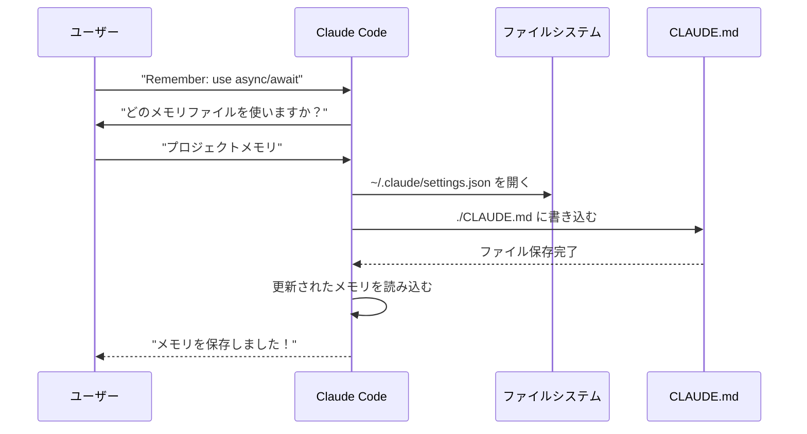
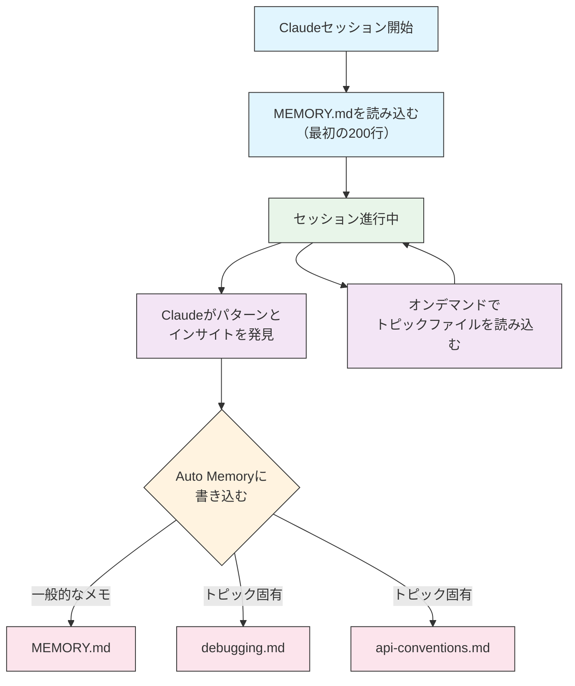

<picture>
  <source media="(prefers-color-scheme: dark)" srcset="../resources/logos/claude-howto-logo-dark.svg">
  
</picture>

# メモリガイド

メモリを使うことで、Claudeはセッションや会話をまたいでコンテキストを保持できます。メモリには2つの形式があります：claude.aiでの自動シンセシスと、Claude CodeにおけるファイルシステムベースのCLAUDE.mdです。

## 概要

Claude Codeのメモリは、複数のセッションや会話をまたいで持続するコンテキストを提供します。一時的なコンテキストウィンドウとは異なり、メモリファイルを使うと以下が可能になります：

- プロジェクト標準をチーム全体で共有する
- 個人の開発設定を保存する
- ディレクトリ固有のルールや設定を維持する
- 外部ドキュメントをインポートする
- プロジェクトの一部としてメモリをバージョン管理する

メモリシステムは複数のレベルで機能し、グローバルな個人設定から特定のサブディレクトリまで、Claudeが何を記憶し、その知識をどのように適用するかを細かく制御できます。

## メモリコマンド クイックリファレンス

| コマンド | 目的 | 使い方 | 使うタイミング |
|---------|------|--------|--------------|
| `/init` | プロジェクトメモリを初期化 | `/init` | 新規プロジェクト開始時、CLAUDE.mdの初回セットアップ |
| `/memory` | エディタでメモリファイルを編集 | `/memory` | 大規模な更新、再構成、内容の確認 |
| `#` プレフィックス | 会話中に素早くメモリを追加 | `# ルールをここに` | 会話中にクイックルールを追加 |
| `# new rule into memory` | 明示的なメモリ追加 | `# new rule into memory<br/>詳細なルール` | 複数行の複雑なルールを追加 |
| `# remember this` | 自然語でのメモリ追加 | `# remember this<br/>指示内容` | 会話的なメモリ更新 |
| `@path/to/file` | 外部コンテンツをインポート | `@README.md` または `@docs/api.md` | CLAUDE.md内で既存ドキュメントを参照 |

## クイックスタート: メモリの初期化

### `/init` コマンド

`/init` コマンドは、Claude Codeでプロジェクトメモリをセットアップする最速の方法です。CLAUDE.mdファイルを基本的なプロジェクトドキュメントで初期化します。

**使い方:**

```bash
/init
```

**実行内容:**

- プロジェクトに新しいCLAUDE.mdファイルを作成（通常は `./CLAUDE.md` または `./.claude/CLAUDE.md`）
- プロジェクトの規約とガイドラインを確立
- セッションをまたいだコンテキスト永続化の基盤を設定
- プロジェクト標準を文書化するためのテンプレート構造を提供

**強化されたインタラクティブモード:** `CLAUDE_CODE_NEW_INIT=true` を設定すると、プロジェクトセットアップをステップバイステップで案内するマルチフェーズのインタラクティブフローが有効になります：

```bash
CLAUDE_CODE_NEW_INIT=true claude
/init
```

**`/init` を使うタイミング:**

- Claude Codeで新しいプロジェクトを開始するとき
- チームのコーディング標準や規約を確立するとき
- コードベース構造に関するドキュメントを作成するとき
- 共同開発のためのメモリ階層をセットアップするとき

**ワークフロー例:**

```markdown
# プロジェクトディレクトリで
/init

# Claudeが次のような構造でCLAUDE.mdを作成:
# プロジェクト設定
## プロジェクト概要
- 名前: Your Project
- Tech Stack: [使用技術]
- チーム規模: [開発者数]

## 開発標準
- コードスタイルの設定
- テスト要件
- Gitワークフローの規約
```

### `#` でクイックメモリ更新

`#` で始めることで、会話中にいつでもメモリに素早く情報を追加できます：

**構文:**

```markdown
# ここにメモリルールまたは指示を記述
```

**例:**

```markdown
# Always use TypeScript strict mode in this project

# Prefer async/await over promise chains

# Run npm test before every commit

# Use kebab-case for file names
```

**仕組み:**

1. `#` の後にルールを書いてメッセージを送信
2. Claudeがメモリ更新リクエストとして認識
3. Claudeがどのメモリファイルを更新するか確認（プロジェクトまたは個人）
4. 適切なCLAUDE.mdファイルにルールが追加される
5. 以降のセッションで自動的にこのコンテキストが読み込まれる

**別のパターン:**

```markdown
# new rule into memory
Always validate user input with Zod schemas

# remember this
Use semantic versioning for all releases

# add to memory
Database migrations must be reversible
```

### `/memory` コマンド

`/memory` コマンドは、Claude Codeセッション内でCLAUDE.mdメモリファイルに直接アクセスして編集する機能を提供します。システムエディタでメモリファイルを開いて包括的な編集が可能です。

**使い方:**

```bash
/memory
```

**実行内容:**

- システムのデフォルトエディタでメモリファイルを開く
- 大規模な追加、修正、再構成が可能
- 階層内のすべてのメモリファイルに直接アクセス
- セッションをまたいだ永続コンテキストの管理が可能

**`/memory` を使うタイミング:**

- 既存のメモリ内容を確認するとき
- プロジェクト標準を大規模に更新するとき
- メモリ構造を再構成するとき
- 詳細なドキュメントやガイドラインを追加するとき
- プロジェクトが進化するにつれてメモリを更新・維持するとき

**比較: `/memory` vs `/init`**

| 観点 | `/memory` | `/init` |
|-----|-----------|---------|
| **目的** | 既存のメモリファイルを編集 | 新しいCLAUDE.mdを初期化 |
| **使うタイミング** | プロジェクトコンテキストの更新・修正 | 新プロジェクトの開始 |
| **動作** | 変更のためにエディタを開く | スターターテンプレートを生成 |
| **ワークフロー** | 継続的なメンテナンス | 初回セットアップ |

**ワークフロー例:**

```markdown
# メモリを編集のために開く
/memory

# Claudeが次のオプションを表示:
# 1. マネージドポリシーメモリ
# 2. プロジェクトメモリ (./CLAUDE.md)
# 3. ユーザーメモリ (~/.claude/CLAUDE.md)
# 4. ローカルプロジェクトメモリ

# オプション2 (プロジェクトメモリ) を選択
# デフォルトエディタが ./CLAUDE.md の内容で開く

# 変更して保存、エディタを閉じる
# Claudeが更新されたメモリを自動的に再読み込み
```

**メモリインポートの使い方:**

CLAUDE.mdファイルは `@path/to/file` 構文で外部コンテンツをインクルードできます：

```markdown
# プロジェクトドキュメント
プロジェクト概要は @README.md を参照
利用可能なnpmコマンドは @package.json を参照
システム設計は @docs/architecture.md を参照

# ホームディレクトリから絶対パスでインポート
@~/.claude/my-project-instructions.md
```

**インポートの機能:**

- 相対パスと絶対パスの両方をサポート（例: `@docs/api.md` または `@~/.claude/my-project-instructions.md`）
- 最大深さ5の再帰インポートをサポート
- 外部ロケーションからの初回インポート時は承認ダイアログが表示（セキュリティ）
- マークダウンのコードスパンやコードブロック内のインポートディレクティブは評価されない（例示に安全）
- 既存ドキュメントを参照することで重複を回避
- 参照されたコンテンツをClaudeのコンテキストに自動インクルード

## メモリアーキテクチャ

Claude Codeのメモリは、異なるスコープが異なる目的を果たす階層システムに従います：



## Claude Codeのメモリ階層

Claude Codeはマルチティア階層メモリシステムを使用しています。メモリファイルはClaude Codeの起動時に自動読み込みされ、上位ファイルが優先されます。

**完全なメモリ階層（優先順位順）:**

1. **マネージドポリシー** - 組織全体の指示
   - macOS: `/Library/Application Support/ClaudeCode/CLAUDE.md`
   - Linux/WSL: `/etc/claude-code/CLAUDE.md`
   - Windows: `C:\Program Files\ClaudeCode\CLAUDE.md`

2. **マネージドドロップイン** - アルファベット順にマージされるポリシーファイル (v2.1.83+)
   - マネージドポリシーCLAUDE.mdと同じ場所の `managed-settings.d/` ディレクトリ
   - モジュラーポリシー管理のためにアルファベット順でマージされる

3. **プロジェクトメモリ** - チーム共有コンテキスト（バージョン管理対象）
   - `./.claude/CLAUDE.md` または `./CLAUDE.md`（リポジトリルート）

4. **プロジェクトルール** - モジュラーなトピック別プロジェクト指示
   - `./.claude/rules/*.md`

5. **ユーザーメモリ** - 個人設定（全プロジェクト共通）
   - `~/.claude/CLAUDE.md`

6. **ユーザーレベルルール** - 個人ルール（全プロジェクト共通）
   - `~/.claude/rules/*.md`

7. **ローカルプロジェクトメモリ** - 個人のプロジェクト固有設定
   - `./CLAUDE.local.md`

> **注意**: `CLAUDE.local.md` は2026年3月時点の[公式ドキュメント](https://code.claude.com/docs/en/memory)には記載されていません。レガシー機能として動作する可能性があります。新規プロジェクトでは `~/.claude/CLAUDE.md`（ユーザーレベル）または `.claude/rules/`（プロジェクトレベル、パススコープ）の使用を検討してください。

8. **Auto Memory** - Claudeの自動メモとラーニング
   - `~/.claude/projects/<project>/memory/`

**メモリ探索の挙動:**

Claudeは以下の順序でメモリファイルを検索し、先に見つかったものが優先されます：



## `claudeMdExcludes` によるCLAUDE.mdファイルの除外

大規模なモノレポでは、一部のCLAUDE.mdファイルが現在の作業に無関係なことがあります。`claudeMdExcludes` 設定を使うと、特定のCLAUDE.mdファイルをスキップしてコンテキストに読み込まないようにできます：

```jsonc
// ~/.claude/settings.json または .claude/settings.json
{
  "claudeMdExcludes": [
    "packages/legacy-app/CLAUDE.md",
    "vendors/**/CLAUDE.md"
  ]
}
```

パターンはプロジェクトルートからの相対パスでマッチされます。これは特に以下の場合に便利です：

- 一部のサブプロジェクトのみが関連する多数のサブプロジェクトを持つモノレポ
- ベンダーやサードパーティのCLAUDE.mdファイルが含まれるリポジトリ
- 古くなった無関係の指示を除外してClaudeのコンテキストウィンドウのノイズを減らす

## 設定ファイルの階層

Claude Codeの設定（`autoMemoryDirectory`、`claudeMdExcludes`、その他の設定を含む）は5レベルの階層から解決され、上位レベルが優先されます：

| レベル | 場所 | スコープ |
|--------|------|----------|
| 1（最高） | マネージドポリシー（システムレベル） | 組織全体への強制 |
| 2 | `managed-settings.d/` (v2.1.83+) | モジュラーポリシードロップイン、アルファベット順でマージ |
| 3 | `~/.claude/settings.json` | ユーザー設定 |
| 4 | `.claude/settings.json` | プロジェクトレベル（gitにコミット） |
| 5（最低） | `.claude/settings.local.json` | ローカルオーバーライド（git無視） |

**プラットフォーム固有の設定 (v2.1.51+):**

設定は以下からも設定可能です：
- **macOS**: プロパティリスト（plist）ファイル
- **Windows**: Windowsレジストリ

これらのプラットフォームネイティブなメカニズムはJSONの設定ファイルと並行して読み込まれ、同じ優先順位ルールに従います。

## モジュラールールシステム

`.claude/rules/` ディレクトリ構造を使って、整理されたパス固有のルールを作成できます。ルールはプロジェクトレベルとユーザーレベルの両方で定義できます：

```
your-project/
├── .claude/
│   ├── CLAUDE.md
│   └── rules/
│       ├── code-style.md
│       ├── testing.md
│       ├── security.md
│       └── api/                  # サブディレクトリもサポート
│           ├── conventions.md
│           └── validation.md

~/.claude/
├── CLAUDE.md
└── rules/                        # ユーザーレベルルール（全プロジェクト共通）
    ├── personal-style.md
    └── preferred-patterns.md
```

ルールは `rules/` ディレクトリ内でサブディレクトリを含めて再帰的に探索されます。`~/.claude/rules/` のユーザーレベルルールはプロジェクトレベルルールより先に読み込まれ、プロジェクトで上書き可能な個人デフォルトを設定できます。

### YAMLフロントマターによるパス固有ルール

特定のファイルパスにのみ適用されるルールを定義：

```markdown
---
paths: src/api/**/*.ts
---

# API開発ルール

- すべてのAPIエンドポイントに入力バリデーションを含めること
- スキーマバリデーションにはZodを使用
- すべてのパラメータとレスポンスタイプを文書化
- すべての操作にエラーハンドリングを含めること
```

**globパターン例:**

- `**/*.ts` - 全TypeScriptファイル
- `src/**/*` - src/以下の全ファイル
- `src/**/*.{ts,tsx}` - 複数の拡張子
- `{src,lib}/**/*.ts, tests/**/*.test.ts` - 複数パターン

### サブディレクトリとシンボリックリンク

`.claude/rules/` のルールは2つの整理機能をサポートします：

- **サブディレクトリ**: ルールは再帰的に探索されるため、トピック別フォルダ（例: `rules/api/`、`rules/testing/`、`rules/security/`）に整理可能
- **シンボリックリンク**: 複数のプロジェクト間でルールを共有するためのシンボリックリンクをサポート。中央の場所から各プロジェクトの `.claude/rules/` ディレクトリにルールファイルをシンボリックリンクできます

## メモリ場所テーブル

| 場所 | スコープ | 優先度 | 共有 | アクセス | 最適な用途 |
|------|----------|--------|------|---------|-----------|
| `/Library/Application Support/ClaudeCode/CLAUDE.md` (macOS) | マネージドポリシー | 1（最高） | 組織 | システム | 全社方針 |
| `/etc/claude-code/CLAUDE.md` (Linux/WSL) | マネージドポリシー | 1（最高） | 組織 | システム | 組織標準 |
| `C:\Program Files\ClaudeCode\CLAUDE.md` (Windows) | マネージドポリシー | 1（最高） | 組織 | システム | 企業ガイドライン |
| `managed-settings.d/*.md`（ポリシーと同じ場所） | マネージドドロップイン | 1.5 | 組織 | システム | モジュラーポリシーファイル (v2.1.83+) |
| `./CLAUDE.md` または `./.claude/CLAUDE.md` | プロジェクトメモリ | 2 | チーム | Git | チーム標準、共有アーキテクチャ |
| `./.claude/rules/*.md` | プロジェクトルール | 3 | チーム | Git | パス固有・モジュラールール |
| `~/.claude/CLAUDE.md` | ユーザーメモリ | 4 | 個人 | ファイルシステム | 個人設定（全プロジェクト共通） |
| `~/.claude/rules/*.md` | ユーザールール | 5 | 個人 | ファイルシステム | 個人ルール（全プロジェクト共通） |
| `./CLAUDE.local.md` | プロジェクトローカル | 6 | 個人 | Git（無視） | 個人のプロジェクト固有設定 |
| `~/.claude/projects/<project>/memory/` | Auto Memory | 7（最低） | 個人 | ファイルシステム | Claudeの自動メモとラーニング |

## メモリ更新のライフサイクル

Claude Codeセッションでのメモリ更新の流れ：



## Auto Memory

Auto Memoryは、Claudeがプロジェクトと作業する中で自動的にラーニング、パターン、インサイトを記録する永続ディレクトリです。手動で書いて維持するCLAUDE.mdファイルとは異なり、Auto Memoryはセッション中にClaude自身が書き込みます。

### Auto Memoryの仕組み

- **場所**: `~/.claude/projects/<project>/memory/`
- **エントリーポイント**: `MEMORY.md` がAuto Memoryディレクトリのメインファイル
- **トピックファイル**: 特定のテーマ用のオプション追加ファイル（例: `debugging.md`、`api-conventions.md`）
- **読み込み挙動**: `MEMORY.md` の最初の200行がセッション開始時にシステムプロンプトに読み込まれる。トピックファイルはオンデマンドで読み込まれ、起動時には読み込まれない
- **読み書き**: Claudeはパターンやプロジェクト固有の知識を発見するにつれて、セッション中にメモリファイルを読み書きする

### Auto Memoryのアーキテクチャ



### Auto Memoryディレクトリ構造

```
~/.claude/projects/<project>/memory/
├── MEMORY.md              # エントリーポイント（起動時に最初の200行を読み込む）
├── debugging.md           # トピックファイル（オンデマンドで読み込む）
├── api-conventions.md     # トピックファイル（オンデマンドで読み込む）
└── testing-patterns.md    # トピックファイル（オンデマンドで読み込む）
```

### バージョン要件

Auto Memoryには **Claude Code v2.1.59以降** が必要です。古いバージョンの場合は先にアップグレードしてください：

```bash
npm install -g @anthropic-ai/claude-code@latest
```

### Auto Memoryディレクトリのカスタマイズ

デフォルトでは、Auto Memoryは `~/.claude/projects/<project>/memory/` に保存されます。`autoMemoryDirectory` 設定（**v2.1.74以降**で利用可能）でこの場所を変更できます：

```jsonc
// ~/.claude/settings.json または .claude/settings.local.json（ユーザー/ローカル設定のみ）
{
  "autoMemoryDirectory": "/path/to/custom/memory/directory"
}
```

> **注意**: `autoMemoryDirectory` はユーザーレベル（`~/.claude/settings.json`）またはローカル設定（`.claude/settings.local.json`）にのみ設定可能で、プロジェクトやマネージドポリシー設定には設定できません。

これは以下の場合に便利です：

- 共有または同期された場所にAuto Memoryを保存したい
- デフォルトのClaude設定ディレクトリからAuto Memoryを分離したい
- デフォルト階層外のプロジェクト固有パスを使いたい

### ワークツリーとリポジトリ共有

同じgitリポジトリ内のすべてのワークツリーとサブディレクトリは、単一のAuto Memoryディレクトリを共有します。ワークツリーを切り替えたり、同じリポジトリの異なるサブディレクトリで作業したりしても、同じメモリファイルを読み書きします。

### サブエージェントのメモリ

サブエージェント（TaskやParallel実行などのツールで生成される）は独自のメモリコンテキストを持てます。サブエージェント定義の `memory` フロントマターフィールドで読み込むメモリスコープを指定します：

```yaml
memory: user      # ユーザーレベルのメモリのみ読み込む
memory: project   # プロジェクトレベルのメモリのみ読み込む
memory: local     # ローカルメモリのみ読み込む
```

これにより、サブエージェントはメモリ階層全体を継承せず、フォーカスされたコンテキストで動作できます。

### Auto Memoryの制御

Auto Memoryは `CLAUDE_CODE_DISABLE_AUTO_MEMORY` 環境変数で制御できます：

| 値 | 挙動 |
|----|------|
| `0` | Auto Memoryを強制**オン** |
| `1` | Auto Memoryを強制**オフ** |
| *（未設定）* | デフォルト動作（Auto Memoryは有効） |

```bash
# セッションでAuto Memoryを無効化
CLAUDE_CODE_DISABLE_AUTO_MEMORY=1 claude

# Auto Memoryを明示的に強制オン
CLAUDE_CODE_DISABLE_AUTO_MEMORY=0 claude
```

## `--add-dir` で追加ディレクトリを指定

`--add-dir` フラグを使うと、Claude Codeが現在の作業ディレクトリ以外の追加ディレクトリからもCLAUDE.mdファイルを読み込めます。これはモノレポや複数プロジェクトのセットアップで他のディレクトリのコンテキストが必要な場合に便利です。

この機能を有効にするには、環境変数を設定します：

```bash
CLAUDE_CODE_ADDITIONAL_DIRECTORIES_CLAUDE_MD=1
```

その後、フラグ付きでClaude Codeを起動します：

```bash
claude --add-dir /path/to/other/project
```

Claudeは指定された追加ディレクトリからCLAUDE.mdを読み込み、現在の作業ディレクトリのメモリファイルと並行して使用します。

## 実践例

### 例1: プロジェクトメモリ構造

**ファイル:** `./CLAUDE.md`

```markdown
# プロジェクト設定

## プロジェクト概要
- **名前**: Eコマースプラットフォーム
- **Tech Stack**: Node.js, PostgreSQL, React 18, Docker
- **チーム規模**: 5人の開発者
- **期限**: Q4 2025

## アーキテクチャ
@docs/architecture.md
@docs/api-standards.md
@docs/database-schema.md

## 開発標準

### コードスタイル
- フォーマットにはPrettierを使用
- airbnb設定のESLintを使用
- 最大行長: 100文字
- インデント: スペース2つ

### 命名規則
- **ファイル**: kebab-case (user-controller.js)
- **クラス**: PascalCase (UserService)
- **関数/変数**: camelCase (getUserById)
- **定数**: UPPER_SNAKE_CASE (API_BASE_URL)
- **DBテーブル**: snake_case (user_accounts)

### Gitワークフロー
- ブランチ名: `feature/description` または `fix/description`
- コミットメッセージ: Conventional Commitsに従う
- マージ前にPR必須
- すべてのCI/CDチェックをパスする必要あり
- 最低1件の承認が必要

### テスト要件
- コードカバレッジ最低80%
- すべてのクリティカルパスにテスト必須
- ユニットテストにはJestを使用
- E2EテストにはCypressを使用
- テストファイル名: `*.test.ts` または `*.spec.ts`

### API標準
- RESTfulエンドポイントのみ
- JSONリクエスト/レスポンス
- HTTPステータスコードを正しく使用
- APIエンドポイントのバージョニング: `/api/v1/`
- 例付きですべてのエンドポイントをドキュメント化

### データベース
- スキーマ変更にはマイグレーションを使用
- 認証情報をハードコードしない
- コネクションプーリングを使用
- 開発環境ではクエリログを有効化
- 定期的なバックアップが必要

### デプロイ
- Dockerベースのデプロイ
- Kubernetesオーケストレーション
- ブルーグリーンデプロイ戦略
- 失敗時の自動ロールバック
- デプロイ前にDBマイグレーションを実行

## よく使うコマンド

| コマンド | 目的 |
|---------|------|
| `npm run dev` | 開発サーバー起動 |
| `npm test` | テストスイート実行 |
| `npm run lint` | コードスタイルチェック |
| `npm run build` | 本番用ビルド |
| `npm run migrate` | DBマイグレーション実行 |

## チーム連絡先
- テックリード: Sarah Chen (@sarah.chen)
- プロダクトマネージャー: Mike Johnson (@mike.j)
- DevOps: Alex Kim (@alex.k)

## 既知の問題と回避策
- ピーク時にPostgreSQLコネクションプーリングが20に制限される
- 回避策: クエリキューイングを実装
- async generatorsでSafari 14との互換性問題
- 回避策: Babelトランスパイラーを使用

## 関連プロジェクト
- アナリティクスダッシュボード: `/projects/analytics`
- モバイルアプリ: `/projects/mobile`
- 管理パネル: `/projects/admin`
```

### 例2: ディレクトリ固有のメモリ

**ファイル:** `./src/api/CLAUDE.md`

```markdown
# APIモジュール標準

このファイルは /src/api/ 内のすべてに対してルートのCLAUDE.mdを上書きします

## API固有の標準

### リクエストバリデーション
- スキーマバリデーションにはZodを使用
- 常に入力をバリデートする
- バリデーションエラーには400を返す
- フィールドレベルのエラー詳細を含める

### 認証
- すべてのエンドポイントにJWTトークンが必要
- AuthorizationヘッダーにトークンをセットI
- トークンは24時間後に期限切れ
- リフレッシュトークンメカニズムを実装

### レスポンス形式

すべてのレスポンスはこの構造に従うこと:

```json
{
  "success": true,
  "data": { /* 実際のデータ */ },
  "timestamp": "2025-11-06T10:30:00Z",
  "version": "1.0"
}
```

エラーレスポンス:
```json
{
  "success": false,
  "error": {
    "code": "VALIDATION_ERROR",
    "message": "ユーザーへのメッセージ",
    "details": { /* フィールドエラー */ }
  },
  "timestamp": "2025-11-06T10:30:00Z"
}
```

### ページネーション
- カーソルベースのページネーションを使用（オフセットは使わない）
- `hasMore` booleanを含める
- 最大ページサイズを100に制限
- デフォルトページサイズ: 20

### レートリミット
- 認証済みユーザー: 1時間に1000リクエスト
- パブリックエンドポイント: 1時間に100リクエスト
- 超過時は429を返す
- retry-afterヘッダーを含める

### キャッシング
- セッションキャッシングにRedisを使用
- キャッシュ期間: デフォルト5分
- 書き込み操作時にキャッシュを無効化
- リソースタイプでキャッシュキーをタグ付け
```

### 例3: 個人メモリ

**ファイル:** `~/.claude/CLAUDE.md`

```markdown
# 私の開発設定

## 自己紹介
- **経験レベル**: フルスタック開発8年
- **好きな言語**: TypeScript, Python
- **コミュニケーションスタイル**: 直接的、例示あり
- **学習スタイル**: コード付きビジュアル図

## コード設定

### エラーハンドリング
try-catchブロックと意味のあるエラーメッセージで明示的なエラーハンドリングを好む。
汎用エラーは避ける。デバッグのために常にエラーをログに記録する。

### コメント
WHYのためにコメントを使い、WHATのためには使わない。コードは自己文書化すべき。
ビジネスロジックや明らかでない決定を説明するコメントを書く。

### テスト
TDD（テスト駆動開発）を好む。
実装の前にテストを書く。
実装詳細ではなく動作にフォーカスする。

### アーキテクチャ
モジュラーで疎結合の設計を好む。
テスタビリティのために依存性注入を使用。
関心事を分離する（Controller、Service、Repository）。

## デバッグ設定
- プレフィックス付きconsole.logを使用: `[DEBUG]`
- コンテキストを含める: 関数名、関連変数
- 利用可能な場合はスタックトレースを使用
- ログに常にタイムスタンプを含める

## コミュニケーション
- 複雑な概念は図で説明する
- 理論を説明する前に具体例を示す
- 変更前後のコードスニペットを含める
- 最後に要点をまとめる

## プロジェクト整理
プロジェクトの整理方法:

   project/
   ├── src/
   │   ├── api/
   │   ├── services/
   │   ├── models/
   │   └── utils/
   ├── tests/
   ├── docs/
   └── docker/

## ツール
- **IDE**: VS Code with vim keybindings
- **ターミナル**: Zsh with Oh-My-Zsh
- **フォーマット**: Prettier（行長100文字）
- **リンター**: ESLint with airbnb config
- **テストフレームワーク**: Jest with React Testing Library
```

_テスト_
Claudeに新しいルールを保存するよう依頼


`Claude.md` ファイルがどこにもなかったためClaudeがルールを保存しなかった。その後Claudeに場所を確認するよう依頼。


### 例4: セッション中のメモリ更新

アクティブなClaude Codeセッション中に新しいルールをメモリに追加できます。2つの方法があります：

#### 方法1: 直接リクエスト

```markdown
ユーザー: 新しいコンポーネントすべてにReact HooksをクラスコンポーネントではなくReact Hooksを使うことを覚えておいて。

Claude: メモリに追加します。どのメモリファイルに保存しますか？
        1. プロジェクトメモリ (./CLAUDE.md)
        2. 個人メモリ (~/.claude/CLAUDE.md)

ユーザー: プロジェクトメモリ

Claude: ✅ メモリを保存しました！

./CLAUDE.md に追加:
---

### コンポーネント開発
- 関数コンポーネントとReact Hooksを使用
- クラスコンポーネントよりhooksを優先
- 再利用可能なロジックにはカスタムhooks
- イベントハンドラーにはuseCallback
- 高コストな計算にはuseMemo
```

#### 方法2: "# new rule into memory" パターン

```markdown
ユーザー: # new rule into memory
          処理前に必ずZodスキーマでユーザー入力を検証すること。

Claude: このルールをメモリに保存します。どのメモリファイルを使いますか？
        1. プロジェクトメモリ (./CLAUDE.md)
        2. 個人メモリ (~/.claude/CLAUDE.md)

ユーザー: プロジェクトメモリ

Claude: ✅ メモリを保存しました！

./CLAUDE.md に追加:
---

### 入力バリデーション
- 処理前に必ずZodスキーマでユーザー入力を検証する
- 各APIハンドラーファイルの先頭でスキーマを定義する
- バリデーションエラーには400ステータスを返す
```

#### メモリ追加のコツ

- ルールは具体的でアクション可能に記述する
- 関連するルールをセクションヘッダーでグループ化する
- 内容を重複させず既存セクションを更新する
- 適切なメモリスコープを選択する（プロジェクト vs 個人）

## メモリ機能の比較

| 機能 | Claude Web/Desktop | Claude Code (CLAUDE.md) |
|------|-------------------|------------------------|
| 自動シンセシス | ✅ 24時間ごと | ❌ 手動 |
| クロスプロジェクト | ✅ 共有 | ❌ プロジェクト固有 |
| チームアクセス | ✅ 共有プロジェクト | ✅ git追跡 |
| 検索可能 | ✅ 組み込み | ✅ `/memory` を通じて |
| 編集可能 | ✅ チャット内 | ✅ ファイル直接編集 |
| インポート/エクスポート | ✅ あり | ✅ コピー/ペースト |
| 永続性 | ✅ 24時間以上 | ✅ 無期限 |

### Claude Web/Desktopのメモリ

#### メモリシンセシスのタイムライン


**メモリサマリーの例:**

```markdown
## Claudeのユーザー記憶

### 職業的背景
- 8年のフルスタック開発経験を持つシニア開発者
- TypeScript/Node.jsバックエンドとReactフロントエンドに注力
- オープンソースのアクティブコントリビューター
- AIと機械学習に興味あり

### プロジェクトコンテキスト
- 現在Eコマースプラットフォームを構築中
- Tech Stack: Node.js, PostgreSQL, React 18, Docker
- 5人の開発チームで作業中
- CI/CDとブルーグリーンデプロイを使用

### コミュニケーション設定
- 直接的で簡潔な説明を好む
- ビジュアル図と例を好む
- コードスニペットを評価する
- コメントでビジネスロジックを説明する

### 現在の目標
- APIパフォーマンスの改善
- テストカバレッジを90%に向上
- キャッシング戦略の実装
- アーキテクチャのドキュメント化
```

## ベストプラクティス

### やること - 含めるべきもの

- **具体的で詳細に**: 曖昧なガイダンスではなく、明確で詳細な指示を使う
  - ✅ 良い例: "すべてのJavaScriptファイルでスペース2つのインデントを使用"
  - ❌ 避けるべき: "ベストプラクティスに従う"

- **整理する**: 明確なmarkdownセクションと見出しでメモリファイルを構造化する

- **適切な階層レベルを使用**:
  - **マネージドポリシー**: 全社方針、セキュリティ標準、コンプライアンス要件
  - **プロジェクトメモリ**: チーム標準、アーキテクチャ、コーディング規約（gitにコミット）
  - **ユーザーメモリ**: 個人設定、コミュニケーションスタイル、ツール選択
  - **ディレクトリメモリ**: モジュール固有のルールと上書き

- **インポートを活用**: `@path/to/file` 構文で既存ドキュメントを参照
  - 最大5レベルの再帰ネストをサポート
  - メモリファイル間の重複を避ける
  - 例: `プロジェクト概要は @README.md を参照`

- **よく使うコマンドをドキュメント化**: 繰り返し使うコマンドを記録して時間を節約

- **プロジェクトメモリをバージョン管理**: チームのためにプロジェクトレベルのCLAUDE.mdファイルをgitにコミットする

- **定期的に見直す**: プロジェクトが進化し要件が変わるにつれてメモリを定期更新する

- **具体的な例を提供**: コードスニペットと具体的なシナリオを含める

### やってはいけないこと - 避けるべきもの

- **秘密情報を保存しない**: APIキー、パスワード、トークン、認証情報を絶対に含めない

- **機密データを含めない**: 個人情報、プライベート情報、専有の秘密を含めない

- **コンテンツを重複させない**: 既存ドキュメントの参照には `@path` を使う

- **曖昧にしない**: 「ベストプラクティスに従う」「良いコードを書く」などの汎用的な文言を避ける

- **長くしすぎない**: 個々のメモリファイルは500行以下に抑える

- **過度に整理しない**: 階層を戦略的に使う。過剰なサブディレクトリの上書きを作らない

- **更新を忘れない**: 古いメモリは混乱や時代遅れのプラクティスを引き起こす可能性がある

- **ネスト上限を超えない**: メモリインポートは最大5レベルのネストをサポート

### メモリ管理のコツ

**適切なメモリレベルを選択:**

| ユースケース | メモリレベル | 理由 |
|------------|------------|------|
| 全社セキュリティポリシー | マネージドポリシー | 組織全体のすべてのプロジェクトに適用 |
| チームコードスタイルガイド | プロジェクト | gitでチームと共有 |
| 好みのエディタショートカット | ユーザー | 個人設定、共有しない |
| APIモジュール標準 | ディレクトリ | そのモジュールに固有 |

**クイック更新ワークフロー:**

1. 単一ルール: 会話で `#` プレフィックスを使用
2. 複数の変更: `/memory` でエディタを開く
3. 初回セットアップ: `/init` でテンプレートを作成

**インポートのベストプラクティス:**

```markdown
# 良い例: 既存ドキュメントを参照
@README.md
@docs/architecture.md
@package.json

# 避けるべき: 他の場所にある内容をコピーすること
# README の内容を CLAUDE.md にコピーする代わりに、インポートするだけ
```

## セットアップ手順

### プロジェクトメモリのセットアップ

#### 方法1: `/init` コマンドを使用（推奨）

プロジェクトメモリをセットアップする最速の方法:

1. **プロジェクトディレクトリに移動:**
   ```bash
   cd /path/to/your/project
   ```

2. **Claude Codeでinitコマンドを実行:**
   ```bash
   /init
   ```

3. **Claudeがテンプレート構造でCLAUDE.mdを作成・設定**

4. **生成されたファイルをプロジェクトのニーズに合わせてカスタマイズ**

5. **gitにコミット:**
   ```bash
   git add CLAUDE.md
   git commit -m "Initialize project memory with /init"
   ```

#### 方法2: 手動作成

手動セットアップを好む場合:

1. **プロジェクトルートにCLAUDE.mdを作成:**
   ```bash
   cd /path/to/your/project
   touch CLAUDE.md
   ```

2. **プロジェクト標準を追加:**
   ```bash
   cat > CLAUDE.md << 'EOF'
   # プロジェクト設定

   ## プロジェクト概要
   - **名前**: プロジェクト名
   - **Tech Stack**: 使用技術の一覧
   - **チーム規模**: 開発者数

   ## 開発標準
   - コーディング標準
   - 命名規則
   - テスト要件
   EOF
   ```

3. **gitにコミット:**
   ```bash
   git add CLAUDE.md
   git commit -m "Add project memory configuration"
   ```

#### 方法3: `#` でクイック更新

CLAUDE.mdが存在すれば、会話中に素早くルールを追加できます:

```markdown
# Use semantic versioning for all releases

# Always run tests before committing

# Prefer composition over inheritance
```

Claudeがどのメモリファイルを更新するか確認します。

### 個人メモリのセットアップ

1. **~/.claude ディレクトリを作成:**
   ```bash
   mkdir -p ~/.claude
   ```

2. **個人のCLAUDE.mdを作成:**
   ```bash
   touch ~/.claude/CLAUDE.md
   ```

3. **設定を追加:**
   ```bash
   cat > ~/.claude/CLAUDE.md << 'EOF'
   # 私の開発設定

   ## 自己紹介
   - 経験レベル: [あなたのレベル]
   - 好きな言語: [あなたの言語]
   - コミュニケーションスタイル: [あなたのスタイル]

   ## コード設定
   - [あなたの設定]
   EOF
   ```

### ディレクトリ固有のメモリのセットアップ

1. **特定のディレクトリのメモリを作成:**
   ```bash
   mkdir -p /path/to/directory/.claude
   touch /path/to/directory/CLAUDE.md
   ```

2. **ディレクトリ固有のルールを追加:**
   ```bash
   cat > /path/to/directory/CLAUDE.md << 'EOF'
   # [ディレクトリ名] 標準

   このファイルはこのディレクトリでルートのCLAUDE.mdを上書きします。

   ## [固有の標準]
   EOF
   ```

3. **バージョン管理にコミット:**
   ```bash
   git add /path/to/directory/CLAUDE.md
   git commit -m "Add [directory] memory configuration"
   ```

### セットアップの確認

1. **メモリの場所を確認:**
   ```bash
   # プロジェクトルートメモリ
   ls -la ./CLAUDE.md

   # 個人メモリ
   ls -la ~/.claude/CLAUDE.md
   ```

2. **Claude Codeはセッション開始時にこれらのファイルを自動読み込み**

3. **プロジェクトでClaude Codeを起動してテスト**

## 公式ドキュメント

最新情報は公式Claude Codeドキュメントを参照してください：

- **[メモリドキュメント](https://code.claude.com/docs/en/memory)** - 完全なメモリシステムリファレンス
- **[スラッシュコマンドリファレンス](https://code.claude.com/docs/en/interactive-mode)** - `/init` と `/memory` を含むすべての組み込みコマンド
- **[CLIリファレンス](https://code.claude.com/docs/en/cli-reference)** - コマンドラインインターフェースのドキュメント

### 公式ドキュメントの主要技術詳細

**メモリの読み込み:**

- すべてのメモリファイルはClaude Code起動時に自動読み込み
- Claudeは現在の作業ディレクトリから上方向にトラバースしてCLAUDE.mdファイルを探す
- サブツリーファイルはそれらのディレクトリにアクセスする際にコンテキスト的に探索・読み込み

**インポート構文:**

- `@path/to/file` を使って外部コンテンツをインクルード（例: `@~/.claude/my-project-instructions.md`）
- 相対パスと絶対パスの両方をサポート
- 最大深さ5の再帰インポートをサポート
- 外部からの初回インポート時は承認ダイアログが表示
- マークダウンのコードスパンやコードブロック内では評価されない
- 参照されたコンテンツをClaudeのコンテキストに自動インクルード

**メモリ階層の優先順位:**

1. マネージドポリシー（最高優先度）
2. マネージドドロップイン（`managed-settings.d/`、v2.1.83+）
3. プロジェクトメモリ
4. プロジェクトルール（`.claude/rules/`）
5. ユーザーメモリ
6. ユーザーレベルルール（`~/.claude/rules/`）
7. ローカルプロジェクトメモリ
8. Auto Memory（最低優先度）

## 関連概念リンク

### 連携ポイント
- [MCPプロトコル](../05-mcp/) - メモリと並行したライブデータアクセス
- [スラッシュコマンド](../01-slash-commands/) - セッション固有のショートカット
- [スキル](../03-skills/) - メモリコンテキストを持つ自動ワークフロー

### 関連するClaude機能
- [Claude Webメモリ](https://claude.ai) - 自動シンセシス
- [公式メモリドキュメント](https://code.claude.com/docs/en/memory) - Anthropicドキュメント
