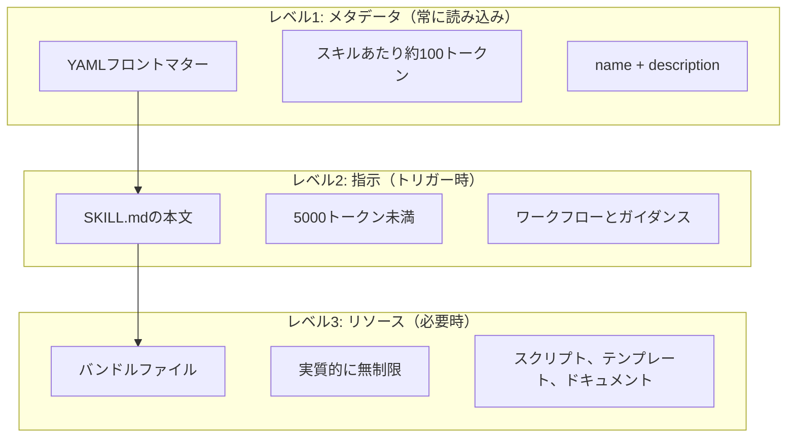
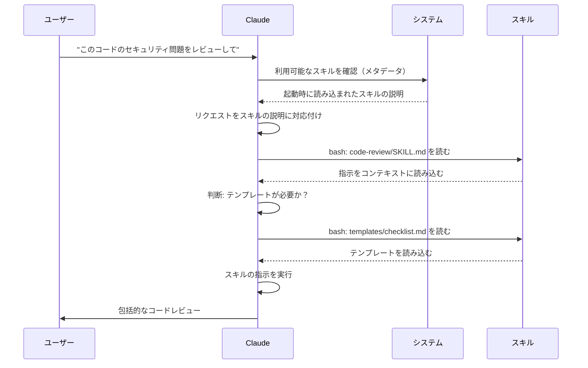

<picture>
  <source media="(prefers-color-scheme: dark)" srcset="../resources/logos/claude-howto-logo-dark.svg">
  
</picture>

# エージェントスキルガイド

エージェントスキルは、Claudeの機能を拡張するファイルシステムベースの再利用可能な機能です。ドメイン固有の専門知識、ワークフロー、ベストプラクティスを、Claudeが関連するときに自動的に使用できる探索可能なコンポーネントにパッケージ化します。

## 概要

**エージェントスキル**は、汎用エージェントをスペシャリストに変えるモジュラーな機能です。プロンプト（1回限りのタスクのための会話レベルの指示）とは異なり、スキルはオンデマンドで読み込まれ、複数の会話にわたって同じガイダンスを繰り返し提供する必要をなくします。

### 主なメリット

- **Claudeを専門化**: ドメイン固有タスクのための機能をカスタマイズ
- **繰り返しを削減**: 一度作成すれば、会話全体で自動的に使用
- **機能を組み合わせる**: スキルを組み合わせて複雑なワークフローを構築
- **ワークフローをスケール**: 複数のプロジェクトやチームでスキルを再利用
- **品質を維持**: ベストプラクティスをワークフローに直接組み込む

スキルは [Agent Skills](https://agentskills.io) オープン標準に従い、複数のAIツールで機能します。Claude Codeは呼び出し制御、サブエージェント実行、動的コンテキストインジェクションなどの追加機能で標準を拡張しています。

> **注意**: カスタムスラッシュコマンドはスキルにマージされました。`.claude/commands/` ファイルは引き続き動作し、同じフロントマターフィールドをサポートします。スキルは新規開発に推奨されます。同じパスに両方が存在する場合（例: `.claude/commands/review.md` と `.claude/skills/review/SKILL.md`）、スキルが優先されます。

## スキルの仕組み: プログレッシブディスクロージャー

スキルは**プログレッシブディスクロージャー**アーキテクチャを活用しています。Claudeはコンテキストを事前に消費するのではなく、必要に応じて段階的に情報を読み込みます。これにより、無制限のスケーラビリティを維持しながら効率的なコンテキスト管理が可能になります。

### 3段階の読み込み



| レベル | 読み込みタイミング | トークンコスト | コンテンツ |
|--------|-----------------|--------------|----------|
| **レベル1: メタデータ** | 常に（起動時） | スキルあたり約100トークン | YAMLフロントマターの `name` と `description` |
| **レベル2: 指示** | スキルがトリガーされた時 | 5000トークン未満 | 指示とガイダンスを含むSKILL.mdの本文 |
| **レベル3+: リソース** | 必要に応じて | 実質的に無制限 | コンテンツをコンテキストに読み込まずbashで実行するバンドルファイル |

多くのスキルをインストールしてもコンテキストペナルティなし。Claudeは実際にトリガーされるまで、各スキルが存在することとその使いどころのみを把握しています。

## スキルの読み込みプロセス



## スキルの種類と場所

| 種類 | 場所 | スコープ | 共有 | 最適な用途 |
|------|------|----------|------|-----------|
| **エンタープライズ** | マネージド設定 | 全組織ユーザー | あり | 組織全体の標準 |
| **個人** | `~/.claude/skills/<skill-name>/SKILL.md` | 個人 | なし | 個人のワークフロー |
| **プロジェクト** | `.claude/skills/<skill-name>/SKILL.md` | チーム | あり（git経由） | チーム標準 |
| **プラグイン** | `<plugin>/skills/<skill-name>/SKILL.md` | 有効化された場所 | 依存 | プラグインにバンドル |

スキルが複数のレベルで同じ名前を共有する場合、優先度の高い場所が勝ちます：**エンタープライズ > 個人 > プロジェクト**。プラグインスキルは `plugin-name:skill-name` という名前空間を使うため競合しません。

### 自動探索

**ネストされたディレクトリ**: サブディレクトリ内のファイルを操作する際、Claude Codeはネストされた `.claude/skills/` ディレクトリからスキルを自動探索します。例えば、`packages/frontend/` のファイルを編集している場合、`packages/frontend/.claude/skills/` のスキルも探索します。これによりパッケージ固有のスキルを持つモノレポをサポートします。

**`--add-dir` ディレクトリ**: `--add-dir` で追加されたディレクトリのスキルは、ライブ変更検出付きで自動読み込みされます。それらのディレクトリのスキルファイルへの変更は、Claude Codeを再起動せずに即座に反映されます。

**説明バジェット**: スキルの説明（レベル1メタデータ）はコンテキストウィンドウの**2%**に制限されます（フォールバック: **16,000文字**）。多くのスキルをインストールしている場合、一部が除外されることがあります。`/context` を実行して警告を確認してください。`SLASH_COMMAND_TOOL_CHAR_BUDGET` 環境変数でバジェットを上書きできます。

## カスタムスキルの作成

### 基本ディレクトリ構造

```
my-skill/
├── SKILL.md           # メイン指示（必須）
├── template.md        # Claudeが記入するテンプレート
├── examples/
│   └── sample.md      # 期待される形式を示すサンプル出力
└── scripts/
    └── validate.sh    # Claudeが実行できるスクリプト
```

### SKILL.mdの形式

```yaml
---
name: your-skill-name
description: このスキルの機能と使うタイミングの簡単な説明
---

# スキル名

## 指示
Claudeへの明確なステップバイステップのガイダンスを提供する。

## 例
このスキルの使い方の具体例を示す。
```

### 必須フィールド

- **name**: 小文字、数字、ハイフンのみ（最大64文字）。"anthropic"または"claude"を含めることはできない。
- **description**: スキルの機能とそれを使うタイミング（最大1024文字）。Claudeがいつスキルをアクティブ化するかを知るために重要。

### オプションのフロントマターフィールド

```yaml
---
name: my-skill
description: このスキルの機能と使うタイミング
argument-hint: "[filename] [format]"        # オートコンプリートのヒント
disable-model-invocation: true              # ユーザーのみが呼び出し可能
user-invocable: false                       # スラッシュメニューから非表示
allowed-tools: Read, Grep, Glob             # ツールアクセスを制限
model: opus                                 # 使用する特定モデル
effort: high                                # 努力レベルの上書き (low, medium, high, max)
context: fork                               # 隔離されたサブエージェントで実行
agent: Explore                              # エージェントの種類（context: fork使用時）
shell: bash                                 # コマンド用シェル: bash（デフォルト）またはpowershell
hooks:                                      # スキルスコープのhooks
  PreToolUse:
    - matcher: "Bash"
      hooks:
        - type: command
          command: "./scripts/validate.sh"
---
```

| フィールド | 説明 |
|-----------|------|
| `name` | 小文字、数字、ハイフンのみ（最大64文字）。"anthropic"または"claude"を含めることはできない。 |
| `description` | スキルの機能とそれを使うタイミング（最大1024文字）。自動呼び出しマッチングに重要。 |
| `argument-hint` | `/` オートコンプリートメニューに表示されるヒント（例: `"[filename] [format]"`）。 |
| `disable-model-invocation` | `true` = ユーザーのみが `/name` で呼び出し可能。Claudeが自動呼び出しすることはない。 |
| `user-invocable` | `false` = `/` メニューから非表示。Claudeのみが自動的に呼び出し可能。 |
| `allowed-tools` | パーミッションプロンプトなしでスキルが使用できるツールのカンマ区切りリスト。 |
| `model` | スキルがアクティブな間のモデル上書き（例: `opus`、`sonnet`）。 |
| `effort` | スキルがアクティブな間の努力レベル上書き: `low`、`medium`、`high`、`max`。 |
| `context` | `fork` でスキルを独自のコンテキストウィンドウを持つフォークされたサブエージェントコンテキストで実行。 |
| `agent` | `context: fork` 使用時のサブエージェント種類（例: `Explore`、`Plan`、`general-purpose`）。 |
| `shell` | `` !`command` `` 置換とスクリプト用のシェル: `bash`（デフォルト）または `powershell`。 |
| `hooks` | このスキルのライフサイクルにスコープされたhooks（グローバルhooksと同じ形式）。 |

## スキルのコンテンツ種類

スキルには2種類のコンテンツがあり、それぞれ異なる目的に適しています：

### 参照コンテンツ

現在の作業に適用する知識をClaudeに追加します。規約、パターン、スタイルガイド、ドメイン知識。会話コンテキストとインラインで実行されます。

```yaml
---
name: api-conventions
description: このコードベースのAPI設計パターン
---

APIエンドポイントを書く際:
- RESTfulの命名規則を使用する
- 一貫したエラー形式を返す
- リクエストバリデーションを含める
```

### タスクコンテンツ

特定のアクションのためのステップバイステップの指示。多くの場合、`/skill-name` で直接呼び出します。

```yaml
---
name: deploy
description: アプリケーションを本番環境にデプロイする
context: fork
disable-model-invocation: true
---

アプリケーションをデプロイする:
1. テストスイートを実行する
2. アプリケーションをビルドする
3. デプロイ先にプッシュする
```

## スキル呼び出しの制御

デフォルトでは、あなたとClaudeの両方が任意のスキルを呼び出せます。2つのフロントマターフィールドで3つの呼び出しモードを制御できます：

| フロントマター | ユーザーが呼び出せる | Claudeが呼び出せる |
|---|---|---|
| （デフォルト） | はい | はい |
| `disable-model-invocation: true` | はい | いいえ |
| `user-invocable: false` | いいえ | はい |

**`disable-model-invocation: true` を使う場面**: 副作用のあるワークフロー: `/commit`、`/deploy`、`/send-slack-message`。コードが準備できているように見えるからといってClaudeに自動デプロイさせたくない場合。

**`user-invocable: false` を使う場面**: アクションとして実行可能ではないバックグラウンドの知識。`legacy-system-context` スキルが古いシステムの仕組みを説明する場合、Claudeには役立つがユーザーには意味のあるアクションではない。

## 文字列置換

スキルはスキルコンテンツがClaudeに渡される前に解決される動的な値をサポートします：

| 変数 | 説明 |
|------|------|
| `$ARGUMENTS` | スキル呼び出し時に渡されたすべての引数 |
| `$ARGUMENTS[N]` または `$N` | インデックスによる特定の引数へのアクセス（0ベース） |
| `${CLAUDE_SESSION_ID}` | 現在のセッションID |
| `${CLAUDE_SKILL_DIR}` | スキルのSKILL.mdファイルが含まれるディレクトリ |
| `` !`command` `` | 動的コンテキストインジェクション — シェルコマンドを実行して出力をインライン展開 |

**例:**

```yaml
---
name: fix-issue
description: GitHubのissueを修正する
---

コーディング標準に従ってGitHub issue $ARGUMENTS を修正する。
1. issueの説明を読む
2. 修正を実装する
3. テストを書く
4. コミットを作成する
```

`/fix-issue 123` を実行すると `$ARGUMENTS` が `123` に置換されます。

## 動的コンテキストのインジェクション

`` !`command` `` 構文はスキルコンテンツがClaudeに送信される前にシェルコマンドを実行します：

```yaml
---
name: pr-summary
description: プルリクエストの変更をまとめる
context: fork
agent: Explore
---

## プルリクエストのコンテキスト
- PRの差分: !`gh pr diff`
- PRのコメント: !`gh pr view --comments`
- 変更ファイル: !`gh pr diff --name-only`

## タスク
このプルリクエストをまとめる...
```

コマンドは即座に実行されます。Claudeは最終的な出力のみを見ます。デフォルトでは `bash` でコマンドが実行されます。フロントマターで `shell: powershell` を設定するとPowerShellを使用します。

## サブエージェントでスキルを実行する

`context: fork` を追加すると、スキルを隔離されたサブエージェントコンテキストで実行します。スキルのコンテンツは、独自のコンテキストウィンドウを持つ専用サブエージェントのタスクになり、メインの会話をクリーンに保ちます。

`agent` フィールドで使用するエージェントの種類を指定します：

| エージェントの種類 | 最適な用途 |
|---|---|
| `Explore` | 読み取り専用の調査、コードベース分析 |
| `Plan` | 実装計画の作成 |
| `general-purpose` | すべてのツールが必要な広範なタスク |
| カスタムエージェント | 設定で定義された専門エージェント |

**フロントマター例:**

```yaml
---
context: fork
agent: Explore
---
```

**完全なスキル例:**

```yaml
---
name: deep-research
description: トピックを徹底的に調査する
context: fork
agent: Explore
---

$ARGUMENTS を徹底的に調査する:
1. GlobとGrepを使って関連ファイルを見つける
2. コードを読んで分析する
3. 具体的なファイル参照付きで調査結果をまとめる
```

## 実践例

### 例1: コードレビュースキル

**ディレクトリ構造:**

```
~/.claude/skills/code-review/
├── SKILL.md
├── templates/
│   ├── review-checklist.md
│   └── finding-template.md
└── scripts/
    ├── analyze-metrics.py
    └── compare-complexity.py
```

**ファイル:** `~/.claude/skills/code-review/SKILL.md`

```yaml
---
name: code-review-specialist
description: セキュリティ、パフォーマンス、品質分析を含む包括的なコードレビュー。コードのレビュー、コード品質の分析、プルリクエストの評価、またはコードレビュー、セキュリティ分析、パフォーマンス最適化の言及があった場合に使用する。
---

# コードレビュースキル

このスキルは以下に注力した包括的なコードレビュー機能を提供します：

1. **セキュリティ分析**
   - 認証/認可の問題
   - データ露出リスク
   - インジェクション脆弱性
   - 暗号化の弱点

2. **パフォーマンスレビュー**
   - アルゴリズム効率（Big O分析）
   - メモリ最適化
   - データベースクエリ最適化
   - キャッシングの機会

3. **コード品質**
   - SOLIDの原則
   - デザインパターン
   - 命名規則
   - テストカバレッジ

4. **保守性**
   - コードの読みやすさ
   - 関数のサイズ（50行未満であるべき）
   - サイクロマティック複雑度
   - 型安全性

## レビューテンプレート

レビューするコードの各部分について提供する内容:

### サマリー
- 全体的な品質評価（1-5）
- 主要な発見の数
- 推奨される優先エリア

### クリティカルな問題（あれば）
- **問題**: 明確な説明
- **場所**: ファイルと行番号
- **影響**: これが重要な理由
- **深刻度**: Critical/High/Medium
- **修正方法**: コード例

詳細なチェックリストは [templates/review-checklist.md](templates/review-checklist.md) を参照。
```

### 例2: コードベースビジュアライザースキル

インタラクティブなHTMLビジュアライゼーションを生成するスキル：

**ディレクトリ構造:**

```
~/.claude/skills/codebase-visualizer/
├── SKILL.md
└── scripts/
    └── visualize.py
```

**ファイル:** `~/.claude/skills/codebase-visualizer/SKILL.md`

```yaml
---
name: codebase-visualizer
description: コードベースのインタラクティブな折りたたみ可能なツリービジュアライゼーションを生成する。新しいリポジトリを探索したり、プロジェクト構造を理解したり、大きなファイルを特定したりする場合に使用する。
allowed-tools: Bash(python *)
---

# コードベースビジュアライザー

プロジェクトのファイル構造を示すインタラクティブなHTMLツリービューを生成します。

## 使い方

プロジェクトルートからビジュアライゼーションスクリプトを実行:

```bash
python ~/.claude/skills/codebase-visualizer/scripts/visualize.py .
```

`codebase-map.html` が作成され、デフォルトブラウザで開かれます。

## ビジュアライゼーションの内容

- **折りたたみ可能なディレクトリ**: フォルダをクリックして展開/折りたたみ
- **ファイルサイズ**: 各ファイルの隣に表示
- **カラー**: ファイルタイプによって異なる色
- **ディレクトリ合計**: 各フォルダの合計サイズを表示
```

バンドルされたPythonスクリプトが重い処理を担い、Claudeがオーケストレーションを処理します。

### 例3: デプロイスキル（ユーザー呼び出しのみ）

```yaml
---
name: deploy
description: アプリケーションを本番環境にデプロイする
disable-model-invocation: true
allowed-tools: Bash(npm *), Bash(git *)
---

$ARGUMENTS を本番環境にデプロイする:

1. テストスイートを実行: `npm test`
2. アプリケーションをビルド: `npm run build`
3. デプロイ先にプッシュ
4. デプロイが成功したことを確認
5. デプロイのステータスを報告
```

### 例4: ブランドボイススキル（バックグラウンド知識）

```yaml
---
name: brand-voice
description: すべてのコミュニケーションがブランドのボイスとトーンガイドラインに合致していることを確認する。マーケティングコピー、顧客コミュニケーション、または公開向けコンテンツを作成する際に使用する。
user-invocable: false
---

## トーンオブボイス
- **親しみやすくプロフェッショナル** - カジュアルにならずに親しみやすく
- **明確で簡潔** - 専門用語を避ける
- **自信がある** - 自分たちが何をしているか分かっている
- **共感的** - ユーザーのニーズを理解する

## ライティングガイドライン
- 読者に話しかける際は "you" を使用
- 能動態を使用
- 文章は20語以内に抑える
- 価値提案から始める

テンプレートは [templates/](templates/) を参照。
```

### 例5: CLAUDE.mdジェネレータースキル

```yaml
---
name: claude-md
description: 最適なAIエージェントオンボーディングのためのベストプラクティスに従ってCLAUDE.mdファイルを作成または更新する。CLAUDE.md、プロジェクトドキュメント、またはAIオンボーディングの言及があった場合に使用する。
---

## コア原則

**LLMはステートレス**: CLAUDE.mdはすべての会話に自動的にインクルードされる唯一のファイルです。

### ゴールデンルール

1. **Less is More**: 300行以内に抑える（理想は100行以内）
2. **普遍的な適用可能性**: すべてのセッションに関連する情報のみを含める
3. **ClaudeをLinterとして使わない**: 代わりに決定論的なツールを使用
4. **自動生成しない**: 慎重に検討して手動で作成する

## 必須セクション

- **プロジェクト名**: 1行の簡単な説明
- **Tech Stack**: 主要言語、フレームワーク、データベース
- **開発コマンド**: インストール、テスト、ビルドコマンド
- **重要な規約**: 明らかでない、影響の大きい規約のみ
- **既知の問題/注意点**: 開発者がつまずきやすいこと
```

### 例6: スクリプト付きリファクタリングスキル

**ディレクトリ構造:**

```
refactor/
├── SKILL.md
├── references/
│   ├── code-smells.md
│   └── refactoring-catalog.md
├── templates/
│   └── refactoring-plan.md
└── scripts/
    ├── analyze-complexity.py
    └── detect-smells.py
```

**ファイル:** `refactor/SKILL.md`

```yaml
---
name: code-refactor
description: Martin Fowlerの方法論に基づく体系的なコードリファクタリング。コードのリファクタリング、コード構造の改善、技術的負債の削減、またはコードスメルの解消の依頼があった場合に使用する。
---

# コードリファクタリングスキル

テストに裏打ちされた安全で段階的な変更を重視したフェーズドアプローチ。

## ワークフロー

フェーズ1: 調査・分析 → フェーズ2: テストカバレッジ評価 →
フェーズ3: コードスメルの特定 → フェーズ4: リファクタリング計画の作成 →
フェーズ5: 段階的な実装 → フェーズ6: レビューと反復

## コア原則

1. **動作の保持**: 外部の動作は変わらないようにする
2. **小さな変更**: 小さくテスト可能な変更を行う
3. **テスト駆動**: テストがセーフティネット
4. **継続的**: リファクタリングは継続的なプロセス、一回限りのイベントではない

コードスメルのカタログは [references/code-smells.md](references/code-smells.md) を参照。
リファクタリング技法は [references/refactoring-catalog.md](references/refactoring-catalog.md) を参照。
```

## サポートファイル

スキルには `SKILL.md` 以外の複数のファイルをディレクトリに含めることができます。これらのサポートファイル（テンプレート、例、スクリプト、参照ドキュメント）により、メインのスキルファイルをフォーカスした状態に保ちながら、Claudeが必要に応じて読み込める追加リソースを提供できます。

```
my-skill/
├── SKILL.md              # メイン指示（必須、500行以内に抑える）
├── templates/            # Claudeが記入するテンプレート
│   └── output-format.md
├── examples/             # 期待される形式を示すサンプル出力
│   └── sample-output.md
├── references/           # ドメイン知識と仕様
│   └── api-spec.md
└── scripts/              # Claudeが実行できるスクリプト
    └── validate.sh
```

サポートファイルのガイドライン:

- `SKILL.md` は**500行以内**に抑える。詳細な参照資料、大きな例、仕様は別ファイルに移す。
- `SKILL.md` から追加ファイルを**相対パス**で参照する（例: `[APIリファレンス](references/api-spec.md)`）。
- サポートファイルはレベル3（必要に応じて）で読み込まれるため、Claudeが実際に読むまでコンテキストを消費しない。

## スキルの管理

### 利用可能なスキルの確認

Claudeに直接確認:
```
利用可能なスキルは何ですか？
```

またはファイルシステムを確認:
```bash
# 個人スキルの一覧
ls ~/.claude/skills/

# プロジェクトスキルの一覧
ls .claude/skills/
```

### スキルのテスト

2つのテスト方法:

**Claudeに自動呼び出しさせる** には、説明にマッチするリクエストをする:
```
このコードのセキュリティ問題のレビューをお願いできますか？
```

**または直接呼び出す** には、スキル名を使用:
```
/code-review src/auth/login.ts
```

### スキルの更新

`SKILL.md` ファイルを直接編集します。変更は次回のClaude Code起動時に有効になります。

```bash
# 個人スキル
code ~/.claude/skills/my-skill/SKILL.md

# プロジェクトスキル
code .claude/skills/my-skill/SKILL.md
```

### ClaudeのスキルアクセスIを制限する

スキルを呼び出せるスキルを制御する3つの方法:

**`/permissions` ですべてのスキルを無効化**:
```
# 拒否ルールに追加:
Skill
```

**特定のスキルを許可または拒否**:
```
# 特定のスキルのみ許可
Skill(commit)
Skill(review-pr *)

# 特定のスキルを拒否
Skill(deploy *)
```

**個別のスキルを非表示にする** には、フロントマターに `disable-model-invocation: true` を追加。

## ベストプラクティス

### 1. 説明を具体的にする

- **悪い例（曖昧）**: "ドキュメントを助ける"
- **良い例（具体的）**: "PDFファイルからテキストとテーブルを抽出し、フォームに記入し、ドキュメントをマージする。PDFファイルを扱う場合や、ユーザーがPDF、フォーム、ドキュメント抽出を言及した場合に使用する。"

### 2. スキルをフォーカスした状態に保つ

- 1スキル = 1機能
- ✅ "PDFフォームへの記入"
- ❌ "ドキュメント処理"（広すぎる）

### 3. トリガーキーワードを含める

ユーザーのリクエストにマッチするキーワードを説明に追加:
```yaml
description: Excelスプレッドシートを分析し、ピボットテーブルを生成し、チャートを作成する。Excelファイル、スプレッドシート、または.xlsxファイルを扱う場合に使用する。
```

### 4. SKILL.mdを500行以内に保つ

詳細な参照資料は、Claudeが必要に応じて読み込む別ファイルに移す。

### 5. サポートファイルを参照する

```markdown
## 追加リソース

- 完全なAPI詳細は [reference.md](reference.md) を参照
- 使用例は [examples.md](examples.md) を参照
```

### やること

- 明確で説明的な名前を使用する
- 包括的な指示を含める
- 具体的な例を追加する
- 関連するスクリプトとテンプレートをパッケージ化する
- 実際のシナリオでテストする
- 依存関係をドキュメント化する

### やってはいけないこと

- 1回限りのタスクのためにスキルを作らない
- 既存の機能を重複させない
- スキルを広くしすぎない
- descriptionフィールドをスキップしない
- 信頼できないソースからのスキルを監査せずにインストールしない

## トラブルシューティング

### クイックリファレンス

| 問題 | 解決策 |
|------|--------|
| Claudeがスキルを使わない | トリガーキーワードで説明をより具体的にする |
| スキルファイルが見つからない | パスを確認: `~/.claude/skills/name/SKILL.md` |
| YAMLエラー | `---` マーカー、インデント、タブがないことを確認 |
| スキルが競合する | 説明に明確なトリガーキーワードを使用する |
| スクリプトが実行されない | パーミッションを確認: `chmod +x scripts/*.py` |
| Claudeがすべてのスキルを見えない | スキルが多すぎる。`/context` で警告を確認 |

### スキルがトリガーされない

期待通りにスキルが使われない場合:

1. 説明にユーザーが自然に言いそうなキーワードが含まれているか確認
2. "利用可能なスキルは何ですか？"と聞いた時にスキルが表示されるか確認
3. 説明にマッチするようにリクエストを言い換えてみる
4. `/skill-name` で直接呼び出してテストする

### スキルが頻繁にトリガーされすぎる

意図しない時にスキルが使われる場合:

1. 説明をより具体的にする
2. 手動呼び出しのみにするために `disable-model-invocation: true` を追加

### Claudeがすべてのスキルを見えない

スキルの説明はコンテキストウィンドウの**2%**（フォールバック: **16,000文字**）で読み込まれます。`/context` を実行して除外されたスキルの警告を確認してください。`SLASH_COMMAND_TOOL_CHAR_BUDGET` 環境変数でバジェットを上書きできます。

## セキュリティに関する考慮事項

**信頼できるソースのスキルのみ使用してください。** スキルは指示やコードを通じてClaudeに機能を提供します。悪意のあるスキルはClaudeに有害な方法でツールを呼び出したりコードを実行させたりする可能性があります。

**主なセキュリティ上の考慮事項:**

- **徹底的に監査する**: スキルディレクトリ内のすべてのファイルをレビューする
- **外部ソースはリスクがある**: 外部URLからフェッチするスキルは侵害される可能性がある
- **ツールの悪用**: 悪意のあるスキルは有害な方法でツールを呼び出す可能性がある
- **ソフトウェアのインストールと同様に扱う**: 信頼できるソースのスキルのみ使用する

## スキルと他の機能の比較

| 機能 | 呼び出し方法 | 最適な用途 |
|------|------------|-----------|
| **スキル** | 自動または `/name` | 再利用可能な専門知識、ワークフロー |
| **スラッシュコマンド** | ユーザーによる `/name` | クイックショートカット（スキルにマージ済み） |
| **サブエージェント** | 自動委譲 | 隔離されたタスク実行 |
| **メモリ (CLAUDE.md)** | 常に読み込み | 永続的なプロジェクトコンテキスト |
| **MCP** | リアルタイム | 外部データ/サービスへのアクセス |
| **Hooks** | イベント駆動 | 自動化された副作用 |

## バンドルスキル

Claude Codeにはインストール不要で常に利用可能ないくつかの組み込みスキルが含まれています：

| スキル | 説明 |
|--------|------|
| `/simplify` | 変更されたファイルを再利用性、品質、効率の観点でレビュー。3つの並列レビューエージェントを生成 |
| `/batch <instruction>` | git worktreeを使ってコードベース全体に大規模な並列変更をオーケストレート |
| `/debug [description]` | デバッグログを読んで現在のセッションのトラブルシューティング |
| `/loop [interval] <prompt>` | 一定間隔でプロンプトを繰り返し実行（例: `/loop 5m check the deploy`） |
| `/claude-api` | Claude API/SDKリファレンスを読み込む。`anthropic`/`@anthropic-ai/sdk`のインポート時に自動アクティブ化 |

これらのスキルはすぐに使用でき、設定不要です。カスタムスキルと同じSKILL.md形式に従っています。

## スキルの共有

### プロジェクトスキル（チームでの共有）

1. `.claude/skills/` にスキルを作成
2. gitにコミット
3. チームメンバーが変更をプル — スキルがすぐに利用可能

### 個人スキル

```bash
# 個人ディレクトリにコピー
cp -r my-skill ~/.claude/skills/

# スクリプトを実行可能にする
chmod +x ~/.claude/skills/my-skill/scripts/*.py
```

### プラグイン配布

スキルをプラグインの `skills/` ディレクトリにパッケージ化して広く配布できます。

## 追加リソース

- [公式スキルドキュメント](https://code.claude.com/docs/en/skills)
- [エージェントスキルアーキテクチャブログ](https://claude.com/blog/equipping-agents-for-the-real-world-with-agent-skills)
- [スキルリポジトリ](https://github.com/luongnv89/skills) - すぐに使えるスキルのコレクション
- [スラッシュコマンドガイド](../01-slash-commands/) - ユーザー起動のショートカット
- [サブエージェントガイド](../04-subagents/) - 委譲されたAIエージェント
- [メモリガイド](../02-memory/) - 永続コンテキスト
- [MCP（モデルコンテキストプロトコル）](../05-mcp/) - リアルタイム外部データ
- [Hooksガイド](../06-hooks/) - イベント駆動自動化
