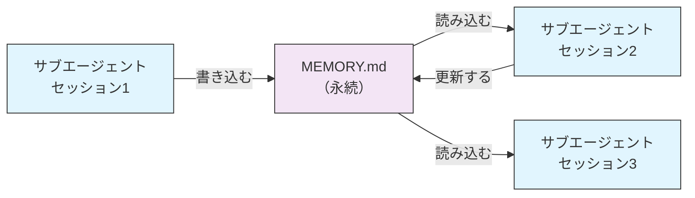
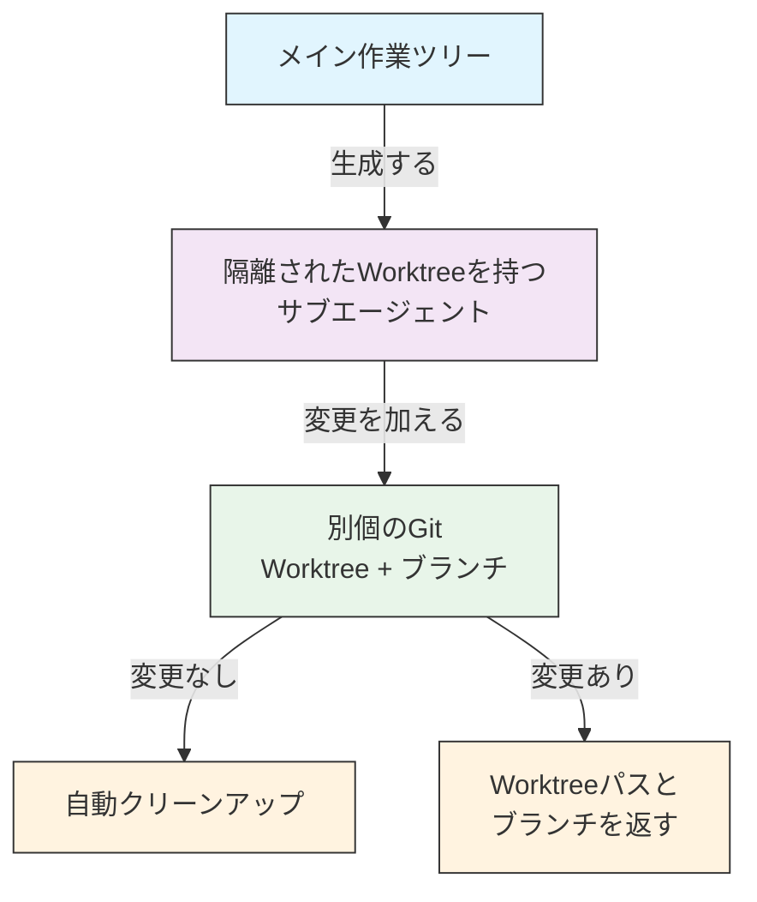
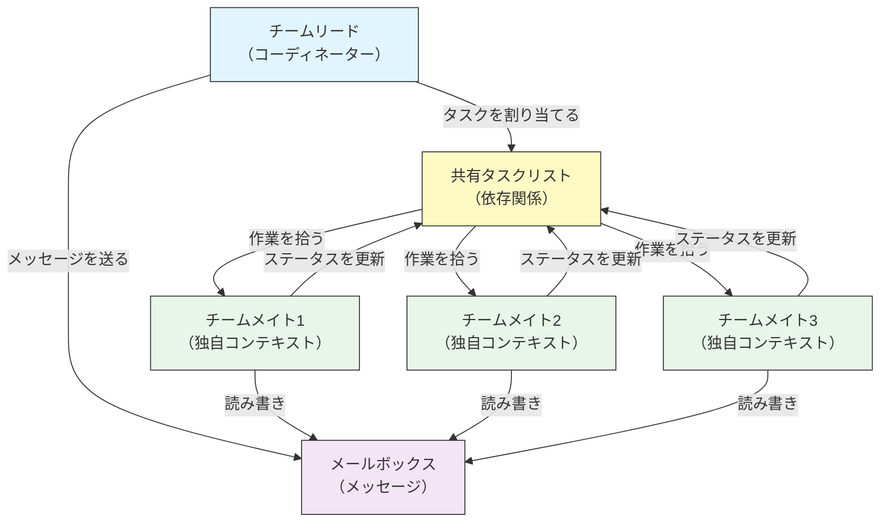
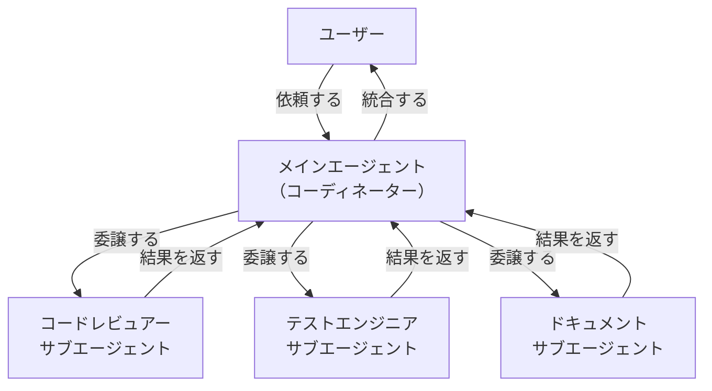
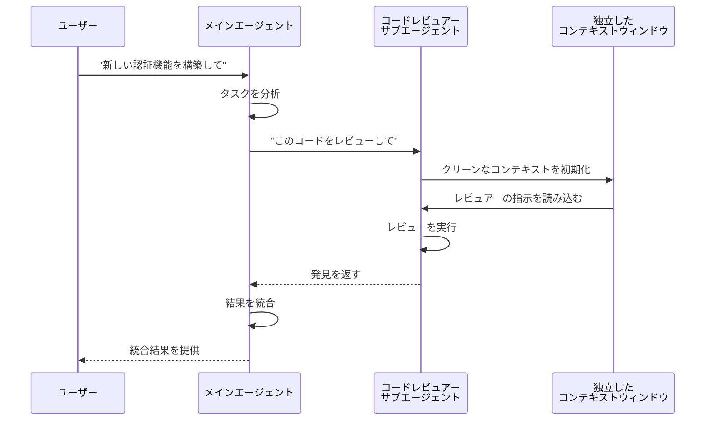
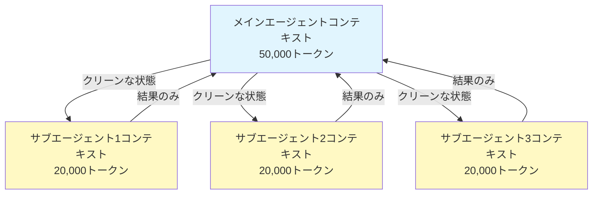
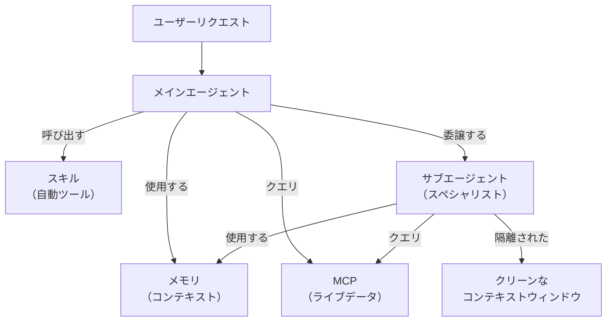

<picture>
  <source media="(prefers-color-scheme: dark)" srcset="../resources/logos/claude-howto-logo-dark.svg">
  
</picture>

# サブエージェント 完全リファレンスガイド

サブエージェントは、Claude Codeがタスクを委譲できる専門化されたAIアシスタントです。各サブエージェントは特定の目的を持ち、メインの会話とは別の独自のコンテキストウィンドウを使用し、特定のツールとカスタムシステムプロンプトで設定できます。

## 目次

1. [概要](#概要)
2. [主なメリット](#主なメリット)
3. [ファイルの場所](#ファイルの場所)
4. [設定](#設定)
5. [組み込みサブエージェント](#組み込みサブエージェント)
6. [サブエージェントの管理](#サブエージェントの管理)
7. [サブエージェントの使い方](#サブエージェントの使い方)
8. [再開可能なエージェント](#再開可能なエージェント)
9. [サブエージェントのチェーン](#サブエージェントのチェーン)
10. [サブエージェントの永続メモリ](#サブエージェントの永続メモリ)
11. [バックグラウンドサブエージェント](#バックグラウンドサブエージェント)
12. [Worktreeの隔離](#worktreeの隔離)
13. [生成可能なサブエージェントの制限](#生成可能なサブエージェントの制限)
14. [`claude agents` CLIコマンド](#claude-agents-cliコマンド)
15. [エージェントチーム（実験的）](#エージェントチーム実験的)
16. [プラグインサブエージェントのセキュリティ](#プラグインサブエージェントのセキュリティ)
17. [アーキテクチャ](#アーキテクチャ)
18. [コンテキスト管理](#コンテキスト管理)
19. [サブエージェントを使うタイミング](#サブエージェントを使うタイミング)
20. [ベストプラクティス](#ベストプラクティス)
21. [このフォルダのサブエージェント例](#このフォルダのサブエージェント例)
22. [インストール手順](#インストール手順)
23. [関連概念](#関連概念)

---

## 概要

サブエージェントはClaude Codeにおける委譲タスク実行を可能にします：

- **隔離されたAIアシスタント**を独立したコンテキストウィンドウで作成
- **カスタマイズされたシステムプロンプト**で専門的な知識を提供
- **ツールアクセス制御**で機能を制限
- 複雑なタスクによる**コンテキスト汚染を防止**
- 複数の専門化されたタスクの**並列実行**を実現

各サブエージェントはクリーンな状態で独立して動作し、自分のタスクに必要な特定のコンテキストのみを受け取り、結果をメインエージェントに返して統合させます。

**クイックスタート**: `/agents` コマンドを使ってサブエージェントをインタラクティブに作成、表示、編集、管理できます。

---

## 主なメリット

| メリット | 説明 |
|---------|------|
| **コンテキスト保護** | 別のコンテキストで動作し、メインの会話の汚染を防ぐ |
| **専門的な知識** | 特定のドメインに特化し、より高い成功率を実現 |
| **再利用性** | 異なるプロジェクト間で使用し、チームと共有可能 |
| **柔軟なパーミッション** | サブエージェントの種類によって異なるツールアクセスレベル |
| **スケーラビリティ** | 複数のエージェントが異なる側面を同時に処理 |

---

## ファイルの場所

サブエージェントファイルは、異なるスコープを持つ複数の場所に保存できます：

| 優先度 | 種類 | 場所 | スコープ |
|--------|------|------|----------|
| 1（最高） | **CLI定義** | `--agents` フラグ（JSON） | セッションのみ |
| 2 | **プロジェクトサブエージェント** | `.claude/agents/` | 現在のプロジェクト |
| 3 | **ユーザーサブエージェント** | `~/.claude/agents/` | すべてのプロジェクト |
| 4（最低） | **プラグインエージェント** | プラグインの `agents/` ディレクトリ | プラグイン経由 |

重複する名前が存在する場合、優先度の高いソースが優先されます。

---

## 設定

### ファイル形式

サブエージェントはYAMLフロントマターとmarkdownのシステムプロンプトで定義されます：

```yaml
---
name: your-sub-agent-name
description: このサブエージェントを呼び出すタイミングの説明
tools: tool1, tool2, tool3  # 省略可 - 省略時はすべてのツールを継承
disallowedTools: tool4  # 省略可 - 明示的に禁止するツール
model: sonnet  # 省略可 - sonnet, opus, haiku, または inherit
permissionMode: default  # 省略可 - パーミッションモード
maxTurns: 20  # 省略可 - エージェントのターン数上限
skills: skill1, skill2  # 省略可 - コンテキストにプリロードするスキル
mcpServers: server1  # 省略可 - 利用可能にするMCPサーバー
memory: user  # 省略可 - 永続メモリスコープ (user, project, local)
background: false  # 省略可 - バックグラウンドタスクとして実行
effort: high  # 省略可 - 推論の努力レベル (low, medium, high, max)
isolation: worktree  # 省略可 - git worktreeの隔離
initialPrompt: "Start by analyzing the codebase"  # 省略可 - メインエージェント起動時に自動送信される最初のターン
hooks:  # 省略可 - コンポーネントスコープのhooks
  PreToolUse:
    - matcher: "Bash"
      hooks:
        - type: command
          command: "./scripts/security-check.sh"
---

サブエージェントのシステムプロンプトをここに記述します。複数段落にわたることができ、
サブエージェントの役割、能力、問題解決のアプローチを明確に定義するべきです。
```

### 設定フィールド

| フィールド | 必須 | 説明 |
|-----------|------|------|
| `name` | はい | 一意な識別子（小文字とハイフンのみ） |
| `description` | はい | 目的の自然言語による説明。自動呼び出しを促すには "use PROACTIVELY" を含める |
| `tools` | いいえ | 特定のツールのカンマ区切りリスト。省略するとすべてのツールを継承。生成可能なサブエージェントを制限する `Agent(agent_name)` 構文をサポート |
| `disallowedTools` | いいえ | サブエージェントが使ってはいけないツールのカンマ区切りリスト |
| `model` | いいえ | 使用するモデル: `sonnet`、`opus`、`haiku`、フルモデルID、または `inherit`。デフォルトは設定済みのサブエージェントモデル |
| `permissionMode` | いいえ | `default`、`acceptEdits`、`dontAsk`、`bypassPermissions`、`plan` |
| `maxTurns` | いいえ | サブエージェントが実行できるエージェントターンの最大数 |
| `skills` | いいえ | プリロードするスキルのカンマ区切りリスト。起動時にサブエージェントのコンテキストにスキルの全内容をインジェクト |
| `mcpServers` | いいえ | サブエージェントで利用可能にするMCPサーバー |
| `hooks` | いいえ | コンポーネントスコープのhooks（PreToolUse、PostToolUse、Stop） |
| `memory` | いいえ | 永続メモリディレクトリのスコープ: `user`、`project`、または `local` |
| `background` | いいえ | `true` に設定するとこのサブエージェントを常にバックグラウンドタスクとして実行 |
| `effort` | いいえ | 推論の努力レベル: `low`、`medium`、`high`、または `max` |
| `isolation` | いいえ | `worktree` に設定するとサブエージェントに独自のgit worktreeを与える |
| `initialPrompt` | いいえ | サブエージェントがメインエージェントとして実行された時に自動送信される最初のターン |

### ツール設定オプション

**オプション1: すべてのツールを継承（フィールドを省略）**
```yaml
---
name: full-access-agent
description: すべての利用可能なツールを持つエージェント
---
```

**オプション2: 個別のツールを指定**
```yaml
---
name: limited-agent
description: 特定のツールのみを持つエージェント
tools: Read, Grep, Glob, Bash
---
```

**オプション3: 条件付きツールアクセス**
```yaml
---
name: conditional-agent
description: フィルタリングされたツールアクセスを持つエージェント
tools: Read, Bash(npm:*), Bash(test:*)
---
```

### CLIベースの設定

`--agents` フラグとJSON形式を使って1回のセッション用にサブエージェントを定義：

```bash
claude --agents '{
  "code-reviewer": {
    "description": "エキスパートコードレビュアー。コード変更後に積極的に使用。",
    "prompt": "あなたはシニアコードレビュアーです。コード品質、セキュリティ、ベストプラクティスに注力してください。",
    "tools": ["Read", "Grep", "Glob", "Bash"],
    "model": "sonnet"
  }
}'
```

**`--agents` フラグのJSON形式:**

```json
{
  "agent-name": {
    "description": "必須: このエージェントを呼び出すタイミング",
    "prompt": "必須: エージェントのシステムプロンプト",
    "tools": ["省略可", "ツールの", "配列"],
    "model": "省略可: sonnet|opus|haiku"
  }
}
```

**エージェント定義の優先順位:**

エージェント定義は以下の優先順位で読み込まれます（最初のマッチが勝ち）：
1. **CLI定義** - `--agents` フラグ（セッションのみ、JSON）
2. **プロジェクトレベル** - `.claude/agents/`（現在のプロジェクト）
3. **ユーザーレベル** - `~/.claude/agents/`（すべてのプロジェクト）
4. **プラグインレベル** - プラグインの `agents/` ディレクトリ

これにより、CLIの定義が1回のセッションで他のすべてのソースを上書きできます。

---

## 組み込みサブエージェント

Claude Codeには常に利用可能ないくつかの組み込みサブエージェントが含まれています：

| エージェント | モデル | 目的 |
|------------|--------|------|
| **general-purpose** | 継承 | 複雑なマルチステップタスク |
| **Plan** | 継承 | プランモードのリサーチ |
| **Explore** | Haiku | 読み取り専用コードベース探索（quick/medium/very thorough） |
| **Bash** | 継承 | 別コンテキストでのターミナルコマンド |
| **statusline-setup** | Sonnet | ステータスラインの設定 |
| **Claude Code Guide** | Haiku | Claude Codeの機能に関する質問への回答 |

### General-Purposeサブエージェント

| プロパティ | 値 |
|-----------|-----|
| **モデル** | 親から継承 |
| **ツール** | すべてのツール |
| **目的** | 複雑なリサーチタスク、マルチステップ操作、コード修正 |

**使用タイミング**: 複雑な推論と探索・修正の両方が必要なタスク。

### Planサブエージェント

| プロパティ | 値 |
|-----------|-----|
| **モデル** | 親から継承 |
| **ツール** | Read、Glob、Grep、Bash |
| **目的** | プランモードでコードベースを調査するために自動使用 |

**使用タイミング**: Claudeがプランを提示する前にコードベースを理解する必要がある時。

### Exploreサブエージェント

| プロパティ | 値 |
|-----------|-----|
| **モデル** | Haiku（高速、低レイテンシ） |
| **モード** | 厳密に読み取り専用 |
| **ツール** | Glob、Grep、Read、Bash（読み取り専用コマンドのみ） |
| **目的** | 高速なコードベース検索と分析 |

**使用タイミング**: 変更を加えずにコードを検索/理解する時。

**詳細レベル** - 探索の深さを指定：
- **"quick"** - 最小限の探索での高速検索。特定のパターンを見つけるのに適している
- **"medium"** - 中程度の探索。速度と徹底さのバランス、デフォルトのアプローチ
- **"very thorough"** - 複数の場所と命名規則にわたる包括的な分析。時間がかかる場合がある

### Bashサブエージェント

| プロパティ | 値 |
|-----------|-----|
| **モデル** | 親から継承 |
| **ツール** | Bash |
| **目的** | 別のコンテキストウィンドウでターミナルコマンドを実行 |

**使用タイミング**: 隔離されたコンテキストが有益なシェルコマンドを実行する時。

### Statusline Setupサブエージェント

| プロパティ | 値 |
|-----------|-----|
| **モデル** | Sonnet |
| **ツール** | Read、Write、Bash |
| **目的** | Claude Codeのステータスライン表示を設定 |

**使用タイミング**: ステータスラインをセットアップまたはカスタマイズする時。

### Claude Code Guideサブエージェント

| プロパティ | 値 |
|-----------|-----|
| **モデル** | Haiku（高速、低レイテンシ） |
| **ツール** | 読み取り専用 |
| **目的** | Claude Codeの機能と使い方に関する質問に回答 |

**使用タイミング**: ユーザーがClaude Codeの動作や特定の機能の使い方について質問する時。

---

## サブエージェントの管理

### `/agents` コマンドを使用（推奨）

```bash
/agents
```

これにより、以下ができるインタラクティブメニューが提供されます：
- 利用可能なすべてのサブエージェントを表示（組み込み、ユーザー、プロジェクト）
- ガイド付きセットアップで新しいサブエージェントを作成
- 既存のカスタムサブエージェントとツールアクセスを編集
- カスタムサブエージェントを削除
- 重複が存在する場合にアクティブなサブエージェントを確認

### ファイルの直接管理

```bash
# プロジェクトサブエージェントを作成
mkdir -p .claude/agents
cat > .claude/agents/test-runner.md << 'EOF'
---
name: test-runner
description: テストを実行して失敗を修正するために積極的に使用
---

あなたはテスト自動化の専門家です。コードの変更を見たら、積極的に適切なテストを実行してください。
テストが失敗した場合は、失敗を分析し、元のテストの意図を保ちながら修正してください。
EOF

# ユーザーサブエージェントを作成（すべてのプロジェクトで利用可能）
mkdir -p ~/.claude/agents
```

---

## サブエージェントの使い方

### 自動委譲

Claudeは以下に基づいてタスクを積極的に委譲します：
- リクエストのタスク説明
- サブエージェント設定の `description` フィールド
- 現在のコンテキストと利用可能なツール

積極的な使用を促すには、`description` フィールドに "use PROACTIVELY" または "MUST BE USED" を含めます：

```yaml
---
name: code-reviewer
description: エキスパートコードレビュースペシャリスト。コードの記述または修正後に積極的に使用（use PROACTIVELY）。
---
```

### 明示的な呼び出し

特定のサブエージェントを明示的にリクエストできます：

```
> test-runner サブエージェントを使って失敗したテストを修正して
> code-reviewer サブエージェントに最近の変更を見てもらって
> debugger サブエージェントにこのエラーを調査させて
```

### @メンション呼び出し

`@` プレフィックスを使って特定のサブエージェントを確実に呼び出せます（自動委譲のヒューリスティックをバイパス）：

```
> @"code-reviewer (agent)" は認証モジュールをレビューして
```

### セッション全体のエージェント

特定のエージェントをメインエージェントとして使ってセッション全体を実行：

```bash
# CLIフラグ経由
claude --agent code-reviewer

# settings.json経由
{
  "agent": "code-reviewer"
}
```

### 利用可能なエージェントの一覧

`claude agents` コマンドを使って設定済みのすべてのエージェントを一覧表示：

```bash
claude agents
```

---

## 再開可能なエージェント

サブエージェントは完全なコンテキストを保持したまま以前の会話を継続できます：

```bash
# 初回呼び出し
> code-analyzer エージェントを使って認証モジュールのレビューを開始して
# agentId: "abc123" が返される

# 後でエージェントを再開
> エージェント abc123 を再開して、認証ロジックも分析して
```

**ユースケース**:
- 複数のセッションにわたる長期的なリサーチ
- コンテキストを失わない反復的な改善
- コンテキストを維持するマルチステップワークフロー

---

## サブエージェントのチェーン

複数のサブエージェントを順番に実行：

```bash
> まず code-analyzer サブエージェントでパフォーマンスの問題を見つけて、
  次に optimizer サブエージェントでそれを修正して
```

これにより、あるサブエージェントの出力が別のサブエージェントに渡される複雑なワークフローが実現できます。

---

## サブエージェントの永続メモリ

`memory` フィールドにより、サブエージェントは会話をまたいで持続する永続ディレクトリを持てます。これにより、サブエージェントはセッション間で持続するメモ、発見、コンテキストを保存しながら時間をかけて知識を蓄積できます。

### メモリスコープ

| スコープ | ディレクトリ | ユースケース |
|---------|-------------|------------|
| `user` | `~/.claude/agent-memory/<name>/` | すべてのプロジェクトにわたる個人メモと設定 |
| `project` | `.claude/agent-memory/<name>/` | チームと共有するプロジェクト固有の知識 |
| `local` | `.claude/agent-memory-local/<name>/` | バージョン管理にコミットしないローカルプロジェクト知識 |

### 仕組み

- メモリディレクトリの `MEMORY.md` の最初の200行がサブエージェントのシステムプロンプトに自動読み込み
- `Read`、`Write`、`Edit` ツールがサブエージェントのメモリファイル管理のために自動的に有効化
- サブエージェントは必要に応じてメモリディレクトリに追加ファイルを作成可能

### 設定例

```yaml
---
name: researcher
memory: user
---

あなたはリサーチアシスタントです。発見を保存し、セッションをまたいで進捗を追跡し、
時間をかけて知識を蓄積するためにメモリディレクトリを使用してください。

各セッションの開始時にMEMORY.mdファイルを確認して以前のコンテキストを思い出してください。
```



---

## バックグラウンドサブエージェント

サブエージェントはバックグラウンドで実行でき、メインの会話を他のタスクに使えます。

### 設定

フロントマターに `background: true` を設定すると、常にバックグラウンドタスクとしてサブエージェントが実行されます：

```yaml
---
name: long-runner
background: true
description: バックグラウンドで長時間かかる分析タスクを実行
---
```

### キーボードショートカット

| ショートカット | アクション |
|-------------|-----------|
| `Ctrl+B` | 現在実行中のサブエージェントタスクをバックグラウンドに移行 |
| `Ctrl+F` | すべてのバックグラウンドエージェントを強制終了（確認のため2回押す） |

### バックグラウンドタスクの無効化

環境変数を設定してバックグラウンドタスクのサポートを完全に無効化：

```bash
export CLAUDE_CODE_DISABLE_BACKGROUND_TASKS=1
```

---

## Worktreeの隔離

`isolation: worktree` 設定により、サブエージェントは独自のgit worktreeを持ち、メインの作業ツリーに影響を与えずに独立して変更を加えられます。

### 設定

```yaml
---
name: feature-builder
isolation: worktree
description: 隔離されたgit worktreeで機能を実装
tools: Read, Write, Edit, Bash, Grep, Glob
---
```

### 仕組み



- サブエージェントは別のブランチの独自のgit worktreeで動作
- サブエージェントが変更を加えない場合、worktreeは自動的にクリーンアップ
- 変更が存在する場合、worktreeのパスとブランチ名がレビューまたはマージのためにメインエージェントに返される

---

## 生成可能なサブエージェントの制限

`tools` フィールドの `Agent(agent_type)` 構文を使って、特定のサブエージェントが生成できるサブエージェントを制御できます。これにより、委譲用の特定のサブエージェントを許可リストに登録できます。

> **注意**: v2.1.63で `Task` ツールは `Agent` にリネームされました。既存の `Task(...)` 参照はエイリアスとして引き続き動作します。

### 例

```yaml
---
name: coordinator
description: 専門化されたエージェント間の作業を調整
tools: Agent(worker, researcher), Read, Bash
---

あなたはコーディネーターエージェントです。"worker" と "researcher" サブエージェントにのみ
作業を委譲できます。Read と Bash は自分自身の探索に使用してください。
```

この例では、`coordinator` サブエージェントは `worker` と `researcher` サブエージェントのみを生成できます。他の場所で定義されていても、他のサブエージェントを生成することはできません。

---

## `claude agents` CLIコマンド

`claude agents` コマンドは、ソース（組み込み、ユーザーレベル、プロジェクトレベル）別にグループ化されたすべての設定済みエージェントを一覧表示します：

```bash
claude agents
```

このコマンドの機能：
- すべてのソースから利用可能なすべてのエージェントを表示
- ソースの場所別にエージェントをグループ化
- 上位優先度レベルのエージェントが下位レベルのものをシャドウしている場合に**オーバーライド**を表示（例: ユーザーレベルのエージェントと同じ名前のプロジェクトレベルエージェント）

---

## エージェントチーム（実験的）

エージェントチームは、複雑なタスクに協力して取り組む複数のClaude Codeインスタンスを調整します。サブエージェント（結果を返す委譲されたサブタスク）とは異なり、チームメイトは独自のコンテキストで独立して動作し、共有メールボックスシステムを通じて直接通信します。

> **注意**: エージェントチームは実験的で、Claude Code v2.1.32+が必要です。使用前に有効化してください。

### サブエージェントとエージェントチームの比較

| 観点 | サブエージェント | エージェントチーム |
|------|--------------|----------------|
| **委譲モデル** | 親がサブタスクを委譲し、結果を待つ | チームリードが作業を割り当て、チームメイトが独立して実行 |
| **コンテキスト** | サブタスクごとにフレッシュなコンテキスト、結果が集約される | 各チームメイトが独自の永続コンテキストを維持 |
| **調整** | 親が管理する順次または並列 | 自動依存関係管理を持つ共有タスクリスト |
| **通信** | 戻り値のみ | メールボックス経由のエージェント間メッセージング |
| **セッション再開** | サポートあり | インプロセスチームメイトはサポートなし |
| **最適な用途** | フォーカスされた明確に定義されたサブタスク | 並列作業が必要な大規模マルチファイルプロジェクト |

### エージェントチームの有効化

環境変数を設定するか `settings.json` に追加：

```bash
export CLAUDE_CODE_EXPERIMENTAL_AGENT_TEAMS=1
```

または `settings.json` で：

```json
{
  "env": {
    "CLAUDE_CODE_EXPERIMENTAL_AGENT_TEAMS": "1"
  }
}
```

### チームの開始

有効化後、プロンプトでチームメイトと協力して作業するようClaudeに依頼：

```
ユーザー: 認証モジュールを構築して。チームを使って — 一人はAPIエンドポイント、
          一人はデータベーススキーマ、一人はテストスイートを担当してください。
```

Claudeがチームを作成し、タスクを割り当て、作業を自動的に調整します。

### 表示モード

チームメイトのアクティビティの表示方法を制御：

| モード | フラグ | 説明 |
|--------|--------|------|
| **Auto** | `--teammate-mode auto` | ターミナルに最適な表示モードを自動選択 |
| **In-process** | `--teammate-mode in-process` | チームメイトの出力を現在のターミナルにインライン表示（デフォルト） |
| **Split-panes** | `--teammate-mode tmux` | 各チームメイトを別のtmuxまたはiTerm2ペインで開く |

```bash
claude --teammate-mode tmux
```

`settings.json` で表示モードを設定することもできます：

```json
{
  "teammateMode": "tmux"
}
```

> **注意**: スプリットペインモードはtmuxまたはiTerm2が必要です。VS Codeターミナル、Windowsターミナル、Ghosttyでは利用できません。

### ナビゲーション

スプリットペインモードでは `Shift+Down` でチームメイト間を移動できます。

### チーム設定

チーム設定は `~/.claude/teams/{team-name}/config.json` に保存されます。

### アーキテクチャ



**主要コンポーネント**:

- **チームリード**: チームを作成し、タスクを割り当て、調整するメインのClaude Codeセッション
- **共有タスクリスト**: 自動依存関係追跡を持つ同期されたタスクリスト
- **メールボックス**: チームメイトがステータスを通信し調整するエージェント間メッセージングシステム
- **チームメイト**: 各自独自のコンテキストウィンドウを持つ独立したClaude Codeインスタンス

### タスク割り当てとメッセージング

チームリードが作業をタスクに分解してチームメイトに割り当てます。共有タスクリストが処理するもの：

- **自動依存関係管理** — タスクは依存関係が完了するまで待機
- **ステータス追跡** — チームメイトが作業中にタスクステータスを更新
- **エージェント間メッセージング** — チームメイトが調整のためにメールボックスを通じてメッセージを送信（例: "データベーススキーマが準備できました、クエリを書き始めることができます"）

### プラン承認ワークフロー

複雑なタスクでは、チームメイトが作業を開始する前にチームリードが実行計画を作成します。ユーザーが計画を確認して承認することで、コードの変更が行われる前にチームのアプローチが期待に沿っていることを確認します。

### チームのHookイベント

エージェントチームには2つの追加[hookイベント](../06-hooks/)があります：

| イベント | 発火タイミング | ユースケース |
|--------|------------|------------|
| `TeammateIdle` | チームメイトが現在のタスクを終えて保留中の作業がない時 | 通知をトリガー、フォローアップタスクを割り当て |
| `TaskCompleted` | 共有タスクリストのタスクが完了としてマークされた時 | バリデーションを実行、ダッシュボードを更新、依存する作業をチェーン |

### ベストプラクティス

- **チームサイズ**: 最適な調整のためチームを3〜5人に抑える
- **タスクサイズ**: 5〜15分かかるタスクに分解する — 並列化できる程度に小さく、意味がある程度に大きく
- **ファイル競合を避ける**: マージ競合を防ぐために異なるチームメイトに異なるファイルやディレクトリを割り当てる
- **シンプルに始める**: 最初のチームにはインプロセスモードを使用し、慣れたらスプリットペインに切り替える
- **明確なタスクの説明**: チームメイトが独立して作業できるように具体的でアクション可能なタスクの説明を提供する

### 制限事項

- **実験的**: 機能の動作は将来のリリースで変更される可能性がある
- **セッション再開なし**: インプロセスのチームメイトはセッション終了後に再開できない
- **1セッション1チーム**: 1つのセッションでネストされたチームや複数のチームを作成できない
- **固定されたリーダーシップ**: チームリードの役割はチームメイトに移譲できない
- **スプリットペインの制限**: tmux/iTerm2が必要。VS Codeターミナル、Windowsターミナル、Ghosttyでは利用不可
- **クロスセッションチームなし**: チームメイトは現在のセッション内にのみ存在

> **警告**: エージェントチームは実験的です。まず重要でない作業でテストし、予期しない動作についてチームメイトの調整を監視してください。

---

## プラグインサブエージェントのセキュリティ

プラグインが提供するサブエージェントは、セキュリティのためフロントマター機能が制限されています。以下のフィールドはプラグインのサブエージェント定義で**許可されていません**：

- `hooks` - ライフサイクルhooksを定義できない
- `mcpServers` - MCPサーバーを設定できない
- `permissionMode` - パーミッション設定を上書きできない

これにより、プラグインがサブエージェントhooksを通じて権限を昇格させたり任意のコマンドを実行したりすることを防ぎます。

---

## アーキテクチャ

### 高レベルアーキテクチャ



### サブエージェントのライフサイクル



---

## コンテキスト管理



### 重要なポイント

- 各サブエージェントはメインの会話履歴なしに**フレッシュなコンテキストウィンドウ**を得る
- 特定のタスクに必要な**関連コンテキストのみ**がサブエージェントに渡される
- 結果はメインエージェントに**集約**される
- これにより長いプロジェクトでの**コンテキストトークンの枯渇を防ぐ**

### パフォーマンスに関する考慮事項

- **コンテキスト効率** - エージェントはメインコンテキストを保護し、より長いセッションを可能にする
- **レイテンシ** - サブエージェントはクリーンな状態から始まり、初期コンテキストの収集でレイテンシが増加する可能性がある

### 主な動作

- **ネストした生成なし** - サブエージェントは他のサブエージェントを生成できない
- **バックグラウンドのパーミッション** - バックグラウンドのサブエージェントは事前承認されていないパーミッションを自動拒否
- **バックグラウンド化** - `Ctrl+B` を押すと現在実行中のタスクをバックグラウンドに移行
- **トランスクリプト** - サブエージェントのトランスクリプトは `~/.claude/projects/{project}/{sessionId}/subagents/agent-{agentId}.jsonl` に保存
- **自動コンパクション** - サブエージェントのコンテキストは約95%の容量で自動コンパクト（`CLAUDE_AUTOCOMPACT_PCT_OVERRIDE` 環境変数で上書き可能）

---

## サブエージェントを使うタイミング

| シナリオ | サブエージェントを使う | 理由 |
|---------|------------------|------|
| 多くのステップを持つ複雑な機能 | はい | 懸念事項を分離し、コンテキスト汚染を防ぐ |
| 簡単なコードレビュー | いいえ | 不要なオーバーヘッド |
| 並列タスク実行 | はい | 各サブエージェントが独自のコンテキストを持つ |
| 専門的な知識が必要 | はい | カスタムシステムプロンプト |
| 長時間の分析 | はい | メインコンテキストの枯渇を防ぐ |
| 単一タスク | いいえ | 不必要にレイテンシが増加する |

---

## ベストプラクティス

### 設計原則

**やること:**
- Claudeが生成したエージェントから始める - 最初にClaudeでサブエージェントを生成し、その後カスタマイズするために反復
- フォーカスされたサブエージェントを設計する - 何でも1つのサブエージェントで行うのではなく、単一の明確な責任
- 詳細なプロンプトを書く - 具体的な指示、例、制約を含める
- ツールアクセスを制限する - サブエージェントの目的に必要なツールのみを付与
- バージョン管理 - チームのコラボレーションのためにプロジェクトサブエージェントをバージョン管理にチェックイン

**やってはいけないこと:**
- 同じ役割を持つ重複するサブエージェントを作らない
- サブエージェントに不要なツールアクセスを与えない
- シンプルな単一ステップのタスクにサブエージェントを使わない
- 1つのサブエージェントのプロンプトに複数の懸念事項を混在させない
- 必要なコンテキストを渡すのを忘れない

### システムプロンプトのベストプラクティス

1. **役割を具体的に**
   ```
   あなたは [特定のエリア] を専門とするエキスパートコードレビュアーです
   ```

2. **優先順位を明確に定義**
   ```
   レビューの優先順位（順序）:
   1. セキュリティ問題
   2. パフォーマンスの問題
   3. コード品質
   ```

3. **出力形式を指定**
   ```
   各問題について提供: 深刻度、カテゴリー、場所、説明、修正方法、影響
   ```

4. **アクションステップを含める**
   ```
   呼び出し時:
   1. git diff を実行して最近の変更を確認
   2. 修正されたファイルに注力
   3. 即座にレビューを開始
   ```

### ツールアクセス戦略

1. **制限的から始める**: 必須ツールのみから開始
2. **必要な時のみ拡張**: 要件が求める時のみツールを追加
3. **可能な限り読み取り専用**: 分析エージェントにはRead/Grepを使用
4. **サンドボックス実行**: Bashコマンドを特定のパターンに制限

---

## このフォルダのサブエージェント例

このフォルダには、すぐに使えるサブエージェントの例が含まれています：

### 1. コードレビュアー (`code-reviewer.md`)

**目的**: 包括的なコード品質と保守性分析

**ツール**: Read、Grep、Glob、Bash

**専門分野**:
- セキュリティ脆弱性の検出
- パフォーマンス最適化の特定
- コード保守性の評価
- テストカバレッジの分析

**使用タイミング**: 品質とセキュリティに注力した自動コードレビューが必要な時

---

### 2. テストエンジニア (`test-engineer.md`)

**目的**: テスト戦略、カバレッジ分析、自動テスト

**ツール**: Read、Write、Bash、Grep

**専門分野**:
- ユニットテストの作成
- インテグレーションテストの設計
- エッジケースの特定
- カバレッジ分析（80%以上を目標）

**使用タイミング**: 包括的なテストスイートの作成またはカバレッジ分析が必要な時

---

### 3. ドキュメントライター (`documentation-writer.md`)

**目的**: 技術ドキュメント、APIドキュメント、ユーザーガイド

**ツール**: Read、Write、Grep

**専門分野**:
- APIエンドポイントのドキュメント
- ユーザーガイドの作成
- アーキテクチャのドキュメント
- コードコメントの改善

**使用タイミング**: プロジェクトのドキュメントを作成または更新する必要がある時

---

### 4. セキュアレビュアー (`secure-reviewer.md`)

**目的**: 最小限のパーミッションを持つセキュリティ重視のコードレビュー

**ツール**: Read、Grep

**専門分野**:
- セキュリティ脆弱性の検出
- 認証/認可の問題
- データ露出リスク
- インジェクション攻撃の特定

**使用タイミング**: 修正機能なしにセキュリティ監査が必要な時

---

### 5. 実装エージェント (`implementation-agent.md`)

**目的**: 機能開発のための完全な実装機能

**ツール**: Read、Write、Edit、Bash、Grep、Glob

**専門分野**:
- 機能実装
- コード生成
- ビルドとテストの実行
- コードベースの修正

**使用タイミング**: サブエージェントに機能をエンドツーエンドで実装させる必要がある時

---

### 6. デバッガー (`debugger.md`)

**目的**: エラー、テストの失敗、予期しない動作のデバッグスペシャリスト

**ツール**: Read、Edit、Bash、Grep、Glob

**専門分野**:
- 根本原因分析
- エラーの調査
- テスト失敗の解決
- 最小限の修正実装

**使用タイミング**: バグ、エラー、または予期しない動作に遭遇した時

---

### 7. データサイエンティスト (`data-scientist.md`)

**目的**: SQLクエリとデータインサイトのためのデータ分析エキスパート

**ツール**: Bash、Read、Write

**専門分野**:
- SQLクエリの最適化
- BigQuery操作
- データ分析と可視化
- 統計的インサイト

**使用タイミング**: データ分析、SQLクエリ、またはBigQuery操作が必要な時

---

## インストール手順

### 方法1: /agentsコマンドを使用（推奨）

```bash
/agents
```

次に：
1. 'エージェントを新規作成' を選択
2. プロジェクトレベルまたはユーザーレベルを選択
3. サブエージェントを詳細に説明
4. アクセスを許可するツールを選択（またはすべてを継承するために空白のまま）
5. 保存して使用

### 方法2: プロジェクトにコピー

エージェントファイルをプロジェクトの `.claude/agents/` ディレクトリにコピー：

```bash
# プロジェクトに移動
cd /path/to/your/project

# agentsディレクトリが存在しない場合は作成
mkdir -p .claude/agents

# このフォルダからすべてのエージェントファイルをコピー
cp /path/to/04-subagents/*.md .claude/agents/

# READMEを削除（.claude/agentsでは不要）
rm .claude/agents/README.md
```

### 方法3: ユーザーディレクトリにコピー

すべてのプロジェクトで利用可能なエージェントの場合：

```bash
# ユーザーエージェントディレクトリを作成
mkdir -p ~/.claude/agents

# エージェントをコピー
cp /path/to/04-subagents/code-reviewer.md ~/.claude/agents/
cp /path/to/04-subagents/debugger.md ~/.claude/agents/
# ... 必要に応じて他のものもコピー
```

### 確認

インストール後、エージェントが認識されているか確認：

```bash
/agents
```

インストールされたエージェントが組み込みのものと一緒に表示されるはずです。

---

## ファイル構造

```
project/
├── .claude/
│   └── agents/
│       ├── code-reviewer.md
│       ├── test-engineer.md
│       ├── documentation-writer.md
│       ├── secure-reviewer.md
│       ├── implementation-agent.md
│       ├── debugger.md
│       └── data-scientist.md
└── ...
```

---

## 関連概念

### 関連機能

- **[スラッシュコマンド](../01-slash-commands/)** - クイックなユーザー起動のショートカット
- **[メモリ](../02-memory/)** - セッションをまたいだ永続コンテキスト
- **[スキル](../03-skills/)** - 再利用可能な自律的な機能
- **[MCPプロトコル](../05-mcp/)** - リアルタイムの外部データアクセス
- **[Hooks](../06-hooks/)** - イベント駆動のシェルコマンド自動化
- **[プラグイン](../07-plugins/)** - バンドルされた拡張パッケージ

### 他の機能との比較

| 機能 | ユーザー起動 | 自動起動 | 永続的 | 外部アクセス | 隔離コンテキスト |
|------|------------|---------|------|------------|---------------|
| **スラッシュコマンド** | はい | いいえ | いいえ | いいえ | いいえ |
| **サブエージェント** | はい | はい | いいえ | いいえ | はい |
| **メモリ** | 自動 | 自動 | はい | いいえ | いいえ |
| **MCP** | 自動 | はい | いいえ | はい | いいえ |
| **スキル** | はい | はい | いいえ | いいえ | いいえ |

### 連携パターン



---

## 追加リソース

- [公式サブエージェントドキュメント](https://code.claude.com/docs/en/sub-agents)
- [CLIリファレンス](https://code.claude.com/docs/en/cli-reference) - `--agents` フラグとその他のCLIオプション
- [プラグインガイド](../07-plugins/) - エージェントを他の機能とバンドル
- [スキルガイド](../03-skills/) - 自動起動の機能
- [メモリガイド](../02-memory/) - 永続コンテキスト
- [Hooksガイド](../06-hooks/) - イベント駆動の自動化

---

*最終更新: 2026年3月*

*このガイドはClaude Codeの完全なサブエージェント設定、委譲パターン、ベストプラクティスをカバーしています。*
