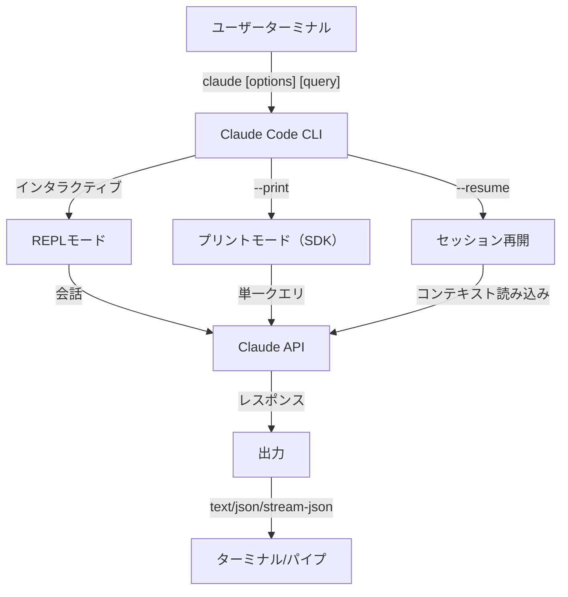
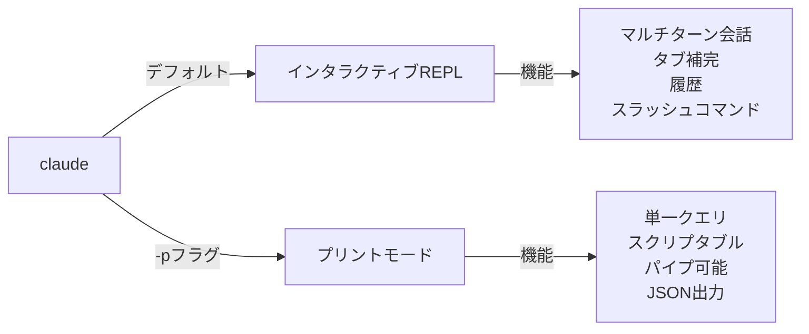

<picture>
  <source media="(prefers-color-scheme: dark)" srcset="../resources/logos/claude-howto-logo-dark.svg">
  
</picture>

# CLIリファレンス

## 概要

Claude Code CLI（コマンドラインインターフェース）は、Claude Codeを操作する主要な方法です。クエリの実行、セッション管理、モデルの設定、ClaudeをI開発ワークフローに統合するための強力なオプションを提供します。

## アーキテクチャ



## CLIコマンド

| コマンド | 説明 | 例 |
|---------|------|-----|
| `claude` | インタラクティブREPLを開始 | `claude` |
| `claude "query"` | 初期プロンプト付きでREPLを開始 | `claude "このプロジェクトを説明して"` |
| `claude -p "query"` | プリントモード - クエリ後に終了 | `claude -p "この関数を説明して"` |
| `cat file \| claude -p "query"` | パイプされたコンテンツを処理 | `cat logs.txt \| claude -p "説明して"` |
| `claude -c` | 最近の会話を継続 | `claude -c` |
| `claude -c -p "query"` | プリントモードで継続 | `claude -c -p "型エラーを確認して"` |
| `claude -r "<session>" "query"` | IDまたは名前でセッションを再開 | `claude -r "auth-refactor" "このPRを完成させて"` |
| `claude update` | 最新バージョンに更新 | `claude update` |
| `claude mcp` | MCPサーバーを設定 | [MCPドキュメント](../05-mcp/)を参照 |
| `claude mcp serve` | Claude CodeをMCPサーバーとして実行 | `claude mcp serve` |
| `claude agents` | 設定済みのすべてのサブエージェントを一覧表示 | `claude agents` |
| `claude auto-mode defaults` | 自動モードのデフォルトルールをJSONで表示 | `claude auto-mode defaults` |
| `claude remote-control` | リモートコントロールサーバーを起動 | `claude remote-control` |
| `claude plugin` | プラグインを管理（インストール、有効化、無効化） | `claude plugin install my-plugin` |
| `claude auth login` | ログイン（`--email`、`--sso` をサポート） | `claude auth login --email user@example.com` |
| `claude auth logout` | 現在のアカウントからログアウト | `claude auth logout` |
| `claude auth status` | 認証ステータスを確認（ログイン中は終了コード0、未ログインは1） | `claude auth status` |

## コアフラグ

| フラグ | 説明 | 例 |
|------|------|-----|
| `-p, --print` | インタラクティブモードなしでレスポンスを表示 | `claude -p "query"` |
| `-c, --continue` | 最近の会話を読み込む | `claude --continue` |
| `-r, --resume` | IDまたは名前でセッションを再開 | `claude --resume auth-refactor` |
| `-v, --version` | バージョン番号を出力 | `claude -v` |
| `-w, --worktree` | 隔離されたgit worktreeで開始 | `claude -w` |
| `-n, --name` | セッション表示名 | `claude -n "auth-refactor"` |
| `--from-pr <number>` | GitHub PRにリンクされたセッションを再開 | `claude --from-pr 42` |
| `--remote "task"` | claude.aiでwebセッションを作成 | `claude --remote "APIを実装して"` |
| `--remote-control, --rc` | リモートコントロール付きインタラクティブセッション | `claude --rc` |
| `--teleport` | webセッションをローカルで再開 | `claude --teleport` |
| `--teammate-mode` | エージェントチームの表示モード | `claude --teammate-mode tmux` |
| `--bare` | ミニマルモード（hooks、スキル、プラグイン、MCP、auto memory、CLAUDE.mdをスキップ） | `claude --bare` |
| `--enable-auto-mode` | 自動パーミッションモードのロック解除 | `claude --enable-auto-mode` |
| `--channels` | MCPチャンネルプラグインをサブスクライブ | `claude --channels discord,telegram` |
| `--chrome` / `--no-chrome` | Chromeブラウザ統合を有効/無効 | `claude --chrome` |
| `--effort` | 思考の努力レベルを設定 | `claude --effort high` |
| `--init` / `--init-only` | 初期化フックを実行 | `claude --init` |
| `--maintenance` | メンテナンスフックを実行して終了 | `claude --maintenance` |
| `--disable-slash-commands` | すべてのスキルとスラッシュコマンドを無効化 | `claude --disable-slash-commands` |
| `--no-session-persistence` | セッション保存を無効化（プリントモード） | `claude -p --no-session-persistence "query"` |

### インタラクティブモードとプリントモード



**インタラクティブモード**（デフォルト）:
```bash
# インタラクティブセッションを開始
claude

# 初期プロンプト付きで開始
claude "認証フローを説明して"
```

**プリントモード**（非インタラクティブ）:
```bash
# 単一クエリ後に終了
claude -p "この関数は何をしますか？"

# ファイルのコンテンツを処理
cat error.log | claude -p "このエラーを説明して"

# 他のツールとチェーン
claude -p "TODOを一覧表示して" | grep "URGENT"
```

## モデルと設定

| フラグ | 説明 | 例 |
|------|------|-----|
| `--model` | モデルを設定（sonnet、opus、haiku、またはフルネーム） | `claude --model opus` |
| `--fallback-model` | 過負荷時の自動モデルフォールバック | `claude -p --fallback-model sonnet "query"` |
| `--agent` | セッションのエージェントを指定 | `claude --agent my-custom-agent` |
| `--agents` | JSONでカスタムサブエージェントを定義 | [エージェント設定](#エージェント設定)を参照 |
| `--effort` | 努力レベルを設定（low、medium、high、max） | `claude --effort high` |

### モデル選択の例

```bash
# 複雑なタスクにはOpus 4.6を使用
claude --model opus "キャッシング戦略を設計して"

# 簡単なタスクにはHaiku 4.5を使用
claude --model haiku -p "このJSONをフォーマットして"

# フルモデル名
claude --model claude-sonnet-4-6-20250929 "このコードをレビューして"

# 信頼性のためフォールバック付き
claude -p --model opus --fallback-model sonnet "アーキテクチャを分析して"

# opusplan（Opusが計画し、Sonnetが実行）を使用
claude --model opusplan "キャッシングレイヤーを設計して実装して"
```

## システムプロンプトのカスタマイズ

| フラグ | 説明 | 例 |
|------|------|-----|
| `--system-prompt` | デフォルトプロンプト全体を置き換え | `claude --system-prompt "あなたはPythonの専門家です"` |
| `--system-prompt-file` | ファイルからプロンプトを読み込む（プリントモード） | `claude -p --system-prompt-file ./prompt.txt "query"` |
| `--append-system-prompt` | デフォルトプロンプトに追加 | `claude --append-system-prompt "常にTypeScriptを使用"` |

### システムプロンプトの例

```bash
# 完全なカスタムペルソナ
claude --system-prompt "あなたはシニアセキュリティエンジニアです。脆弱性に注目してください。"

# 特定の指示を追加
claude --append-system-prompt "コード例には常にユニットテストを含める"

# ファイルから複雑なプロンプトを読み込む
claude -p --system-prompt-file ./prompts/code-reviewer.txt "main.pyをレビューして"
```

### システムプロンプトフラグの比較

| フラグ | 動作 | インタラクティブ | プリント |
|------|------|-------------|------|
| `--system-prompt` | デフォルトシステムプロンプト全体を置き換え | ✅ | ✅ |
| `--system-prompt-file` | ファイルのプロンプトに置き換え | ❌ | ✅ |
| `--append-system-prompt` | デフォルトシステムプロンプトに追加 | ✅ | ✅ |

**`--system-prompt-file` はプリントモードのみで使用。インタラクティブモードでは `--system-prompt` または `--append-system-prompt` を使用。**

## ツールとパーミッション管理

| フラグ | 説明 | 例 |
|------|------|-----|
| `--tools` | 利用可能な組み込みツールを制限 | `claude -p --tools "Bash,Edit,Read" "query"` |
| `--allowedTools` | プロンプトなしで実行するツール | `"Bash(git log:*)" "Read"` |
| `--disallowedTools` | コンテキストから削除するツール | `"Bash(rm:*)" "Edit"` |
| `--dangerously-skip-permissions` | すべてのパーミッションプロンプトをスキップ | `claude --dangerously-skip-permissions` |
| `--permission-mode` | 指定されたパーミッションモードで開始 | `claude --permission-mode auto` |
| `--permission-prompt-tool` | パーミッション処理用のMCPツール | `claude -p --permission-prompt-tool mcp_auth "query"` |
| `--enable-auto-mode` | 自動パーミッションモードのロック解除 | `claude --enable-auto-mode` |

### パーミッションの例

```bash
# コードレビューの読み取り専用モード
claude --permission-mode plan "このコードベースをレビューして"

# 安全なツールのみに制限
claude --tools "Read,Grep,Glob" -p "すべてのTODOコメントを見つけて"

# プロンプトなしで特定のgitコマンドを許可
claude --allowedTools "Bash(git status:*)" "Bash(git log:*)"

# 危険な操作をブロック
claude --disallowedTools "Bash(rm -rf:*)" "Bash(git push --force:*)"
```

## 出力とフォーマット

| フラグ | 説明 | オプション | 例 |
|------|------|---------|-----|
| `--output-format` | 出力フォーマットを指定（プリントモード） | `text`、`json`、`stream-json` | `claude -p --output-format json "query"` |
| `--input-format` | 入力フォーマットを指定（プリントモード） | `text`、`stream-json` | `claude -p --input-format stream-json` |
| `--verbose` | 詳細ログを有効化 | | `claude --verbose` |
| `--include-partial-messages` | ストリーミングイベントを含める | `stream-json` が必要 | `claude -p --output-format stream-json --include-partial-messages "query"` |
| `--json-schema` | スキーマに一致する検証済みJSONを取得 | | `claude -p --json-schema '{"type":"object"}' "query"` |
| `--max-budget-usd` | プリントモードの最大支出額 | | `claude -p --max-budget-usd 5.00 "query"` |

### 出力フォーマットの例

```bash
# プレーンテキスト（デフォルト）
claude -p "このコードを説明して"

# プログラムでの使用のためのJSON
claude -p --output-format json "main.pyのすべての関数を一覧表示して"

# リアルタイム処理のためのストリーミングJSON
claude -p --output-format stream-json "長いレポートを生成して"

# スキーマバリデーション付きの構造化出力
claude -p --json-schema '{"type":"object","properties":{"bugs":{"type":"array"}}}' \
  "このコードのバグを見つけてJSONで返して"
```

## ワークスペースとディレクトリ

| フラグ | 説明 | 例 |
|------|------|-----|
| `--add-dir` | 追加の作業ディレクトリを追加 | `claude --add-dir ../apps ../lib` |
| `--setting-sources` | カンマ区切りの設定ソース | `claude --setting-sources user,project` |
| `--settings` | ファイルまたはJSONから設定を読み込む | `claude --settings ./settings.json` |
| `--plugin-dir` | ディレクトリからプラグインを読み込む（繰り返し可） | `claude --plugin-dir ./my-plugin` |

### マルチディレクトリの例

```bash
# 複数のプロジェクトディレクトリにわたって作業
claude --add-dir ../frontend ../backend ../shared "すべてのAPIエンドポイントを見つけて"

# カスタム設定を読み込む
claude --settings '{"model":"opus","verbose":true}' "複雑なタスク"
```

## MCP設定

| フラグ | 説明 | 例 |
|------|------|-----|
| `--mcp-config` | JSONからMCPサーバーを読み込む | `claude --mcp-config ./mcp.json` |
| `--strict-mcp-config` | 指定されたMCP設定のみを使用 | `claude --strict-mcp-config --mcp-config ./mcp.json` |
| `--channels` | MCPチャンネルプラグインをサブスクライブ | `claude --channels discord,telegram` |

### MCPの例

```bash
# GitHub MCPサーバーを読み込む
claude --mcp-config ./github-mcp.json "オープンなPRを一覧表示して"

# 厳格モード - 指定されたサーバーのみ
claude --strict-mcp-config --mcp-config ./production-mcp.json "ステージングにデプロイして"
```

## セッション管理

| フラグ | 説明 | 例 |
|------|------|-----|
| `--session-id` | 特定のセッションIDを使用（UUID） | `claude --session-id "550e8400-..."` |
| `--fork-session` | 再開時に新しいセッションを作成 | `claude --resume abc123 --fork-session` |

### セッションの例

```bash
# 最後の会話を継続
claude -c

# 名前付きセッションを再開
claude -r "feature-auth" "ログインの実装を続けて"

# 実験のためにセッションをフォーク
claude --resume feature-auth --fork-session "別のアプローチを試して"

# 特定のセッションIDを使用
claude --session-id "550e8400-e29b-41d4-a716-446655440000" "続けて"
```

### セッションのフォーク

既存のセッションから実験用のブランチを作成：

```bash
# 別のアプローチを試すためにセッションをフォーク
claude --resume abc123 --fork-session "別の実装を試して"

# カスタムメッセージ付きでフォーク
claude -r "feature-auth" --fork-session "異なるアーキテクチャでテスト"
```

**ユースケース:**
- 元のセッションを失わずに別の実装を試す
- 並列で異なるアプローチを実験
- 成功した作業からバリエーションを作成
- メインセッションに影響なく破壊的な変更をテスト

元のセッションは変更されず、フォークは新しい独立したセッションになります。

## 高度な機能

| フラグ | 説明 | 例 |
|------|------|-----|
| `--chrome` | Chromeブラウザ統合を有効化 | `claude --chrome` |
| `--no-chrome` | Chromeブラウザ統合を無効化 | `claude --no-chrome` |
| `--ide` | 利用可能な場合にIDEに自動接続 | `claude --ide` |
| `--max-turns` | エージェントのターンを制限（非インタラクティブ） | `claude -p --max-turns 3 "query"` |
| `--debug` | フィルタリング付きデバッグモードを有効化 | `claude --debug "api,mcp"` |
| `--enable-lsp-logging` | 詳細なLSPロギングを有効化 | `claude --enable-lsp-logging` |
| `--betas` | APIリクエストのベータヘッダー | `claude --betas interleaved-thinking` |
| `--plugin-dir` | ディレクトリからプラグインを読み込む（繰り返し可） | `claude --plugin-dir ./my-plugin` |
| `--enable-auto-mode` | 自動パーミッションモードのロック解除 | `claude --enable-auto-mode` |
| `--effort` | 思考の努力レベルを設定 | `claude --effort high` |
| `--bare` | ミニマルモード | `claude --bare "クイッククエリ"` |
| `--channels` | MCPチャンネルプラグインをサブスクライブ | `claude --channels discord` |
| `--fork-session` | 再開時に新しいセッションIDを作成 | `claude --resume abc --fork-session` |
| `--max-budget-usd` | 最大支出（プリントモード） | `claude -p --max-budget-usd 5.00 "query"` |
| `--json-schema` | バリデーション済みJSON出力 | `claude -p --json-schema '{"type":"object"}' "q"` |

### 高度な機能の例

```bash
# 自律的なアクションを制限
claude -p --max-turns 5 "このモジュールをリファクタリングして"

# API呼び出しをデバッグ
claude --debug "api" "テストクエリ"

# IDE統合を有効化
claude --ide "このファイルを手伝って"
```

## エージェント設定

`--agents` フラグはセッション用のカスタムサブエージェントを定義するJSONオブジェクトを受け取ります。

### エージェントJSONフォーマット

```json
{
  "agent-name": {
    "description": "必須: このエージェントを呼び出すタイミング",
    "prompt": "必須: エージェントのシステムプロンプト",
    "tools": ["省略可", "ツールの", "配列"],
    "model": "省略可: sonnet|opus|haiku"
  }
}
```

**必須フィールド:**
- `description` - このエージェントをいつ使用するかの自然言語による説明
- `prompt` - エージェントの役割と動作を定義するシステムプロンプト

**省略可フィールド:**
- `tools` - 利用可能なツールの配列（省略するとすべてを継承）
  - フォーマット: `["Read", "Grep", "Glob", "Bash"]`
- `model` - 使用するモデル: `sonnet`、`opus`、または `haiku`

### 完全なエージェントの例

```json
{
  "code-reviewer": {
    "description": "エキスパートコードレビュアー。コード変更後に積極的に使用。",
    "prompt": "あなたはシニアコードレビュアーです。コード品質、セキュリティ、ベストプラクティスに注力してください。",
    "tools": ["Read", "Grep", "Glob", "Bash"],
    "model": "sonnet"
  },
  "debugger": {
    "description": "エラーとテスト失敗のためのデバッグスペシャリスト。",
    "prompt": "あなたはエキスパートデバッガーです。エラーを分析し、根本原因を特定し、修正を提供してください。",
    "tools": ["Read", "Edit", "Bash", "Grep"],
    "model": "opus"
  },
  "documenter": {
    "description": "ガイド生成のためのドキュメントスペシャリスト。",
    "prompt": "あなたはテクニカルライターです。明確で包括的なドキュメントを作成してください。",
    "tools": ["Read", "Write"],
    "model": "haiku"
  }
}
```

### エージェントコマンドの例

```bash
# インラインでカスタムエージェントを定義
claude --agents '{
  "security-auditor": {
    "description": "脆弱性分析のためのセキュリティスペシャリスト",
    "prompt": "あなたはセキュリティエキスパートです。脆弱性を見つけて修正を提案してください。",
    "tools": ["Read", "Grep", "Glob"],
    "model": "opus"
  }
}' "セキュリティ問題についてこのコードベースを監査して"

# ファイルからエージェントを読み込む
claude --agents "$(cat ~/.claude/agents.json)" "認証モジュールをレビューして"

# 他のフラグと組み合わせる
claude -p --agents "$(cat agents.json)" --model sonnet "パフォーマンスを分析して"
```

### エージェントの優先順位

複数のエージェント定義が存在する場合、次の優先順位で読み込まれます：
1. **CLI定義**（`--agents` フラグ） - セッション固有
2. **ユーザーレベル**（`~/.claude/agents/`） - すべてのプロジェクト
3. **プロジェクトレベル**（`.claude/agents/`） - 現在のプロジェクト

CLI定義のエージェントはセッションのユーザーとプロジェクトの両方のエージェントを上書きします。

---

## 高価値なユースケース

### 1. CI/CD統合

自動化されたコードレビュー、テスト、ドキュメントのためにCI/CDパイプラインでClaude Codeを使用します。

**GitHub Actionsの例:**

```yaml
name: AIコードレビュー

on: [pull_request]

jobs:
  review:
    runs-on: ubuntu-latest
    steps:
      - uses: actions/checkout@v4

      - name: Claude Codeをインストール
        run: npm install -g @anthropic-ai/claude-code

      - name: コードレビューを実行
        env:
          ANTHROPIC_API_KEY: ${{ secrets.ANTHROPIC_API_KEY }}
        run: |
          claude -p --output-format json \
            --max-turns 1 \
            "このPRの変更をレビューして:
            - セキュリティ脆弱性
            - パフォーマンスの問題
            - コード品質
            'issues'配列を含むJSONとして出力" > review.json

      - name: レビューコメントを投稿
        uses: actions/github-script@v7
        with:
          script: |
            const fs = require('fs');
            const review = JSON.parse(fs.readFileSync('review.json', 'utf8'));
            // レビューコメントを処理して投稿
```

**Jenkinsパイプライン:**

```groovy
pipeline {
    agent any
    stages {
        stage('AIレビュー') {
            steps {
                sh '''
                    claude -p --output-format json \
                      --max-turns 3 \
                      "テストカバレッジを分析して不足しているテストを提案して" \
                      > coverage-analysis.json
                '''
            }
        }
    }
}
```

### 2. スクリプトへのパイプ

分析のためにファイル、ログ、データをClaude経由で処理します。

**ログ分析:**

```bash
# エラーログを分析
tail -1000 /var/log/app/error.log | claude -p "これらのエラーをまとめて修正を提案して"

# アクセスログのパターンを見つける
cat access.log | claude -p "疑わしいアクセスパターンを特定して"

# git履歴を分析
git log --oneline -50 | claude -p "最近の開発活動をまとめて"
```

**コード処理:**

```bash
# 特定のファイルをレビュー
cat src/auth.ts | claude -p "この認証コードのセキュリティ問題をレビューして"

# ドキュメントを生成
cat src/api/*.ts | claude -p "markdownでAPIドキュメントを生成して"

# TODOを見つけて優先度付け
grep -r "TODO" src/ | claude -p "これらのTODOを重要度で優先度付けして"
```

### 3. マルチセッションワークフロー

複数の会話スレッドで複雑なプロジェクトを管理します。

```bash
# フィーチャーブランチセッションを開始
claude -r "feature-auth" "ユーザー認証を実装しよう"

# 後でセッションを継続
claude -r "feature-auth" "パスワードリセット機能を追加して"

# 別のアプローチを試すためにフォーク
claude --resume feature-auth --fork-session "代わりにOAuthを試して"

# 異なるフィーチャーセッションを切り替え
claude -r "feature-payments" "Stripe統合を続けて"
```

### 4. カスタムエージェント設定

チームのワークフローのために専門化されたエージェントを定義します。

```bash
# エージェント設定をファイルに保存
cat > ~/.claude/agents.json << 'EOF'
{
  "reviewer": {
    "description": "PRレビューのためのコードレビュアー",
    "prompt": "品質、セキュリティ、保守性のためのコードをレビューしてください。",
    "model": "opus"
  },
  "documenter": {
    "description": "ドキュメントスペシャリスト",
    "prompt": "明確で包括的なドキュメントを生成してください。",
    "model": "sonnet"
  },
  "refactorer": {
    "description": "コードリファクタリングエキスパート",
    "prompt": "クリーンなコードのリファクタリングを提案して実装してください。",
    "tools": ["Read", "Edit", "Glob"]
  }
}
EOF

# セッションでエージェントを使用
claude --agents "$(cat ~/.claude/agents.json)" "認証モジュールをレビューして"
```

### 5. バッチ処理

一貫した設定で複数のクエリを処理します。

```bash
# 複数のファイルを処理
for file in src/*.ts; do
  echo "処理中 $file..."
  claude -p --model haiku "このファイルをまとめて: $(cat $file)" >> summaries.md
done

# バッチコードレビュー
find src -name "*.py" -exec sh -c '
  echo "## $1" >> review.md
  cat "$1" | claude -p "簡単なコードレビュー" >> review.md
' _ {} \;

# すべてのモジュールのテストを生成
for module in $(ls src/modules/); do
  claude -p "src/modules/$module のユニットテストを生成して" > "tests/$module.test.ts"
done
```

### 6. セキュリティを意識した開発

安全な操作のためにパーミッション制御を使用します。

```bash
# 読み取り専用セキュリティ監査
claude --permission-mode plan \
  --tools "Read,Grep,Glob" \
  "このコードベースのセキュリティ脆弱性を監査して"

# 危険なコマンドをブロック
claude --disallowedTools "Bash(rm:*)" "Bash(curl:*)" "Bash(wget:*)" \
  "このプロジェクトをクリーンアップするのを手伝って"

# 制限された自動化
claude -p --max-turns 2 \
  --allowedTools "Read" "Glob" \
  "ハードコードされた認証情報をすべて見つけて"
```

### 7. JSON API統合

`jq` パースでプログラマブルAPIとしてClaudeを使用します。

```bash
# 構造化された分析を取得
claude -p --output-format json \
  --json-schema '{"type":"object","properties":{"functions":{"type":"array"},"complexity":{"type":"string"}}}' \
  "main.pyを分析して関数リストと複雑度評価を返して"

# 処理のためにjqと統合
claude -p --output-format json "すべてのAPIエンドポイントを一覧表示して" | jq '.endpoints[]'

# スクリプトで使用
RESULT=$(claude -p --output-format json "このコードは安全か？{secure: boolean, issues: []}で回答して" < code.py)
if echo "$RESULT" | jq -e '.secure == false' > /dev/null; then
  echo "セキュリティ問題が見つかりました！"
  echo "$RESULT" | jq '.issues[]'
fi
```

### jqパースの例

ClaudeのJSON出力を `jq` で解析・処理：

```bash
# 特定のフィールドを抽出
claude -p --output-format json "このコードを分析して" | jq '.result'

# 配列要素をフィルタリング
claude -p --output-format json "問題を一覧表示して" | jq -r '.issues[] | select(.severity=="high")'

# 複数フィールドを抽出
claude -p --output-format json "プロジェクトを説明して" | jq -r '.{name, version, description}'

# CSVに変換
claude -p --output-format json "関数を一覧表示して" | jq -r '.functions[] | [.name, .lineCount] | @csv'

# 条件付き処理
claude -p --output-format json "セキュリティを確認して" | jq 'if .vulnerabilities | length > 0 then "UNSAFE" else "SAFE" end'

# ネストした値を抽出
claude -p --output-format json "パフォーマンスを分析して" | jq '.metrics.cpu.usage'

# 配列全体を処理
claude -p --output-format json "TODOを見つけて" | jq '.todos | length'

# 出力を変換
claude -p --output-format json "改善点を一覧表示して" | jq 'map({title: .title, priority: .priority})'
```

---

## モデル

Claude Codeは異なる機能を持つ複数のモデルをサポートしています：

| モデル | ID | コンテキストウィンドウ | 注記 |
|-------|-----|-------------|------|
| Opus 4.6 | `claude-opus-4-6` | 1Mトークン | 最も高性能、適応的な努力レベル |
| Sonnet 4.6 | `claude-sonnet-4-6` | 1Mトークン | バランスの取れた速度と性能 |
| Haiku 4.5 | `claude-haiku-4-5` | 1Mトークン | 最速、クイックタスクに最適 |

### モデル選択

```bash
# ショートネームを使用
claude --model opus "複雑なアーキテクチャレビュー"
claude --model sonnet "この機能を実装して"
claude --model haiku -p "このJSONをフォーマットして"

# opusplanエイリアス（Opusが計画し、Sonnetが実行）
claude --model opusplan "APIを設計して実装して"

# セッション中にfastモードを切り替え
/fast
```

### 努力レベル（Opus 4.6）

Opus 4.6は努力レベルによる適応的な推論をサポートしています：

```bash
# CLIフラグで努力レベルを設定
claude --effort high "複雑なレビュー"

# スラッシュコマンドで努力レベルを設定
/effort high

# 環境変数で努力レベルを設定
export CLAUDE_CODE_EFFORT_LEVEL=high   # low、medium、high、またはmax（Opus 4.6のみ）
```

プロンプト内の "ultrathink" キーワードは深い推論を有効化します。`max` 努力レベルはOpus 4.6専用です。

---

## 主要な環境変数

| 変数 | 説明 |
|-----|------|
| `ANTHROPIC_API_KEY` | 認証用APIキー |
| `ANTHROPIC_MODEL` | デフォルトモデルをオーバーライド |
| `ANTHROPIC_CUSTOM_MODEL_OPTION` | APIのカスタムモデルオプション |
| `ANTHROPIC_DEFAULT_OPUS_MODEL` | デフォルトOpusモデルIDをオーバーライド |
| `ANTHROPIC_DEFAULT_SONNET_MODEL` | デフォルトSonnetモデルIDをオーバーライド |
| `ANTHROPIC_DEFAULT_HAIKU_MODEL` | デフォルトHaikuモデルIDをオーバーライド |
| `MAX_THINKING_TOKENS` | 拡張思考のトークン予算を設定 |
| `CLAUDE_CODE_EFFORT_LEVEL` | 努力レベルを設定（`low`/`medium`/`high`/`max`） |
| `CLAUDE_CODE_SIMPLE` | `--bare` フラグで設定されるミニマルモード |
| `CLAUDE_CODE_DISABLE_AUTO_MEMORY` | CLAUDE.mdの自動更新を無効化 |
| `CLAUDE_CODE_DISABLE_BACKGROUND_TASKS` | バックグラウンドタスク実行を無効化 |
| `CLAUDE_CODE_DISABLE_CRON` | スケジュールされた/cronタスクを無効化 |
| `CLAUDE_CODE_DISABLE_GIT_INSTRUCTIONS` | git関連の指示を無効化 |
| `CLAUDE_CODE_DISABLE_TERMINAL_TITLE` | ターミナルタイトルの更新を無効化 |
| `CLAUDE_CODE_DISABLE_1M_CONTEXT` | 1Mトークンコンテキストウィンドウを無効化 |
| `CLAUDE_CODE_DISABLE_NONSTREAMING_FALLBACK` | 非ストリーミングフォールバックを無効化 |
| `CLAUDE_CODE_ENABLE_TASKS` | タスクリスト機能を有効化 |
| `CLAUDE_CODE_TASK_LIST_ID` | セッション間で共有される名前付きタスクディレクトリ |
| `CLAUDE_CODE_ENABLE_PROMPT_SUGGESTION` | プロンプト提案を切り替え（`true`/`false`） |
| `CLAUDE_CODE_EXPERIMENTAL_AGENT_TEAMS` | 実験的なエージェントチームを有効化 |
| `CLAUDE_CODE_NEW_INIT` | 新しい初期化フローを使用 |
| `CLAUDE_CODE_SUBAGENT_MODEL` | サブエージェント実行のモデル |
| `CLAUDE_CODE_PLUGIN_SEED_DIR` | プラグインシードファイルのディレクトリ |
| `CLAUDE_CODE_SUBPROCESS_ENV_SCRUB` | サブプロセスから削除する環境変数 |
| `CLAUDE_AUTOCOMPACT_PCT_OVERRIDE` | 自動コンパクションのパーセンテージをオーバーライド |
| `CLAUDE_STREAM_IDLE_TIMEOUT_MS` | ストリームのアイドルタイムアウト（ミリ秒） |
| `SLASH_COMMAND_TOOL_CHAR_BUDGET` | スラッシュコマンドツールの文字予算 |
| `ENABLE_TOOL_SEARCH` | ツール検索機能を有効化 |
| `MAX_MCP_OUTPUT_TOKENS` | MCPツール出力の最大トークン数 |

---

## クイックリファレンス

### 最もよく使うコマンド

```bash
# インタラクティブセッション
claude

# クイックな質問
claude -p "どうすれば..."

# 会話を継続
claude -c

# ファイルを処理
cat file.py | claude -p "これをレビューして"

# スクリプト用のJSON出力
claude -p --output-format json "query"
```

### フラグの組み合わせ

| ユースケース | コマンド |
|----------|---------|
| クイックコードレビュー | `cat file \| claude -p "レビューして"` |
| 構造化出力 | `claude -p --output-format json "query"` |
| 安全な探索 | `claude --permission-mode plan` |
| 安全な自律処理 | `claude --enable-auto-mode --permission-mode auto` |
| CI/CD統合 | `claude -p --max-turns 3 --output-format json` |
| 作業の再開 | `claude -r "session-name"` |
| カスタムモデル | `claude --model opus "複雑なタスク"` |
| ミニマルモード | `claude --bare "クイッククエリ"` |
| 予算上限付き実行 | `claude -p --max-budget-usd 2.00 "コードを分析して"` |

---

## トラブルシューティング

### コマンドが見つからない

**問題:** `claude: command not found`

**解決策:**
- Claude Codeをインストール: `npm install -g @anthropic-ai/claude-code`
- PATHにnpmグローバルbinディレクトリが含まれているか確認
- フルパスで実行: `npx claude`

### APIキーの問題

**問題:** 認証失敗

**解決策:**
- APIキーを設定: `export ANTHROPIC_API_KEY=your-key`
- キーが有効で十分なクレジットがあるか確認
- リクエストされたモデルのためのキーパーミッションを確認

### セッションが見つからない

**問題:** セッションを再開できない

**解決策:**
- 正しい名前/IDを見つけるために利用可能なセッションを一覧表示
- 非アクティブ期間後にセッションが期限切れになることがある
- 最近のセッションを継続するには `-c` を使用

### 出力フォーマットの問題

**問題:** JSON出力が正しくない

**解決策:**
- 構造を強制するために `--json-schema` を使用
- プロンプトに明示的なJSON指示を追加
- `--output-format json` を使用（プロンプトでJSONを求めるだけでなく）

### パーミッション拒否

**問題:** ツール実行がブロックされる

**解決策:**
- `--permission-mode` の設定を確認
- `--allowedTools` と `--disallowedTools` フラグを確認
- 自動化には `--dangerously-skip-permissions` を使用（注意が必要）

---

## 追加リソース

- **[公式CLIリファレンス](https://code.claude.com/docs/en/cli-reference)** - 完全なコマンドリファレンス
- **[ヘッドレスモードのドキュメント](https://code.claude.com/docs/en/headless)** - 自動化実行
- **[スラッシュコマンド](../01-slash-commands/)** - Claude内のカスタムショートカット
- **[メモリガイド](../02-memory/)** - CLAUDE.mdを通じた永続コンテキスト
- **[MCPプロトコル](../05-mcp/)** - 外部ツール統合
- **[高度な機能](../09-advanced-features/)** - プランニングモード、拡張思考
- **[サブエージェントガイド](../04-subagents/)** - 委譲されたタスク実行

---

*[Claude How To](../) ガイドシリーズの一部*
