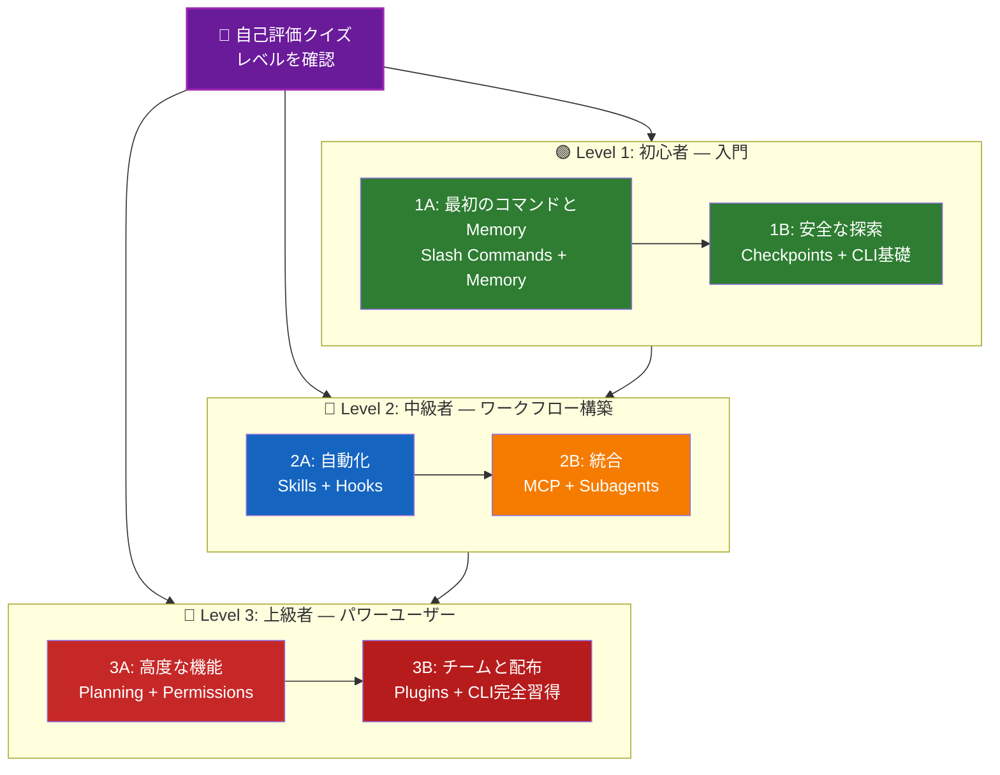

<picture>
  <source media="(prefers-color-scheme: dark)" srcset="resources/logos/claude-howto-logo-dark.svg">
  
</picture>

# 📚 Claude Code 学習ロードマップ

**Claude Codeが初めて？** このガイドは自分のペースでClaude Codeの機能をマスターするためのものです。完全な初心者でも経験豊富な開発者でも、まず以下の自己評価クイズで自分に合ったパスを見つけましょう。

---

## 🧭 自分のレベルを確認する

スタート地点は人それぞれです。このクイックセルフアセスメントで適切な入口を見つけましょう。

**以下の質問に正直に答えてください:**

- [ ] Claude Codeを起動して会話できる (`claude`)
- [ ] CLAUDE.mdファイルを作成または編集したことがある
- [ ] 組み込みslash commandsを3つ以上使ったことがある (例: /help, /compact, /model)
- [ ] カスタムslash commandまたはskill (SKILL.md) を作成したことがある
- [ ] MCPサーバーを設定したことがある (例: GitHub, データベース)
- [ ] ~/.claude/settings.json にhooksを設定したことがある
- [ ] カスタムsubagentsを作成または使ったことがある (.claude/agents/)
- [ ] スクリプティングやCI/CDにプリントモード (`claude -p`) を使ったことがある

**あなたのレベル:**

| チェック数 | レベル | 始める場所 | 所要時間 |
|--------|-------|----------|------------------|
| 0〜2 | **Level 1: 初心者** — 入門 | [Milestone 1A](#milestone-1a-最初のコマンドとmemory) | 約3時間 |
| 3〜5 | **Level 2: 中級者** — ワークフロー構築 | [Milestone 2A](#milestone-2a-自動化skillshooks) | 約5時間 |
| 6〜8 | **Level 3: 上級者** — パワーユーザー＆チームリード | [Milestone 3A](#milestone-3a-高度な機能) | 約5時間 |

> **ヒント**: 迷ったら1つ下のレベルから始めましょう。知っている内容を素早く復習する方が、基礎的な概念を見逃すよりも良いです。

> **インタラクティブ版**: Claude Codeで `/self-assessment` を実行すると、全10機能エリアにわたる熟練度をスコアリングしパーソナライズされた学習パスを生成するガイド付きインタラクティブクイズが受けられます。

---

## 🎯 学習の考え方

このリポジトリのフォルダは3つの主要な原則に基づいた**推奨学習順序**に番号が付けられています:

1. **依存関係** — 基礎的な概念が先
2. **複雑さ** — 簡単な機能から高度な機能へ
3. **使用頻度** — 最も頻繁に使う機能を早めに学習

このアプローチにより、即時の生産性向上を得ながら確固たる基礎を構築できます。

---

## 🗺️ 学習パス



**カラー凡例:**
- 💜 紫: 自己評価クイズ
- 🟢 緑: Level 1 — 初心者パス
- 🔵 青 / 🟡 金: Level 2 — 中級者パス
- 🔴 赤: Level 3 — 上級者パス

---

## 📊 完全ロードマップ表

| ステップ | 機能 | 複雑さ | 時間 | レベル | 前提条件 | 学ぶ理由 | 主なメリット |
|------|---------|-----------|------|-------|--------------|----------------|--------------|
| **1** | [Slash Commands](01-slash-commands/) | ⭐ 初心者 | 30分 | Level 1 | なし | 即効性のある生産性向上 (55以上の組み込み + 5つのバンドルskill) | 即時自動化、チーム標準化 |
| **2** | [Memory](02-memory/) | ⭐⭐ 初心者+ | 45分 | Level 1 | なし | すべての機能の基盤 | 永続的コンテキスト、設定保存 |
| **3** | [Checkpoints](08-checkpoints/) | ⭐⭐ 中級者 | 45分 | Level 1 | セッション管理 | 安全な探索 | 実験、回復 |
| **4** | [CLI Basics](10-cli/) | ⭐⭐ 初心者+ | 30分 | Level 1 | なし | コアCLI使用法 | インタラクティブ＆プリントモード |
| **5** | [Skills](03-skills/) | ⭐⭐ 中級者 | 1時間 | Level 2 | Slash Commands | 自動的な専門知識 | 再利用可能な機能、一貫性 |
| **6** | [Hooks](06-hooks/) | ⭐⭐ 中級者 | 1時間 | Level 2 | ツール、コマンド | ワークフロー自動化 (25イベント、4タイプ) | バリデーション、品質ゲート |
| **7** | [MCP](05-mcp/) | ⭐⭐⭐ 中級者+ | 1時間 | Level 2 | 設定 | ライブデータアクセス | リアルタイム統合、API |
| **8** | [Subagents](04-subagents/) | ⭐⭐⭐ 中級者+ | 1.5時間 | Level 2 | Memory、コマンド | 複雑なタスク処理 (Bashを含む6つの組み込み) | 委任、専門的な知識 |
| **9** | [Advanced Features](09-advanced-features/) | ⭐⭐⭐⭐⭐ 上級者 | 2〜3時間 | Level 3 | すべての前項目 | パワーユーザーツール | Planning、Auto Mode、Channels、Voice Dictation、パーミッション |
| **10** | [Plugins](07-plugins/) | ⭐⭐⭐⭐ 上級者 | 2時間 | Level 3 | すべての前項目 | 完全なソリューション | チームオンボーディング、配布 |
| **11** | [CLI Mastery](10-cli/) | ⭐⭐⭐ 上級者 | 1時間 | Level 3 | 推奨: すべて | コマンドライン使用法の完全習得 | スクリプティング、CI/CD、自動化 |

**合計学習時間**: 約11〜13時間 (レベルにジャンプして時間を節約することも可能)

---

## 🟢 Level 1: 初心者 — 入門

**対象**: クイズのチェック数が0〜2の方
**時間**: 約3時間
**フォーカス**: 即時の生産性、基礎の理解
**目標**: 日常的に使えるようになり、Level 2に進む準備ができる

### Milestone 1A: 最初のコマンドとMemory

**トピック**: Slash Commands + Memory
**時間**: 1〜2時間
**複雑さ**: ⭐ 初心者
**目標**: カスタムコマンドと永続的コンテキストで即時生産性を向上させる

#### 達成できること
✅ 繰り返しタスク用のカスタムslash commandsを作成する
✅ チーム標準のプロジェクトmemoryをセットアップする
✅ 個人設定を構成する
✅ Claudeがコンテキストを自動的に読み込む仕組みを理解する

#### ハンズオン演習

```bash
# 演習1: 最初のslash commandをインストール
mkdir -p .claude/commands
cp 01-slash-commands/optimize.md .claude/commands/

# 演習2: プロジェクトmemoryを作成
cp 02-memory/project-CLAUDE.md ./CLAUDE.md

# 演習3: 試してみる
# Claude Codeで以下を入力: /optimize
```

#### 成功基準
- [ ] `/optimize` コマンドを正常に呼び出せる
- [ ] ClaudeがCLAUDE.mdからプロジェクト標準を記憶している
- [ ] slash commandsとmemoryのどちらを使うべきか理解している

#### 次のステップ
慣れたら以下を読む:
- [01-slash-commands/README.md](01-slash-commands/README.md)
- [02-memory/README.md](02-memory/README.md)

> **理解度チェック**: Claude Codeで `/lesson-quiz slash-commands` または `/lesson-quiz memory` を実行して学習内容をテスト。

---

### Milestone 1B: 安全な探索

**トピック**: Checkpoints + CLI基礎
**時間**: 1時間
**複雑さ**: ⭐⭐ 初心者+
**目標**: 安全に実験し、コアCLIコマンドを使いこなす

#### 達成できること
✅ 安全な実験のためにcheckpointを作成・復元する
✅ インタラクティブモードとプリントモードを理解する
✅ 基本的なCLIフラグとオプションを使用する
✅ パイプでファイルを処理する

#### ハンズオン演習

```bash
# 演習1: checkpointワークフローを試す
# Claude Codeで:
# 実験的な変更を加えて、Esc+Esc を押すか /rewind を使う
# 実験前のcheckpointを選択
# 「コードと会話を復元」を選んで戻る

# 演習2: インタラクティブモードとプリントモード
claude "このプロジェクトを説明して"           # インタラクティブモード
claude -p "この関数を説明して"       # プリントモード (非インタラクティブ)

# 演習3: パイプでファイル内容を処理
cat error.log | claude -p "このエラーを説明して"
```

#### 成功基準
- [ ] checkpointを作成して戻れた
- [ ] インタラクティブモードとプリントモードの両方を使用した
- [ ] ファイルをClaude に渡して分析した
- [ ] 安全な実験にcheckpointをいつ使うべきか理解している

#### 次のステップ
- 読む: [08-checkpoints/README.md](08-checkpoints/README.md)
- 読む: [10-cli/README.md](10-cli/README.md)
- **Level 2への準備完了！** [Milestone 2A](#milestone-2a-自動化skillshooks) へ進む

> **理解度チェック**: `/lesson-quiz checkpoints` または `/lesson-quiz cli` を実行してLevel 2への準備ができているか確認。

---

## 🔵 Level 2: 中級者 — ワークフロー構築

**対象**: クイズのチェック数が3〜5の方
**時間**: 約5時間
**フォーカス**: 自動化、統合、タスク委任
**目標**: 自動化されたワークフロー、外部統合、Level 3への準備

### 前提条件チェック

Level 2を始める前に、以下のLevel 1の概念に慣れていることを確認:

- [ ] slash commandsを作成・使用できる ([01-slash-commands/](01-slash-commands/))
- [ ] CLAUDE.mdでプロジェクトmemoryをセットアップしている ([02-memory/](02-memory/))
- [ ] checkpointを作成・復元できる ([08-checkpoints/](08-checkpoints/))
- [ ] コマンドラインから `claude` と `claude -p` を使用できる ([10-cli/](10-cli/))

> **ギャップがある？** 続ける前に上記のリンク先チュートリアルを復習。

---

### Milestone 2A: 自動化 (Skills + Hooks)

**トピック**: Skills + Hooks
**時間**: 2〜3時間
**複雑さ**: ⭐⭐ 中級者
**目標**: 一般的なワークフローと品質チェックを自動化する

#### 達成できること
✅ YAMLフロントマターで専門的な機能を自動呼び出しする (`effort` と `shell` フィールドを含む)
✅ 25のhookイベントにわたるイベント駆動自動化をセットアップする
✅ 4種類のhookタイプを使用する (command, http, prompt, agent)
✅ コード品質標準を強制する
✅ ワークフロー用のカスタムhooksを作成する

#### ハンズオン演習

```bash
# 演習1: skillをインストール
cp -r 03-skills/code-review ~/.claude/skills/

# 演習2: hooksをセットアップ
mkdir -p ~/.claude/hooks
cp 06-hooks/pre-tool-check.sh ~/.claude/hooks/
chmod +x ~/.claude/hooks/pre-tool-check.sh

# 演習3: settingsでhooksを設定
# ~/.claude/settings.json に追加:
{
  "hooks": {
    "PreToolUse": [
      {
        "matcher": "Bash",
        "hooks": [
          {
            "type": "command",
            "command": "~/.claude/hooks/pre-tool-check.sh"
          }
        ]
      }
    ]
  }
}
```

#### 成功基準
- [ ] コードレビューskillが関連する場合に自動呼び出しされる
- [ ] PreToolUse hookがツール実行前に動作する
- [ ] skillの自動呼び出しとhookイベントトリガーの違いを理解している

#### 次のステップ
- 独自のカスタムskillを作成する
- ワークフロー用の追加hooksをセットアップする
- 読む: [03-skills/README.md](03-skills/README.md)
- 読む: [06-hooks/README.md](06-hooks/README.md)

> **理解度チェック**: 次に進む前に `/lesson-quiz skills` または `/lesson-quiz hooks` を実行して知識をテスト。

---

### Milestone 2B: 統合 (MCP + Subagents)

**トピック**: MCP + Subagents
**時間**: 2〜3時間
**複雑さ**: ⭐⭐⭐ 中級者+
**目標**: 外部サービスを統合し複雑なタスクを委任する

#### 達成できること
✅ GitHub・データベース等からライブデータにアクセスする
✅ 専門AIエージェントに作業を委任する
✅ MCPとsubagentsの使い分けを理解する
✅ 統合されたワークフローを構築する

#### ハンズオン演習

```bash
# 演習1: GitHub MCPをセットアップ
export GITHUB_TOKEN="your_github_token"
claude mcp add github -- npx -y @modelcontextprotocol/server-github

# 演習2: MCP統合をテスト
# Claude Codeで: /mcp__github__list_prs

# 演習3: subagentsをインストール
mkdir -p .claude/agents
cp 04-subagents/*.md .claude/agents/
```

#### 統合演習
この完全なワークフローを試す:
1. MCPを使ってGitHub PRを取得する
2. ClaudeにコードレビューをCode-reviewer subagentに委任させる
3. hooksを使ってテストを自動実行する

#### 成功基準
- [ ] MCPを通じてGitHubデータを正常にクエリできる
- [ ] Claudeが複雑なタスクをsubagentsに委任する
- [ ] MCPとsubagentsの違いを理解している
- [ ] MCP + subagents + hooksをワークフローで組み合わせた

#### 次のステップ
- 追加のMCPサーバーをセットアップ (データベース、Slackなど)
- 自分のドメイン用カスタムsubagentsを作成する
- 読む: [05-mcp/README.md](05-mcp/README.md)
- 読む: [04-subagents/README.md](04-subagents/README.md)
- **Level 3への準備完了！** [Milestone 3A](#milestone-3a-高度な機能) へ進む

> **理解度チェック**: `/lesson-quiz mcp` または `/lesson-quiz subagents` を実行してLevel 3への準備ができているか確認。

---

## 🔴 Level 3: 上級者 — パワーユーザー＆チームリード

**対象**: クイズのチェック数が6〜8の方
**時間**: 約5時間
**フォーカス**: チームツール、CI/CD、エンタープライズ機能、プラグイン開発
**目標**: パワーユーザーとして、チームワークフローとCI/CDをセットアップできる

### 前提条件チェック

Level 3を始める前に、以下のLevel 2の概念に慣れていることを確認:

- [ ] 自動呼び出しでskillsを作成・使用できる ([03-skills/](03-skills/))
- [ ] イベント駆動自動化のhooksをセットアップしている ([06-hooks/](06-hooks/))
- [ ] 外部データ用のMCPサーバーを設定できる ([05-mcp/](05-mcp/))
- [ ] タスク委任にsubagentsを使用できる ([04-subagents/](04-subagents/))

> **ギャップがある？** 続ける前に上記のリンク先チュートリアルを復習。

---

### Milestone 3A: 高度な機能

**トピック**: 高度な機能 (Planning、Permissions、Extended Thinking、Auto Mode、Channels、Voice Dictation、Remote/Desktop/Web)
**時間**: 2〜3時間
**複雑さ**: ⭐⭐⭐⭐⭐ 上級者
**目標**: 高度なワークフローとパワーユーザーツールをマスターする

#### 達成できること
✅ 複雑な機能のためのPlanning mode
✅ 6モードの細かなパーミッション制御 (default, acceptEdits, plan, auto, dontAsk, bypassPermissions)
✅ Alt+T / Option+T トグルによるExtended thinking
✅ バックグラウンドタスク管理
✅ Auto Memory で設定を学習する
✅ バックグラウンド安全分類器を持つAuto Mode
✅ 構造化されたマルチセッションワークフローのChannels
✅ ハンズフリー操作のVoice Dictation
✅ Remote control・desktop app・webセッション
✅ マルチエージェント連携のAgent Teams

#### ハンズオン演習

```bash
# 演習1: Planning modeを使う
/plan ユーザー認証システムの実装

# 演習2: パーミッションモードを試す (6種類: default, acceptEdits, plan, auto, dontAsk, bypassPermissions)
claude --permission-mode plan "このコードベースを分析して"
claude --permission-mode acceptEdits "authモジュールをリファクタリングして"
claude --permission-mode auto "機能を実装して"

# 演習3: Extended thinkingを有効化
# セッション中に Alt+T (macOSでは Option+T) を押してトグル

# 演習4: 高度なcheckpointワークフロー
# 1. checkpoint「クリーンな状態」を作成
# 2. Planning modeで機能を設計
# 3. subagent委任で実装
# 4. バックグラウンドでテストを実行
# 5. テスト失敗時はcheckpointに巻き戻し
# 6. 別のアプローチを試す

# 演習5: Auto modeを試す (バックグラウンド安全分類器)
claude --permission-mode auto "ユーザー設定ページを実装して"

# 演習6: Agent teamsを有効化
export CLAUDE_AGENT_TEAMS=1
# Claudeに聞く: "チームアプローチで機能Xを実装して"

# 演習7: スケジュールタスク
/loop 5m /check-status
# または永続的なスケジュールタスクにはCronCreateを使用

# 演習8: マルチセッションワークフローのChannels
# channelsを使ってセッション間の作業を整理する

# 演習9: Voice Dictation
# ハンズフリーでClaude Codeに音声入力する
```

#### 成功基準
- [ ] 複雑な機能にPlanning modeを使用した
- [ ] パーミッションモードを設定した (plan, acceptEdits, auto, dontAsk)
- [ ] Alt+T / Option+T でExtended thinkingをトグルした
- [ ] バックグラウンド安全分類器でAuto modeを使用した
- [ ] 長時間処理にバックグラウンドタスクを使用した
- [ ] マルチセッションワークフローのChannelsを探索した
- [ ] ハンズフリー入力のVoice Dictationを試した
- [ ] Remote Control、Desktop App、Webセッションを理解した
- [ ] 共同作業タスクにAgent Teamsを有効化・使用した
- [ ] 繰り返しタスクに `/loop` を使用した

#### 次のステップ
- 読む: [09-advanced-features/README.md](09-advanced-features/README.md)

> **理解度チェック**: `/lesson-quiz advanced` を実行してパワーユーザー機能の習得度をテスト。

---

### Milestone 3B: チームと配布 (Plugins + CLI完全習得)

**トピック**: Plugins + CLI完全習得 + CI/CD
**時間**: 2〜3時間
**複雑さ**: ⭐⭐⭐⭐ 上級者
**目標**: チームツールの構築、pluginsの作成、CI/CD統合のマスター

#### 達成できること
✅ 完全なバンドルpluginsのインストールと作成
✅ スクリプティングと自動化のためのCLIをマスターする
✅ `claude -p` を使ったCI/CD統合をセットアップする
✅ 自動化パイプライン用のJSON出力
✅ セッション管理とバッチ処理

#### ハンズオン演習

```bash
# 演習1: 完全なpluginをインストール
# Claude Codeで: /plugin install pr-review

# 演習2: CI/CDのプリントモード
claude -p "すべてのテストを実行してレポートを生成して"

# 演習3: スクリプト用JSON出力
claude -p --output-format json "すべての関数を一覧表示して"

# 演習4: セッション管理と再開
claude -r "feature-auth" "実装を続けて"

# 演習5: 制約付きCI/CD統合
claude -p --max-turns 3 --output-format json "コードをレビューして"

# 演習6: バッチ処理
for file in *.md; do
  claude -p --output-format json "これを要約して: $(cat $file)" > ${file%.md}.summary.json
done
```

#### CI/CD統合演習
シンプルなCI/CDスクリプトを作成:
1. `claude -p` を使って変更されたファイルをレビューする
2. 結果をJSONとして出力する
3. `jq` で特定の問題を処理する
4. GitHub Actionsワークフローに統合する

#### 成功基準
- [ ] pluginをインストールして使用した
- [ ] チーム用にpluginを構築または変更した
- [ ] CI/CDでプリントモード (`claude -p`) を使用した
- [ ] スクリプティング用のJSON出力を生成した
- [ ] 以前のセッションを正常に再開した
- [ ] バッチ処理スクリプトを作成した
- [ ] CI/CDワークフローにClaudeを統合した

#### CLIの実際のユースケース
- **コードレビュー自動化**: CI/CDパイプラインでコードレビューを実行
- **ログ分析**: エラーログとシステム出力を分析
- **ドキュメント生成**: ドキュメントをバッチ生成
- **テストインサイト**: テスト失敗を分析
- **パフォーマンス分析**: パフォーマンスメトリクスをレビュー
- **データ処理**: データファイルを変換・分析

#### 次のステップ
- 読む: [07-plugins/README.md](07-plugins/README.md)
- 読む: [10-cli/README.md](10-cli/README.md)
- チーム全体のCLIショートカットとpluginsを作成する
- バッチ処理スクリプトをセットアップする

> **理解度チェック**: `/lesson-quiz plugins` または `/lesson-quiz cli` を実行して習得度を確認。

---

## 🧪 知識をテストする

このリポジトリには、いつでもClaude Codeで理解度を評価できる2つのインタラクティブskillsが含まれています:

| Skill | コマンド | 目的 |
|-------|---------|---------|
| **Self-Assessment** | `/self-assessment` | 全10機能にわたる総合熟練度を評価。Quick (2分) またはDeep (5分) モードを選んでパーソナライズされたスキルプロフィールと学習パスを取得。 |
| **Lesson Quiz** | `/lesson-quiz [lesson]` | 特定のレッスンを10問でテスト。レッスン前 (プレテスト)、途中 (進捗確認)、または後 (習得度確認) に使用。 |

**例:**
```
/self-assessment                  # 全体レベルを確認
/lesson-quiz hooks                # Lesson 06: Hooksのクイズ
/lesson-quiz 03                   # Lesson 03: Skillsのクイズ
/lesson-quiz advanced-features    # Lesson 09のクイズ
```

---

## ⚡ クイックスタートパス

### 15分しかない場合
**目標**: 最初の成果を得る

1. slash commandをコピー: `cp 01-slash-commands/optimize.md .claude/commands/`
2. Claude Codeで試す: `/optimize`
3. 読む: [01-slash-commands/README.md](01-slash-commands/README.md)

**結果**: 動作するslash commandを持ち、基礎を理解できる

---

### 1時間ある場合
**目標**: 必須の生産性ツールをセットアップする

1. **Slash commands** (15分): `/optimize` と `/pr` をコピーしてテスト
2. **プロジェクトmemory** (15分): プロジェクト標準をCLAUDE.mdに記述
3. **skillをインストール** (15分): code-review skillをセットアップ
4. **一緒に試す** (15分): どう連携するか確認

**結果**: コマンド・memory・自動skillによる基本的な生産性向上

---

### 週末ある場合
**目標**: ほとんどの機能に習熟する

**土曜日の午前** (3時間):
- Milestone 1A完了: Slash Commands + Memory
- Milestone 1B完了: Checkpoints + CLI基礎

**土曜日の午後** (3時間):
- Milestone 2A完了: Skills + Hooks
- Milestone 2B完了: MCP + Subagents

**日曜日** (4時間):
- Milestone 3A完了: 高度な機能
- Milestone 3B完了: Plugins + CLI完全習得 + CI/CD
- チーム用カスタムpluginを構築

**結果**: 他のメンバーをトレーニングし複雑なワークフローを自動化できるClaude Codeパワーユーザーになれる

---

## 💡 学習のコツ

### ✅ やること

- **まずクイズを受ける** — 自分の出発点を確認する
- **各マイルストーンのハンズオン演習を完了する**
- **シンプルから始める** — 段階的に複雑さを追加する
- **次に進む前に各機能をテストする**
- **ノートを取る** — 自分のワークフローで何が効果的かメモする
- **高度なトピックを学ぶ際に以前の概念を参照する**
- **checkpointsを使って安全に実験する**
- **チームと知識を共有する**

### ❌ やってはいけないこと

- **上位レベルに飛ぶ際に前提条件チェックをスキップしない**
- **一度にすべてを学ぼうとしない** — 圧倒される
- **理解せずに設定をコピーしない** — デバッグ方法がわからなくなる
- **テストを忘れない** — 常に機能が動作することを確認する
- **マイルストーンを急がない** — 理解するための時間を取る
- **ドキュメントを無視しない** — 各READMEには貴重な詳細がある
- **孤立して作業しない** — チームメイトと話し合う

---

## 🎓 学習スタイル

### ビジュアル学習者
- 各READMEのMermaidダイアグラムを研究する
- コマンド実行フローを見る
- 自分のワークフローダイアグラムを描く
- 上記のビジュアル学習パスを使用する

### ハンズオン学習者
- すべてのハンズオン演習を完了する
- バリエーションで実験する
- 壊して直す (checkpointsを使って！)
- 自分の例を作成する

### 読書学習者
- 各READMEを丁寧に読む
- コード例を研究する
- 比較表を確認する
- リソースにリンクされているブログ記事を読む

### ソーシャル学習者
- ペアプログラミングセッションをセットアップする
- チームメイトに概念を教える
- Claude Codeコミュニティのディスカッションに参加する
- カスタム設定を共有する

---

## 📈 進捗管理

これらのチェックリストを使ってレベル別に進捗を管理。いつでも `/self-assessment` を実行して最新のスキルプロフィールを取得、または各チュートリアル後に `/lesson-quiz [lesson]` を実行して理解度を確認。

### 🟢 Level 1: 初心者
- [ ] [01-slash-commands](01-slash-commands/) 完了
- [ ] [02-memory](02-memory/) 完了
- [ ] 最初のカスタムslash commandを作成した
- [ ] プロジェクトmemoryをセットアップした
- [ ] **Milestone 1A達成**
- [ ] [08-checkpoints](08-checkpoints/) 完了
- [ ] [10-cli](10-cli/) 基礎完了
- [ ] checkpointを作成して巻き戻した
- [ ] インタラクティブモードとプリントモードを使用した
- [ ] **Milestone 1B達成**

### 🔵 Level 2: 中級者
- [ ] [03-skills](03-skills/) 完了
- [ ] [06-hooks](06-hooks/) 完了
- [ ] 最初のskillをインストールした
- [ ] PreToolUse hookをセットアップした
- [ ] **Milestone 2A達成**
- [ ] [05-mcp](05-mcp/) 完了
- [ ] [04-subagents](04-subagents/) 完了
- [ ] GitHub MCPを接続した
- [ ] カスタムsubagentを作成した
- [ ] ワークフローで統合を組み合わせた
- [ ] **Milestone 2B達成**

### 🔴 Level 3: 上級者
- [ ] [09-advanced-features](09-advanced-features/) 完了
- [ ] 複雑な機能にPlanning modeを使用した
- [ ] パーミッションモードを設定した (autoを含む6モード)
- [ ] 安全分類器でAuto modeを使用した
- [ ] Extended thinkingトグルを使用した
- [ ] ChannelsとVoice Dictationを探索した
- [ ] **Milestone 3A達成**
- [ ] [07-plugins](07-plugins/) 完了
- [ ] [10-cli](10-cli/) 上級使用法完了
- [ ] プリントモード (`claude -p`) CI/CDをセットアップした
- [ ] 自動化用JSON出力を作成した
- [ ] CI/CDワークフローにClaudeを統合した
- [ ] チームpluginを作成した
- [ ] **Milestone 3B達成**

---

## 🆘 よくある学習の課題

### 課題1: 「一度に覚えることが多すぎる」
**解決策**: 1つのマイルストーンに集中する。次に進む前にすべての演習を完了させる。

### 課題2: 「どの機能をいつ使えばいいかわからない」
**解決策**: メインREADMEの[ユースケースマトリクス](README.md#何を作れるか)を参照する。

### 課題3: 「設定が動かない」
**解決策**: [トラブルシューティング](README.md#トラブルシューティング)セクションを確認してファイルの場所を検証する。

### 課題4: 「概念が重複して見える」
**解決策**: [機能比較](README.md#機能比較)表を確認して違いを理解する。

### 課題5: 「すべてを覚えるのが難しい」
**解決策**: 自分のチートシートを作成する。checkpointsを使って安全に実験する。

### 課題6: 「経験はあるがどこから始めるかわからない」
**解決策**: 上記の[自己評価クイズ](#-自分のレベルを確認する)を受ける。自分のレベルまでスキップして前提条件チェックでギャップを特定する。

---

## 🎯 完了後の次のステップ

すべてのマイルストーンを完了したら:

1. **チームドキュメントを作成する** — チームのClaude Codeセットアップを文書化する
2. **カスタムpluginsを構築する** — チームのワークフローをパッケージ化する
3. **Remote Controlを探索する** — 外部ツールからプログラムでClaude Codeセッションを制御する
4. **Webセッションを試す** — リモート開発のためにブラウザベースのインターフェースでClaude Codeを使用する
5. **Desktop Appを使用する** — ネイティブデスクトップアプリケーションでClaude Code機能にアクセスする
6. **Auto Modeを使用する** — バックグラウンド安全分類器でClaudeに自律的に作業させる
7. **Auto Memoryを活用する** — Claudeに時間とともに自動的に設定を学習させる
8. **Agent Teamsをセットアップする** — 複雑な多面的なタスクで複数のエージェントを調整する
9. **Channelsを使用する** — 構造化されたマルチセッションワークフローで作業を整理する
10. **Voice Dictationを試す** — Claude Codeのインタラクションにハンズフリーの音声入力を使用する
11. **スケジュールタスクを使用する** — `/loop` とcronツールで繰り返しチェックを自動化する
12. **サンプルをコントリビュートする** — コミュニティと共有する
13. **他の人をメンターする** — チームメイトの学習を支援する
14. **ワークフローを最適化する** — 使用状況に基づいて継続的に改善する
15. **最新情報をフォローする** — Claude Codeのリリースと新機能をフォローする

---

## 📚 追加リソース

### 公式ドキュメント
- [Claude Code ドキュメント](https://code.claude.com/docs/en/overview)
- [Anthropic ドキュメント](https://docs.anthropic.com)
- [MCPプロトコル仕様](https://modelcontextprotocol.io)

### ブログ記事
- [Claude Code Slash Commandsの発見](https://medium.com/@luongnv89/discovering-claude-code-slash-commands-cdc17f0dfb29)

### コミュニティ
- [Anthropic Cookbook](https://github.com/anthropics/anthropic-cookbook)
- [MCPサーバーリポジトリ](https://github.com/modelcontextprotocol/servers)

---

## 💬 フィードバック＆サポート

- **問題を見つけた？** リポジトリにIssueを作成する
- **提案がある？** プルリクエストを提出する
- **助けが必要？** ドキュメントを確認するかコミュニティに聞く

---

**最終更新**: 2026年3月
**メンテナンス**: Claude How-Toコントリビューター
**ライセンス**: 教育目的、自由に使用・改変可能

---

[← メインREADMEに戻る](README.md)
